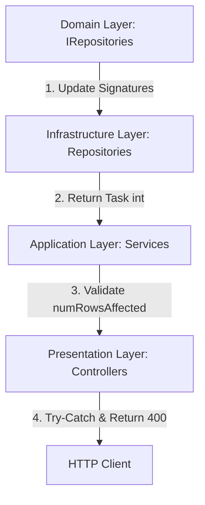

# EF Core SaveChangesAsync() Refactoring Skill

This skill provides comprehensive instructions, architectural guidelines, and code patterns for refactoring Entity Framework Core `SaveChangesAsync()` calls across a multi-layered .NET Web API application (Domain, Infrastructure, Application/Services, and Presentation/Controllers).

The goal of this refactoring is to enforce transactional reliability by verifying that write operations successfully mutate the database, and responding with standardized BadRequest responses if they fail.

---

## Architectural Overview

The refactoring follows a clean architecture approach across four main layers:



---

## Refactoring Workflow

### Phase 1: Domain & Infrastructure Layer Refactoring

#### 1.1 Interface Refactoring (Domain)
Search for all repository interfaces that define `SaveChangesAsync()`. Update their signatures from `Task` to `Task<int>`.

*   **File Pattern**: `Domain/IRepositories/I*Repository.cs`
*   **Before**:
    ```csharp
    Task SaveChangesAsync();
    ```
*   **After**:
    ```csharp
    Task<int> SaveChangesAsync();
    ```

#### 1.2 Implementation Refactoring (Infrastructure)
Update the corresponding concrete repository classes implementing the updated interface.

*   **File Pattern**: `Infrastructure/Repositories/*Repository.cs`
*   **Before**:
    ```csharp
    public async Task SaveChangesAsync()
        => await _context.SaveChangesAsync();
    ```
*   **After**:
    ```csharp
    public async Task<int> SaveChangesAsync()
        => await _context.SaveChangesAsync();
    ```

#### 1.3 Removing Nested SaveChangesAsync in Repository Methods
To respect Unit of Work principles and prevent duplicate DB saves within the same business transaction:
1. Search for repository methods (e.g., `AddXAsync`, `UpdateY`, `DeleteZ`) that have `await _context.SaveChangesAsync()` nested inside them.
2. Remove the nested `SaveChangesAsync()` call from the repository method.
3. Refactor references in Services: First call the CRUD method, and then explicitly call `SaveChangesAsync()` at the Service layer level.

*   **Before (Repository)**:
    ```csharp
    public async Task AddMessageAsync(Message msg)
    {
        await _context.Messages.AddAsync(msg);
        await _context.SaveChangesAsync(); // <-- Nested Save (Remove this!)
    }
    ```
*   **After (Repository)**:
    ```csharp
    public async Task AddMessageAsync(Message msg)
    {
        await _context.Messages.AddAsync(msg);
    }
    ```
*   **Refactored Service Implementation**:
    ```csharp
    // First execute CRUD methods, then call SaveChangesAsync exactly once
    await _chatRepository.AddMessageAsync(msg);
    int numRowsAffected = await _chatRepository.SaveChangesAsync();
    if (numRowsAffected == 0)
        throw new InvalidOperationException("Failed to save changes");
    ```

---

### Phase 2: Application (Service) Layer Transaction Validation

Review all services that reference `SaveChangesAsync()`. Wrap the calls to validate the number of rows affected by the database operation.

#### 2.1 Standard Actions (Void/Task methods)
For methods that execute writes but do not return custom data (or return void/Task):
1.  Assign the returned value of the repository's `SaveChangesAsync()` call to `int numRowsAffected`.
2.  Assert that `numRowsAffected > 0`.
3.  If `numRowsAffected == 0`, throw an `InvalidOperationException("Failed to save changes")`.

*   **Before**:
    ```csharp
    await _reportRepo.AddCourseReportAsync(report);
    await _reportRepo.SaveChangesAsync();
    ```
*   **After**:
    ```csharp
    await _reportRepo.AddCourseReportAsync(report);
    int numRowsAffected = await _reportRepo.SaveChangesAsync();
    if (numRowsAffected == 0)
        throw new InvalidOperationException("Failed to save changes");
    ```

#### 2.2 Special Actions (Boolean methods / Handlers)
For repository or service helper methods that return a `bool` representing database modification success:
1.  Assign the return value of `SaveChangesAsync()` to `int numRowsAffected`.
2.  Return `numRowsAffected > 0`.

*   **Before**:
    ```csharp
    public async Task<bool> UpdateEmailVerifiedAsync(string email)
    {
        var acc = await _context.Accounts.FirstOrDefaultAsync(a => a.Email == email);
        if (acc == null) return false;
        acc.IsVerified = true;
        await _context.SaveChangesAsync();
        return true;
    }
    ```
*   **After**:
    ```csharp
    public async Task<bool> UpdateEmailVerifiedAsync(string email)
    {
        var acc = await _context.Accounts.FirstOrDefaultAsync(a => a.Email == email);
        if (acc == null) return false;
        acc.IsVerified = true;
        int numRowsAffected = await _context.SaveChangesAsync();
        return numRowsAffected > 0;
    }
    ```

---

### Phase 3: Presentation Layer (Controller) Exception Handling

In ASP.NET Controllers, wrap any write action (POST, PUT, DELETE, PATCH) calling refactored services in a `try-catch` block targeting `InvalidOperationException`. 

On catch, return status code **400 BadRequest** containing a standardized error message pattern: `$"Failed to {action}"` where `{action}` is the exact business function of the endpoint.

*   **Before**:
    ```csharp
    [HttpPost("courses")]
    public async Task<IActionResult> ReportCourse([FromBody] CreateCourseReportRequest request)
    {
        var userId = GetUserId();
        if (userId == null) return Unauthorized();

        await _reportService.CreateCourseReportAsync(userId.Value, request, IsInstructor());
        return Ok(ApiResponse<string>.SuccessResponse("Submitted successfully."));
    }
    ```
*   **After**:
    ```csharp
    [HttpPost("courses")]
    public async Task<IActionResult> ReportCourse([FromBody] CreateCourseReportRequest request)
    {
        var userId = GetUserId();
        if (userId == null) return Unauthorized();

        try
        {
            await _reportService.CreateCourseReportAsync(userId.Value, request, IsInstructor());
            return Ok(ApiResponse<string>.SuccessResponse("Submitted successfully."));
        }
        catch (InvalidOperationException ex)
        {
            return BadRequest(ApiResponse<string>.ErrorResponse($"Failed to report course"));
        }
        catch (Exception ex)
        {
            return StatusCode(500, ApiResponse<string>.ErrorResponse(ex.Message));
        }
    }
    ```

---

## Standardized Error Message Guide

Use the following naming conventions for `{action}` when responding with `$"Failed to {action}"`:

| HTTP Method | Controller Action | Standardized Message |
|---|---|---|
| `POST` | Create coupon | `Failed to create coupon` |
| `PUT` | Update coupon | `Failed to update coupon` |
| `DELETE` | Remove item | `Failed to remove item` |
| `POST` | Submit report | `Failed to report course` |
| `PATCH` | Approve request | `Failed to resolve course report` |
| `POST` | Toggle state | `Failed to toggle wishlist` |

---

## Compilation & Verification

Always compile the backend solution to ensure no syntax errors were introduced:
```powershell
dotnet build <SolutionPath>
```
Verify that all updated files build without warnings or compilation errors.
