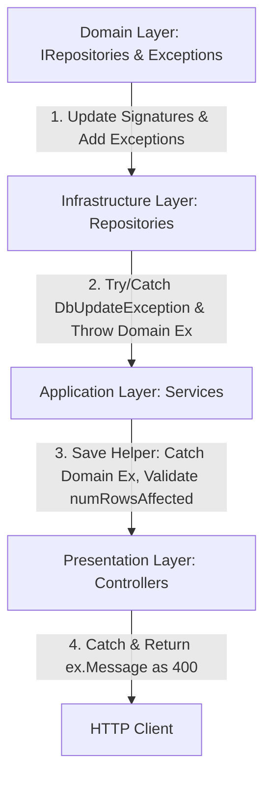

# EF Core SaveChangesAsync() Refactoring Skill

This skill provides comprehensive instructions, architectural guidelines, and code patterns for refactoring Entity Framework Core `SaveChangesAsync()` calls across a multi-layered .NET Web API application (Domain, Infrastructure, Application/Services, and Presentation/Controllers).

The goal of this refactoring is to enforce transactional reliability by verifying that write operations successfully mutate the database, preventing silent failures, and responding with specific, standardized BadRequest responses if they fail.

---

## Architectural Overview

The refactoring follows a clean architecture approach across four main layers:



---

## Refactoring Workflow

### Phase 1: Domain & Infrastructure Layer Refactoring

#### 1.1 Interface Refactoring (Domain)
1. Search for all repository interfaces that define `SaveChangesAsync()`. Update their signatures from `Task` to `Task<int>`.
2. Ensure there is a specific Domain Exception for the entity (e.g., `MediaEmbeddingException`). If it doesn't exist, create it in `Domain/Exceptions/`.

*   **File Pattern**: `Domain/IRepositories/I*Repository.cs`
*   **Before**:
    ```csharp
    Task SaveChangesAsync();
    ```
*   **After**:
    ```csharp
    Task<int> SaveChangesAsync();
    ```

#### 1.2 Implementation Refactoring (Infrastructure)
Update the concrete repository classes. Wrap the `SaveChangesAsync()` call in a `try/catch` to intercept `DbUpdateException` and throw the specific custom Domain Exception with a clear, broad message about constraint violations or data issues.

*   **File Pattern**: `Infrastructure/Repositories/*Repository.cs`
*   **Before**:
    ```csharp
    public async Task SaveChangesAsync()
        => await _context.SaveChangesAsync();
    ```
*   **After**:
    ```csharp
    public async Task<int> SaveChangesAsync()
    {
        try 
        {
            return await _context.SaveChangesAsync();
        }
        catch (DbUpdateException ex)
        {
            throw new CustomEntityException("Database operation failed due to a constraint violation or data issue while saving [Entity Name].", ex);
        }
    }
    ```

#### 1.3 Removing Nested SaveChangesAsync in Repository Methods
To respect Unit of Work principles and prevent duplicate DB saves:
1. Search for repository methods that have `await _context.SaveChangesAsync()` nested inside them.
2. Remove the nested `SaveChangesAsync()` call from the repository method.
3. Refactor references in Services: First call the CRUD method, and then explicitly call the Service-level save helper.

---

### Phase 2: Application (Service) Layer Transaction Validation

To keep the main orchestration logic clean, extract the `SaveChangesAsync()` call into a **private helper method** within the Service.

#### 2.1 Private Save Helper Method
The helper method must:
1. Call the repository's `SaveChangesAsync()`.
2. **DO NOT** assert that `numRowsAffected > 0` or throw an exception on `0`. In EF Core, `SaveChangesAsync()` returning `0` is a successful no-op (e.g., the entity was updated with identical data, so no SQL was generated). Real database failures (like constraints or concurrency issues) will throw exceptions natively. 
3. Catch the specific Domain Exception (e.g., `CustomEntityException`) and rethrow its message as a `BadRequestException`.

*   **Refactored Service Implementation**:
    ```csharp
    public async Task CreateReportAsync(Report report)
    {
        await _reportRepo.AddCourseReportAsync(report);
        await SaveReportChangesAsync();
    }

    private async Task<int> SaveReportChangesAsync()
    {
        try
        {
            return await _reportRepo.SaveChangesAsync();
        }
        catch (CustomEntityException ex)
        {
            throw new BadRequestException(ex.Message);
        }
    }
    ```

---

### Phase 3: Presentation Layer (Controller) Exception Handling

In ASP.NET Controllers, wrap any write action (POST, PUT, DELETE, PATCH) calling refactored services in a `try-catch` block targeting `BadRequestException`. 

On catch, return status code **400 BadRequest** containing the `ex.Message` propagated from the Service layer.

*   **Refactored Controller**:
    ```csharp
    [HttpPost("courses")]
    public async Task<IActionResult> ReportCourse([FromBody] CreateCourseReportRequest request)
    {
        var userId = GetUserId();
        if (userId == null) return Unauthorized();

        try
        {
            await _reportService.CreateCourseReportAsync(userId.Value, request, IsInstructor());
            return Ok(ApiResponse<string>.SuccessResponse("Submitted successfully."));
        }
        catch (BadRequestException ex)
        {
            return BadRequest(ApiResponse<string>.ErrorResponse(ex.Message));
        }
        catch (Exception ex)
        {
            return StatusCode(500, ApiResponse<string>.ErrorResponse(ex.Message));
        }
    }
    ```

---

## Compilation & Verification

Always compile the backend solution to ensure no syntax errors were introduced:
```powershell
dotnet build <SolutionPath>
```
Verify that all updated files build without warnings or compilation errors.
