# Mermaid Class Diagram Generation Skill

This skill provides comprehensive instructions, architectural guidelines, styling rules, and concrete examples for creating and refactoring Mermaid class diagrams. It ensures diagrams are technically accurate, visually consistent, and represent class definitions (fields, properties, methods, interfaces, and database contexts) according to the project's class diagram standard.

> [!IMPORTANT]
> **PlantUML Translation Requirement**
> If the user's input contains a PlantUML class diagram (either via a tagged file or directly pasted code), your primary task is to **translate the PlantUML diagram into the Mermaid format**. You **MUST** ensure the translated Mermaid diagram strictly adheres to **ALL** the rules, styling, and formatting guidelines defined in this skill document (e.g., using `~` for generics, formatting interfaces with asterisks, applying allowed relationships, and using the minimalist style definition). Do not perform a mere 1-to-1 syntax swap; adapt the diagram to fully comply with this skill's standards.

> [!IMPORTANT]
> **Output Location and Naming Convention**
> All generated Mermaid class diagrams **MUST** be exported and saved to the `diagrams/class_mermaid` directory within the workspace. The file naming convention must follow the format `cls_mm_use_case_name` or `cls_mm_functionality_name` with a `.mmd` extension. For example, a diagram for creating a course must be named `cls_mm_create_course.mmd`.

---

## 1. General Participants (Stereotypes & Components)

Depending on the specific use case, a class diagram may include:
- **Frontend Controller**: MVC or API controllers in the frontend layer.
- **ViewModel**: Client-side or UI-focused data models.
- **Backend Controller**: API controllers handling backend routes.
- **Service** & **IService**: Business logic implementation and its corresponding interface.
- **DTO (Data Transfer Object)**: Structured objects for data transfer between layers (e.g., Request, Response, Command/Result DTOs).
- **Repository** & **IRepository**: Data access logic and its corresponding interface.
- **AppDbContext**: EF Core / Database context class.
- **Entity**: Domain or database entities.
- **Exclude**: Exclude any framework-native, external library, or programming-language-native participants (e.g., `ApiClient`, `List`, `Dictionary`, `IMapper`, `HttpClient`, etc.). Additionally, if a class or interface is referenced but would be drawn without any methods or attributes, **skip it entirely** (do not include it as a field and do not draw relationship arrows to it).

---

## 2. Allowed Relationships & Syntax

Use **ONLY** the following relationship connections. Do not use any custom or standard notations not listed here:

| Relationship Type | Mermaid Syntax | Direction/Meaning |
| :--- | :---: | :--- |
| **Dependency** | `..>` | Points *towards* the class being depended on (e.g., `A ..> B`) |
| **Unidirectional Association** | `-->` | Points *towards* the reference target (e.g., `A --> B`) |
| **Bidirectional Association** | `--` | Standard reference link with no specific arrow direction |
| **Aggregation** | `o--` | Part-of relationship; hollow diamond on the container side (e.g., `Container o-- Part`) |
| **Composition** | `*--` | Strong ownership; filled diamond on the owner/container side (e.g., `Owner *-- Component`) |
| **Realization (Implementation)**| `..\|>` | Standard interface implementation; hollow arrow pointing to interface (e.g., `Implementation ..\|> IInterface`) |
| **Inheritance** | `--\|>` | Standard class inheritance; hollow arrow pointing to base class (e.g., `Child --\|> Base`) |

> [!IMPORTANT]
> - **Multiplicity / Cardinality**: DO NOT include any multiplicity labels or cardinality text on relationships. Leave relationships clean of cardinality.
> - **No Relationship Labels / Text**: DO NOT include any text, description, or label on relationship lines (e.g., do not use `: uses`, `: calls`, `: creates`, `: queries`, etc.). Leave all relationships completely clean of text.
> - **No PK / FK Markers**: DO NOT include database key markers like `<<PK>>` or `<<FK>>` in entity classes.

---

## 3. Detailed Relationship Assignment Rules

To maintain consistency across diagrams, assign relationships strictly according to these contextual rules:

### A. Aggregation (`o--`) & Composition (`*--`)
- **Strict Limit**: Use aggregation and composition **ONLY** for relationships between:
  - An **Entity** and another **Entity**
  - A **ViewModel** and another **ViewModel**
  - A **DTO** and another **DTO**
- *Example*: If `Order` entity owns a collection of `OrderItem` entities, use composition: `Order *-- OrderItem`.
- **Fallbacks**: If a strict lifecycle dependency (ownership) does not exist between two Entities, use a **Bidirectional Association** (`--`) for their navigation properties. Only use Composition (`*--`) for strict parent-child relationships where the child cannot exist without the parent (e.g., `Order *-- OrderItem`).

### B. Dependency (`..>`)
- A **Dependency** relationship (`ClassA ..> ClassB`) indicates that Class A relies on Class B, but **Class B CANNOT be a field attribute of Class A (and vice versa)**. If it is a field, it must be mapped as an Association (`-->`).
- **Strict 3-Case Rule**: Class A ONLY has a dependency relationship to Class B if one of these 3 conditions is met:
  1. Class A **instantiates** an object of Class B inside its methods.
  2. Class A **accepts** an object of Class B as an argument in its methods.
  3. Class A **returns** an object of Class B to its callers.
- **Service-to-Entity Constraints based on Use Case Type**:
  - **INSERT (Create) Use Cases**: A Service has a direct **Dependency** on an Entity (e.g., `Service ..> Entity`) because the service instantiates the entity.
  - **UPDATE / DELETE / SELECT (Read) Use Cases**: A Service **DOES NOT** have a direct dependency on an Entity. Entities that are merely retrieved from a Repository (e.g., `var entity = await repo.GetByIdAsync()`) and used for validation or mapping within the Service **DO NOT** constitute a Dependency (`..>`) for the Service. The Service only depends on the Entity if it explicitly instantiates it. Therefore, for these use cases, the Service only depends on the DTO (`Service ..> DTO`), and the Repository depends on the Entity (`Repository ..> Entity`).
- Additionally, use a **Dependency** arrow from Frontend Controller to Backend Controller if Frontend Controller participates in the use case.

### C. Unidirectional Association (`-->`)
- Use a **Unidirectional Association** pointing *towards* the interface or DB context (i.e., **IService / IRepository / AppDbContext**) for relationships where these types are held as private fields/properties (e.g., dependency injection).
- *Triggers*: A controller, service, or repository holds an instance of `IService`, `IRepository`, or `AppDbContext` as a member field.
- *Example*: `CourseController --> ICourseService` (Controller references its service interface).

### D. Realization (`..|>`) and Inheritance (`--|>`)
- Apply standard object-oriented rules:
  - Use `..|>` when a class implements an interface (e.g., `CourseService ..|> ICourseService`).
  - Use `--|>` when a class inherits from a base class (e.g., `InstructorCourseController --|> Controller`).

---

## 4. Best Practices & Styling

- **Standard Layout**: Start your diagram with `classDiagram` or `classDiagram-v2` followed by `direction LR` on the next line to render the diagram from left to right.
- **Namespaces / Packages**: Do not use namespaces/packages.
- **Members Representation & Signatures**:
  - **Field Attributes**: Include private field attributes related to the functionalities, formatted as `visibility attributeName : Interface/Class/Data Type` (e.g., `- _courseRepository : ICourseRepository`).
  - **Full Method Signatures**: Provide complete signatures for methods, specifying visibility (`+` for public, `-` for private, `#` for protected), arguments with their types, and the return type (e.g., `+ CreateCourseAsync(request: CourseCreateRequest, instructorId: int) Task~CourseResponse~`).
  - **Generics**: In Mermaid, you **MUST** use tildes (`~`) instead of angle brackets (`<` `>`) for generic types inside method signatures or property types to avoid parsing errors. For example, use `Task~CourseResponse~` instead of `Task<CourseResponse>`, and `List~CategoryViewModel~` instead of `List<CategoryViewModel>`. **CRITICAL**: If the class block itself is a generic class (e.g., `PagedResult<T>`), you **MUST** use string aliasing to define it so that Mermaid renderers do not incorrectly merge multiple generic classes that share the same base name. Define it as `class AliasName["BaseName~GenericType~"] { ... }` (e.g., `class PagedResultCourseAdminDto["PagedResult~CourseModerationLogAdminDto~"]`). DO NOT define generic classes without an alias (e.g., `class PagedResult~CourseModerationLogAdminDto~ {` is prohibited).
  - **Interface Stereotype & Methods**: For interfaces, you **MUST** include the `<<interface>>` stereotype annotation on the first line inside the class block. Additionally, all methods inside an interface **MUST** be explicitly marked as abstract by appending an asterisk (`*`) at the end of the signature to render them in italics (e.g., `+ CreateCourseAsync(...) Task~CourseResponse~ *`). Note that Mermaid natively italicizes the interface name when `<<interface>>` is used.
  - **Relevance**: For Controllers, Services, Repositories, and AppDbContext, keep attributes and methods clean and relevant to the specific use case to avoid clutter.
    - Identify methods that contain the main execution flow (usually public methods defined in the interface contracts).
    - Only include dependencies and their corresponding private fields if they are directly implemented or referenced in these main public methods.
    - If the main public methods use private helper methods, **keep the private helper methods documented in the class block**, but **skip drawing any external dependencies** (e.g., injected repository interfaces, entities) that are exclusively utilized by those private helpers to reduce relationship clutter.
  - **Data Models (ViewModels, DTOs, Entities)**: If a participant is a ViewModel, DTO, or Entity, you **MUST include ALL of its fields and properties** in the class block. Furthermore, if any of those properties map to another ViewModel, DTO, or Entity that is ALSO present in the diagram, you **MUST explicitly connect them** in the Relationships section using an appropriate relationship (e.g., `Account -- Lockout`).
  - **Shared Name Resolution**: If a Frontend Controller and a Backend Controller share the exact same class name, you **MUST** define them as separate blocks using an alias (e.g., `class AdminAiServiceControllerFE["AdminAiServiceController"]`) and explicitly add the stereotypes `<<frontend controller>>` and `<<backend controller>>` inside their blocks respectively to differentiate them. Similarly, if a ViewModel and a DTO share the exact same name, define them separately and add the stereotypes `<<view model>>` and `<<dto>>`.
- **Styling and Colors**:
  - The diagram should have a simplified, minimalist aesthetic: white background, white fill, black borders, and black text.
  - At the end of the diagram, define a single default style:
    ```mermaid
    classDef default fill:#FFFFFF,stroke:#000000,stroke-width:1px,color:#000000
    ```

---

## 5. Complete Reference Template (`create_course.mermaid`)

Below is the standard, working Mermaid class diagram depicting the "Create Course" structure:

```mermaid
classDiagram
direction LR

%% ==================== FRONTEND ====================

class InstructorCourseController {
    + Create() Task~IActionResult~
    + Create(model: CreateCourseViewModel) Task~IActionResult~
    - GetCategoriesAsync() Task~List~CategoryViewModel~~
    - LoadStripeStatusAsync() void
    - LoadTransferRateAsync() void
}

class CreateCourseViewModel {
    + Title : string
    + CategoryId : int
    + Description : string
    + Price : decimal
    + CourseThumbnailUrl : string
    + WhatYouWillLearn : string
    + Requirements : string
    + CouponId : int?
    + AvailableCategories : List~CategoryViewModel~
}

class CategoryViewModel {
    + CategoryId : int
    + CategoriesName : string
}

%% ==================== BACKEND - CONTROLLER ====================

class CourseController {
    - _courseQueryService : ICourseQueryService
    - _courseCommandService : ICourseCommandService
    - _aiModerationService : ICourseAiModerationService
    
    + CreateCourse(request: CourseCreateRequest) Task~IActionResult~
    - GetInstructorId() int
}

%% ==================== BACKEND - DTOs ====================

class CourseCreateRequest {
    + CategoryId : int
    + Title : string
    + Description : string?
    + Price : decimal
    + CourseThumbnailUrl : string?
    + WhatYouWillLearn : string?
    + Requirements : string?
    + ThumbnailFile : IFormFile?
}

class CourseResponse {
    + CourseId : int
    + InstructorId : int?
    + CategoryId : int?
    + Title : string
    + Description : string?
    + Price : decimal
    + CourseThumbnailUrl : string?
    + CourseStatus : string?
    + CreatedAt : DateTime?
    + UpdatedAt : DateTime?
    + WhatYouWillLearn : string?
    + Requirements : string?
    + InstructorName : string?
    + TotalStudents : int
    + RatingAverage : decimal
    + CategoryName : string?
    + InstructorAvatarUrl : string?
    + InstructorBio : string?
    + InstructorProfessionalTitle : string?
    + InstructorReviewCount : int
    + InstructorStudentsCount : int
    + InstructorCoursesCount : int
    + IsEnrolled : bool
    + IsOwner : bool
    + TotalReviews : int
    + LastApprovedAt : DateTime?
    + AppliedCouponCode : string?
    + AppliedCouponType : string?
    + AppliedCouponValue : decimal?
    + IsRemoved : bool
    + IsInAnyCart : bool
}

%% ==================== BACKEND - DOMAIN ENTITIES ====================

class Course {
    + CourseId : int
    + InstructorId : int?
    + CategoryId : int?
    + CouponId : int?
    + Title : string
    + Description : string?
    + Price : decimal
    + CourseThumbnailUrl : string?
    + CreatedAt : DateTime?
    + UpdatedAt : DateTime?
    + CourseStatus : string?
    + CourseFlagCount : int?
    + CourseAiIntegrations : ICollection~CourseAiIntegration~
    + CartItems : ICollection~CartItem~
    + Category : Category?
    + Coupon : Coupon?
    + Enrollments : ICollection~Enrollment~
    + Instructor : Instructor?
    + Lessons : ICollection~Lesson~
    + OrderItems : ICollection~OrderItem~
    + WishlistItems : ICollection~WishlistItem~
    + CourseExt : CourseExt?
    + WhatYouWillLearn : string?
    + Requirements : string?
    + ModerationFeedback : string?
    + LastApprovedAt : DateTime?
    + IsRemoved : bool
    + ThreatLevel : AiThreatLevel
}

class Category {
    + CategoryId : int
    + CategoriesName : string
    + Description : string?
    + CreatedAt : DateTime?
    + UpdatedAt : DateTime?
    + CategoryStatus : string?
    + Courses : ICollection~Course~
}

class Instructor {
    + InstructorId : int
    + ProfessionalTitle : string?
    + ExpertiseCategories : string?
    + LinkedinUrl : string?
    + YoutubeUrl : string?
    + FacebookUrl : string?
    + DocumentUrl : string?
    + ApprovalStatus : string?
    + RejectionReason : string?
    + StripeAccountId : string?
    + StripeOnboardingStatus : string?
    + PayoutsEnabled : bool?
    + ChargesEnabled : bool?
    + StripeCountry : string?
    + Courses : ICollection~Course~
    + InstructorPayouts : ICollection~InstructorPayout~
    + InstructorNavigation : User
}

class Coupon {
    + CouponId : int
    + ManagerId : int?
    + CouponCode : string
    + CouponType : string?
    + DiscountValue : decimal
    + MinOrderValue : decimal
    + StartDate : DateTime?
    + EndDate : DateTime?
    + UsageLimit : int?
    + UsedCount : int?
    + IsActive : bool?
    + Courses : ICollection~Course~
    + Manager : Manager?
}

%% ==================== BACKEND - SERVICE INTERFACES ====================

class ICourseCommandService {
    <<interface>>
    + CreateCourseAsync(request: CourseCreateRequest, instructorId: int) Task~CourseResponse~ *
}

class ICourseQueryService {
    <<interface>>
    + GetCategoriesAsync() Task~IEnumerable~CategoryResponse~~ *
}

class IInstructorRepository {
    <<interface>>
    + GetByIdAsync(id: int) Task~Instructor?~ *
    + SaveChangesAsync() Task~int~ *
}

class ICourseRepository {
    <<interface>>
    + AddAsync(course: Course) void *
    + SaveChangesAsync() Task~int~ *
}

class IFileUploadService {
    <<interface>>
    + UploadImageAsync(file: IFormFile) Task~string?~ *
    + UploadVideoAsync(file: IFormFile) Task~string?~ *
}

class IContentHashService {
    <<interface>>
    + ComputeCourseHashAsync(text: string) Task~string~ *
    + SaveCourseHashesAsync(command: SaveCourseHashesCommand) void *
}

class IRedisService {
    <<interface>>
    + RemoveCacheAsync(key: string) void *
}

%% ==================== BACKEND - SERVICE IMPLEMENTATION ====================

class CourseCommandService {
    - _courseRepository : ICourseRepository
    - _instructorRepository : IInstructorRepository
    - _uploadService : IFileUploadService
    - _redisService : IRedisService
    - _contentHashService : IContentHashService
    
    + CreateCourseAsync(request: CourseCreateRequest, instructorId: int) Task~CourseResponse~
    - UpdateCourseHashesAsync(course: Course) Task~void~
}

%% ==================== BACKEND - REPOSITORY IMPLEMENTATION ====================

class CourseRepository {
    - _context : AppDbContext
    
    + AddAsync(course: Course) void
    + SaveChangesAsync() Task~int~
}

%% ==================== BACKEND - DbContext ====================

class AppDbContext {
    + Categories : DbSet~Category~
    + Coupons : DbSet~Coupon~
    + Courses : DbSet~Course~
    + Instructors : DbSet~Instructor~
    
    # OnConfiguring(optionsBuilder: DbContextOptionsBuilder) void
    # OnModelCreating(modelBuilder: ModelBuilder) void
}

%% ==================== RELATIONSHIPS ====================

%% === COMPOSITION (filled diamond) ===
Instructor *-- Course

%% === AGGREGATION (hollow diamond) ===
CreateCourseViewModel o-- CategoryViewModel
Category o-- Course
Course -- Coupon

%% === UNIDIRECTIONAL ASSOCIATION (solid arrow) ===
CourseController --> ICourseCommandService
CourseController --> ICourseQueryService
CourseCommandService --> ICourseRepository
CourseCommandService --> IInstructorRepository
CourseCommandService --> IFileUploadService
CourseCommandService --> IContentHashService
CourseCommandService --> IRedisService
CourseRepository --> AppDbContext

%% === INTERFACE REALIZATION ===
CourseCommandService ..|> ICourseCommandService
CourseRepository ..|> ICourseRepository

%% === DEPENDENCY (dashed arrows) ===
InstructorCourseController ..> CourseController
InstructorCourseController ..> CreateCourseViewModel
CourseController ..> CourseCreateRequest
CourseCommandService ..> CourseCreateRequest
CourseCommandService ..> CourseResponse
CourseCommandService ..> Course
CourseRepository ..> Course

%% ==================== STYLES ====================

classDef default fill:#FFFFFF,stroke:#000000,stroke-width:1px,color:#000000
```


```
