# PlantUML Class Diagram Generation Skill

This skill provides comprehensive instructions, architectural guidelines, styling rules, and concrete examples for creating and refactoring PlantUML class diagrams. It ensures diagrams are technically accurate, visually consistent, and represent class definitions (fields, properties, methods, interfaces, and database contexts) according to the project's class diagram standard.

---

## 1. General Participants (Stereotypes & Components)

Depending on the specific use case, a class diagram may include:
- **Frontend Controller**: MVC or API controllers in the frontend layer.
- **ViewModel**: Client-side or UI-focused data models.
- **Backend Controller**: API controllers handling backend routes.
- **Service** & **IService**: Business logic implementation and its corresponding interface.
- **DTO (Data Transfer Object)**: Structured objects for data transfer between layers (e.g., Request, Response, Command/Result DTOs).
- **Repository** & **IRepository**: Data access logic and its corresponding interface.
- **AppDbContext**: EF Core / Database context class.
- **Entity**: Domain or database entities.
- **Exclude**: Exclude any framework-native or programming-language-native participants (e.g., `ApiClient`, `List`, `Dictionary`, etc.).

---

## 2. Allowed Relationships & Syntax

Use **ONLY** the following relationship connections. Do not use any custom or standard notations not listed here:

| Relationship Type | PlantUML Syntax | Direction/Meaning |
| :--- | :---: | :--- |
| **Dependency** | `..>` | Points *towards* the class being depended on (e.g., `A ..> B`) |
| **Unidirectional Association** | `-->` | Points *towards* the reference target (e.g., `A --> B`) |
| **Bidirectional Association** | `--` | Standard reference link with no specific arrow direction |
| **Aggregation** | `o--` | Part-of relationship; hollow diamond on the container side |
| **Composition** | `*--` | Strong ownership; filled diamond on the owner/container side |
| **Realization (Implementation)**| `..|>` | Standard interface implementation; hollow arrow pointing to interface |
| **Inheritance** | `--|>` | Standard class inheritance; hollow arrow pointing to base class |

> [!IMPORTANT]
> **Multiplicity / Cardinality**: DO NOT include any multiplicity labels or cardinality text on relationships (e.g., do not use `class1 "1" --> "*" class2`). Leave relationships clean of cardinality.

---

## 3. Detailed Relationship Assignment Rules

To maintain consistency across diagrams, assign relationships strictly according to these contextual rules:

### A. Aggregation (`o--`) & Composition (`*--`)
- **Strict Limit**: Use aggregation and composition **ONLY** for relationships between:
  - An **Entity** and another **Entity**
  - A **ViewModel** and another **ViewModel**
  - A **DTO** and another **DTO**
- *Example*: If `Order` entity owns a collection of `OrderItem` entities, use composition: `Order *-- OrderItem`.
- **Fallbacks**: If composition/aggregation is not appropriate for these types, use **Unidirectional** (`-->`) or **Bidirectional** (`--`) Association.

### B. Dependency (`..>`)
- Use a **Dependency** arrow pointing *towards* the **ViewModel / DTO / Entity** for any references originating from controllers, services, or repositories.
- *Triggers*: Method arguments, local variable declarations, or return values where a controller, service, or repository utilizes a ViewModel, DTO, or Entity.
- *Example*: `CourseService ..> CourseDto` (Service returns or accepts the DTO).
- Additionally, use a **Dependency** arrow from Frontend Controller to Backend Controller if Frontend Controller participates in the use case.

### C. Unidirectional Association (`-->`)
- Use a **Unidirectional Association** pointing *towards* the interface or DB context (i.e., **IService / IRepository / AppDbContext**) for relationships where these types are held as private fields/properties (e.g., dependency injection).
- *Triggers*: A controller, service, or repository holds an instance of `IService`, `IRepository`, or `AppDbContext` as a member field.
- *Example*: `CourseController --> ICourseService` (Controller references its service interface).

### D. Realization (`..|>`) and Inheritance (`--|>`):
- Apply standard object-oriented rules:
  - Use `..|>` when a class implements an interface (e.g., `CourseService ..|> ICourseService`).
  - Use `--|>` when a class inherits from a base class (e.g., `InstructorCourseController --|> Controller`).

---

## 4. Best Practices & Styling

- **Modern Clean Theme**: Use standard PlantUML styling directives at the top of the file for professional aesthetics:
  ```plantuml
  ' Styling & Settings
  skinparam style strictuml
  skinparam shadowing false
  skinparam class {
      BackgroundColor White
      BorderColor #1A73E8
      ArrowColor #5F6368
  }
  ```
- **Namespaces / Packages**: Do not use namespaces/packages.
- **Members Representation & Signatures**:
  - **Field Attributes**: Include private field attributes related to the functionalities, formatted as `visibility attributeName : Interface/Class/Data Type` (e.g., `- _courseRepository : ICourseRepository`).
  - **Full Method Signatures**: Provide complete signatures for methods, specifying visibility (`+` for public, `-` for private, `#` for protected), arguments with their types, and the return type (e.g., `+ CreateCourseAsync(request: CourseCreateRequest, instructorId: int): Task<CourseResponse>`).
  - **Interface Content Styling**: For interfaces, write all internal contents (methods, properties, attributes) entirely in italics. In PlantUML, format them with double slashes (e.g., `//+ CreateCourseAsync(request: CourseCreateRequest, instructorId: int): Task<CourseResponse>//`).
  - **Relevance**: Keep attributes and methods clean and relevant to the specific usecase/functionality to avoid clutter.
- **Standard Colors**:
  - Abstract/Interface: `ABSTRACT_COLOR` `#FFE6CC`
  - Service Implementation: `SERVICE_COLOR` `#CCE5FF`
  - ViewModel/DTO: `DTO_COLOR` `#E6CCFF`
  - Domain Entity: `ENTITY_COLOR` `#CCFFE6`
  - Repository Implementation: `REPOSITORY_COLOR` `#FFFFCC`
  - Controller: `CONTROLLER_COLOR` `#FFE6E6`
  - DbContext: `DbContext` `#E6F3FF`

---

## 5. Complete Reference Template (`create_course.plantuml`)

Below is the standard, working PlantUML class diagram depicting the "Create Course" structure:

```plantuml
@startuml CreateCourse_ClassDiagram

' Styling & Settings
skinparam style strictuml
skinparam shadowing false
skinparam class {
    BackgroundColor White
    BorderColor #1A73E8
    ArrowColor #5F6368
}

!define ABSTRACT_COLOR #FFE6CC
!define SERVICE_COLOR #CCE5FF
!define DTO_COLOR #E6CCFF
!define ENTITY_COLOR #CCFFE6
!define REPOSITORY_COLOR #FFFFCC
!define CONTROLLER_COLOR #FFE6E6

skinparam backgroundColor #FFFFFF
skinparam classBackgroundColor #F9F9F9
skinparam classBorderColor #333333
skinparam arrowColor #333333

' ==================== FRONTEND ====================

class InstructorCourseController #FFE6E6 {
    + Create() : Task<IActionResult>
    + Create(model: CreateCourseViewModel) : Task<IActionResult>
    - GetCategoriesAsync() : Task<List<CategoryViewModel>>
    - LoadStripeStatusAsync() : Task<void>
    - LoadTransferRateAsync() : Task<void>
}

class CreateCourseViewModel #E6CCFF {
    + Title : string
    + CategoryId : int
    + Description : string
    + Price : decimal
    + CourseThumbnailUrl : string
    + WhatYouWillLearn : string
    + Requirements : string
    + CouponId : int?
    + AvailableCategories : List<CategoryViewModel>
}

class CategoryViewModel #E6CCFF {
    + CategoryId : int
    + CategoriesName : string
}

' ==================== BACKEND - CONTROLLER ====================

class CourseController #FFE6E6 {
    - _courseQueryService : ICourseQueryService
    - _courseCommandService : ICourseCommandService
    - _aiModerationService : ICourseAiModerationService
    
    + CreateCourse(request: CourseCreateRequest) : Task<IActionResult>
    - GetInstructorId() : int
}

' ==================== BACKEND - DTOs ====================

class CourseCreateRequest #E6CCFF {
    + CategoryId : int
    + Title : string
    + Description : string?
    + Price : decimal
    + CourseThumbnailUrl : string?
    + WhatYouWillLearn : string?
    + Requirements : string?
    + ThumbnailFile : IFormFile?
}

class CourseResponse #E6CCFF {
    + CourseId : int
    + InstructorId : int?
    + CategoryId : int?
    + Title : string
    + Description : string?
    + Price : decimal
    + CourseThumbnailUrl : string?
    + CourseStatus : string?
    + CreatedAt : DateTime?
    + UpdatedAt : DateTime?
    + WhatYouWillLearn : string?
    + Requirements : string?
    + InstructorName : string?
    + TotalStudents : int
    + RatingAverage : decimal
    + CategoryName : string?
    + InstructorAvatarUrl : string?
    + InstructorBio : string?
    + InstructorProfessionalTitle : string?
    + InstructorReviewCount : int
    + InstructorStudentsCount : int
    + InstructorCoursesCount : int
    + IsEnrolled : bool
    + IsOwner : bool
    + TotalReviews : int
    + LastApprovedAt : DateTime?
    + AppliedCouponCode : string?
    + AppliedCouponType : string?
    + AppliedCouponValue : decimal?
    + IsRemoved : bool
    + IsInAnyCart : bool
}

' ==================== BACKEND - DOMAIN ENTITIES ====================

class Course #CCFFE6 {
    + CourseId : int <<PK>>
    + InstructorId : int? <<FK>>
    + CategoryId : int? <<FK>>
    + CouponId : int? <<FK>>
    + Title : string
    + Description : string?
    + Price : decimal
    + CourseThumbnailUrl : string?
    + CreatedAt : DateTime?
    + UpdatedAt : DateTime?
    + CourseStatus : string?
    + CourseFlagCount : int?
}

class Category #CCFFE6 {
    + CategoryId : int <<PK>>
    + CategoriesName : string
    + Description : string?
    + CreatedAt : DateTime?
}

class Instructor #CCFFE6 {
    + InstructorId : int <<PK>>
    + ProfessionalTitle : string?
    + ExpertiseCategories : string?
    + LinkedinUrl : string?
    + YoutubeUrl : string?
    + FacebookUrl : string?
    + DocumentUrl : string?
    + ApprovalStatus : string?
    + RejectionReason : string?
    + StripeAccountId : string?
    + StripeOnboardingStatus : string?
}

class Coupon #CCFFE6 {
    + CouponId : int <<PK>>
    + ManagerId : int? <<FK>>
    + CouponCode : string
    + CouponType : string?
    + DiscountValue : decimal
    + MinOrderValue : decimal
    + StartDate : DateTime?
    + EndDate : DateTime?
    + UsageLimit : int?
    + UsedCount : int?
    + IsActive : bool?
}

' ==================== BACKEND - SERVICE INTERFACES ====================

interface ICourseCommandService #FFE6CC {
    //+ CreateCourseAsync(request: CourseCreateRequest, instructorId: int) : Task<CourseResponse>//
    //+ UpdateCourseAsync(courseId: int, request: CourseUpdateRequest, instructorId: int) : Task<CourseResponse>//
    //+ UpdateCourseStatusAsync(courseId: int, status: string, instructorId: int) : Task<void>//
    //+ DeleteCourseAsync(courseId: int, instructorId: int) : Task<void>//
    //+ IntegrateAItoCourseAsync(command: CourseAIIntegrationCommand) : Task<CourseAIIntegrationResult>//
    //+ UpdateCourseStatusAndFeedbackAsync(courseId: int, status: string, feedback: string?) : Task<void>//
}

interface ICourseQueryService #FFE6CC {
    //+ GetAllPublishedCoursesAsync(userId: int?) : Task<IEnumerable<CourseResponse>>//
    //+ GetPublishedCoursesPagedAsync(query: string?, category: string?, sort: string?, price: string?, rating: string?, page: int?, pageSize: int?, userId: int?) : Task<PagedResult<CourseResponse>>//
    //+ GetInstructorCoursesAsync(instructorId: int) : Task<IEnumerable<CourseResponse>>//
    //+ GetInstructorCoursesPagedAsync(instructorId: int, search: string?, status: string?, page: int?, pageSize: int?) : Task<PagedResult<CourseResponse>>//
    //+ GetCourseWithDetailsAsync(courseId: int, instructorId: int, userId: int?) : Task<CourseDetailResponse?>//
    //+ IsEnrolledAsync(userId: int, courseId: int) : Task<bool>//
    //+ GetCategoriesAsync() : Task<IEnumerable<CategoryResponse>>//
    //+ GetByModelAndCourseAsync(modelId: int, courseId: int) : Task<CourseAiIntegrationResponse>//
}

interface IInstructorRepository #FFE6CC {
    //+ GetPendingInstructorsAsync(page: int, pageSize: int) : Task<(IEnumerable<Instructor>, int)>//
    //+ GetByIdAsync(id: int) : Task<Instructor?>//
    //+ GetByIdWithNavigationAsync(instructorId: int) : Task<Instructor?>//
    //+ AddAsync(instructor: Instructor) : Task<void>//
    //+ Update(instructor: Instructor) : void//
    //+ GetAllApplicationsDtoAsync() : Task<List<InstructorDashboardDto>>//
    //+ GetDashboardDtoAsync(userId: int) : Task<InstructorDashboardDto?>//
    //+ GetRejectedApplicationDtoAsync(userId: int) : Task<InstructorDashboardDto?>//
    //+ GetStatsAsync(userId: int) : Task<InstructorStats?>//
    //+ CountActiveCoursesAsync(instructorId: int) : Task<int>//
    //+ GetPayoutsAsync(instructorId: int, page: int, pageSize: int, keyword: string?, sortBy: string?, status: string?, year: int?, month: int?) : Task<PagedResult<InstructorPayoutDto>>//
    //+ GetTotalApprovedInstructorsCountAsync() : Task<int>//
    //+ GetInstructorsWithStripeAsync() : Task<List<Instructor>>//
    //+ SaveChangesAsync() : Task<int>//
}

interface ICourseRepository #FFE6CC {
    //+ GetInstructorCoursesAsync(instructorId: int) : Task<IEnumerable<Course>>//
    //+ GetInstructorCoursesPagedAsync(instructorId: int, search: string?, status: string?, page: int?, pageSize: int?) : Task<(IEnumerable<Course>, int)>//
    //+ GetCourseWithDetailsAsync(courseId: int) : Task<Course?>//
    //+ GetByIdAsync(courseId: int) : Task<Course?>//
    //+ HasEnrollmentsAsync(courseId: int) : Task<bool>//
    //+ GetAllPublishedCoursesAsync() : Task<IEnumerable<Course>>//
    //+ GetAllPublishedCoursesPagedAsync(search: string?, category: string?, sort: string?, price: string?, rating: string?, page: int?, pageSize: int?) : Task<(IEnumerable<Course>, int)>//
    //+ IsEnrolledAsync(userId: int, courseId: int) : Task<bool>//
    //+ GetEnrolledCoursesAsync(userId: int) : Task<IEnumerable<Course>>//
    //+ GetCategoriesAsync() : Task<IEnumerable<Category>>//
    //+ GetCourseStatsAsync(courseIds: IEnumerable<int>) : Task<IEnumerable<CourseStats>>//
    //+ GetCourseStatsAsync(courseId: int) : Task<CourseStats?>//
    //+ AddAsync(course: Course) : Task<void>//
    //+ Update(course: Course) : void//
    //+ Delete(course: Course) : void//
    //+ GetTotalPublishedCoursesCountAsync() : Task<int>//
    //+ GetAveragePlatformRatingAsync() : Task<decimal>//
    //+ GetPendingCoursesModerationAsync(filter: ModerationFilterDto) : Task<PagedResult<CourseModerationDto>>//
    //+ GetCourseModerationStatsAsync() : Task<CourseModerationStatsDto>//
    //+ IsOwnerAsync(userId: int, courseId: int) : Task<bool>//
    //+ GetCourseWithInstructorAsync(courseId: int) : Task<Course?>//
    //+ GetActiveEnrollmentAsync(userId: int, courseId: int) : Task<Enrollment?>//
    //+ SaveChangesAsync() : Task<int>//
}

interface IFileUploadService #FFE6CC {
    //+ UploadImageAsync(file: IFormFile) : Task<string?>//
    //+ UploadVideoAsync(file: IFormFile) : Task<string?>//
    //+ DeleteFileAsync(fileUrl: string) : Task<bool>//
    //+ MoveToTrashAsync(fileUrl: string) : Task<string?>//
    //+ GetPublicIdFromUrl(fileUrl: string) : string?//
    //+ DeleteFileByPublicIdAsync(publicId: string, resourceType: string) : Task<bool>//
    //+ UploadFileAsync(file: IFormFile) : Task<string?>//
    //+ RestoreFromTrashAsync(publicId: string, resourceType: string) : Task<string?>//
}

interface IContentHashService #FFE6CC {
    //+ NormalizeText(text: string) : string//
    //+ ComputeCourseHashAsync(text: string) : Task<string>//
    //+ ComputeFileHashAsync(fileBytes: byte[]) : Task<string>//
    //+ SaveCourseHashesAsync(command: SaveCourseHashesCommand) : Task<void>//
    //+ GetCourseHashesAsync(courseId: int) : Task<CourseExtDto>//
    //+ GetAllCourseHashesAsync() : Task<List<CourseExtDto>>//
}

interface IRedisService #FFE6CC {
    //+ SetUserOnlineAsync(accountId: int, connectionId: string) : Task<void>//
    //+ SetUserOfflineAsync(accountId: int, connectionId: string) : Task<void>//
    //+ IsUserOnlineAsync(accountId: int) : Task<bool>//
    //+ IncrementUnreadCountAsync(accountId: int, chatId: int) : Task<void>//
    //+ ClearUnreadCountAsync(accountId: int, chatId: int) : Task<void>//
    //+ GetUnreadCountAsync(accountId: int, chatId: int) : Task<int>//
    //+ SetCacheAsync<T>(key: string, value: T, expiry: TimeSpan?) : Task<void>//
    //+ GetCacheAsync<T>(key: string) : Task<T?>//
    //+ RemoveCacheAsync(key: string) : Task<void>//
}

' ==================== BACKEND - SERVICE IMPLEMENTATION ====================

class CourseCommandService #CCE5FF {
    - _courseRepository : ICourseRepository
    - _instructorRepository : IInstructorRepository
    - _uploadService : IFileUploadService
    - _redisService : IRedisService
    - _contentHashService : IContentHashService
    
    + CreateCourseAsync(request: CourseCreateRequest, instructorId: int) : Task<CourseResponse>
    + UpdateCourseAsync(courseId: int, request: CourseUpdateRequest, instructorId: int) : Task<CourseResponse>
    + UpdateCourseStatusAsync(courseId: int, status: string, instructorId: int) : Task<void>
    + DeleteCourseAsync(courseId: int, instructorId: int) : Task<void>
    - UpdateCourseHashesAsync(course: Course) : Task<void>
}

' ==================== BACKEND - REPOSITORY IMPLEMENTATION ====================

class CourseRepository #FFFFCC {
    - _context : AppDbContext
    
    + GetInstructorCoursesAsync(instructorId: int) : Task<IEnumerable<Course>>
    + GetInstructorCoursesPagedAsync(instructorId: int, search: string?, status: string?, page: int?, pageSize: int?) : Task<(IEnumerable<Course>, int)>
    + GetCourseWithDetailsAsync(courseId: int) : Task<Course?>
    + GetByIdAsync(courseId: int) : Task<Course?>
    + AddAsync(course: Course) : Task<void>
    + Update(course: Course) : void
    + Delete(course: Course) : void
    + SaveChangesAsync() : Task<int>
}

' ==================== BACKEND - DbContext ====================

class AppDbContext #E6F3FF {
    + Accounts : DbSet<Account>
    + Lockouts : DbSet<Lockout>
    + Categories : DbSet<Category>
    + Coupons : DbSet<Coupon>
    + Courses : DbSet<Course>
    + Enrollments : DbSet<Enrollment>
    + Instructors : DbSet<Instructor>
    + Lessons : DbSet<Lesson>
    + Users : DbSet<User>
    ---
    # OnConfiguring(optionsBuilder: DbContextOptionsBuilder) : void
    # OnModelCreating(modelBuilder: ModelBuilder) : void
}

' ==================== RELATIONSHIPS ====================

' === COMPOSITION (filled diamond) ===
Instructor *-- Course

' === AGGREGATION (hollow diamond) ===
CreateCourseViewModel o-- CategoryViewModel
Category o-- Course
Course -- Coupon

' === UNIDIRECTIONAL ASSOCIATION (solid arrow) ===
CourseController --> ICourseCommandService
CourseController --> ICourseQueryService
CourseCommandService --> ICourseRepository
CourseCommandService --> IInstructorRepository
CourseCommandService --> IFileUploadService
CourseCommandService --> IContentHashService
CourseCommandService --> IRedisService
CourseRepository --> AppDbContext

' === INTERFACE REALIZATION ===
CourseCommandService ..|> ICourseCommandService
CourseRepository ..|> ICourseRepository

' === DEPENDENCY (dashed arrows) ===
InstructorCourseController ..> CourseController : calls
InstructorCourseController ..> CreateCourseViewModel : uses
CourseController ..> CourseCreateRequest : uses
CourseCommandService ..> CourseCreateRequest : uses
CourseCommandService ..> CourseResponse : creates
CourseRepository ..> Course : creates

@enduml
```


