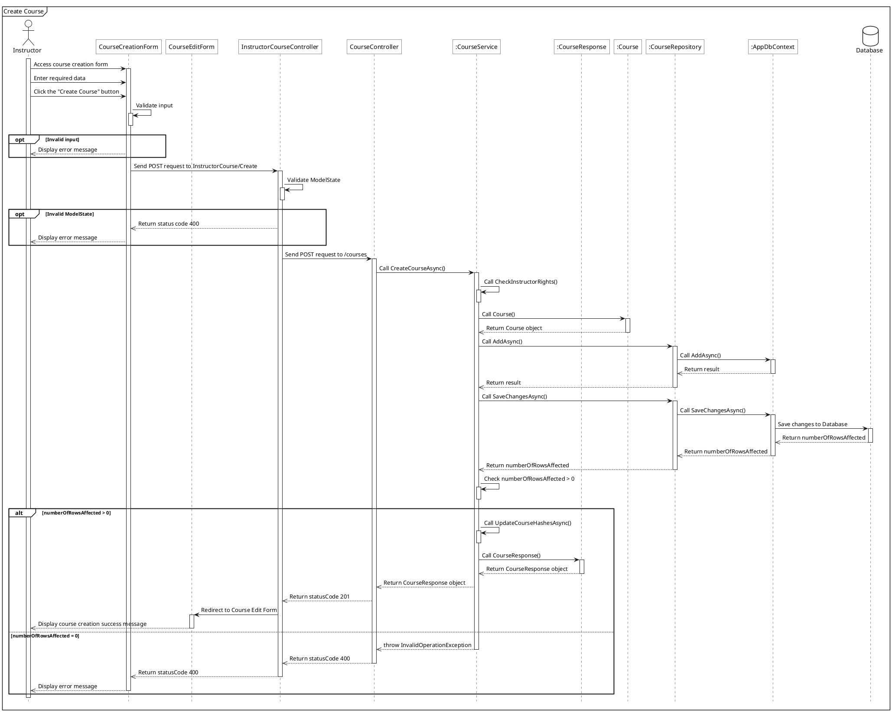

# PlantUML Sequence Diagram Generation Skill

This skill provides comprehensive instructions, architectural guidelines, styling rules, and concrete examples for creating and refactoring PlantUML sequence diagrams. It ensures diagrams are technically accurate, visually consistent, and represent runtime interactions (lifeline activation, database changes, return paths, and validation flows) according to the project's sequence diagram standard.

---

## 1. Participant Naming and Aliasing

To keep diagrams readable and consistent, participants should be defined at the top with standardized aliases:

| Participant Type | PlantUML Definition Example | Alias | Role |
|---|---|---|---|
| Actor | `actor ActorName as act` | `act` | The human actor interacting with the system |
| View / UI | `participant "Form/ViewName" as view` | `view` | Razor views, frontend pages (`.cshtml`, HTML) |
| Redirect Target | `participant "RedirectForm" as r_view` | `r_view` | Target view after redirection |
| Frontend Controller | `participant "FrontendController" as fe_ctrl` | `fe_ctrl` | Standard MVC controller handling client requests |
| Backend Controller | `participant "ApiController" as be_ctrl` | `be_ctrl` | API Controller exposing REST services |
| Service | `participant ":ServiceClass" as sv` | `sv` | Business logic service (e.g. `:CourseService`) |
| Data Transfer / Response | `participant ":ResponseDto" as res` | `res` | Response or DTO class |
| Entity | `participant ":EntityClass" as ett` | `ett` | Domain entity class |
| Repository | `participant ":RepositoryClass" as repo` | `repo` | Data access repository class |
| DB Context | `participant ":AppDbContext" as ctx` | `ctx` | Entity Framework DB context |
| Database | `database Database as db` | `db` | The physical database storage (cylinder) |

### Modeling Rules
- **Implementations Only:** Do not model interfaces (e.g., use `:CourseRepository` rather than `ICourseRepository`).
- **Instance Prefixing:** Prefix class instances with a colon (e.g., `:CourseService`, `:CourseRepository`). Do not prefix views, controllers, or actor aliases.
- **Visuals:** All participants except actors (stick figure) and databases (cylinder figure) must be drawn as rectangles.

---

## 2. Style Definitions and Canvas Settings

Every `.plantuml` file must start with standard styling and settings for a clean, cohesive black-and-white look. Copy and paste the following header configuration exactly:

```plantuml
@startuml 
<style>
    sequenceDiagram{
        actor{
            BackgroundColor white
            LineThickness 1.0
        }
        participant{
            BackgroundColor white
            RoundCorner 0
        }
        database{
            BackgroundColor white
        }
        groupHeader{
            BackgroundColor white
        }
        referenceHeader{
            BackgroundColor white
        }
        reference{
            BackgroundColor white
        }
    }
</style>

hide footbox
```

Use `mainframe <Title>` (e.g., `mainframe Create Course`) right after the header, followed by the participant declarations.

---

## 3. Interaction Arrow Styles

Ensure correct arrow types to model request/response control flow:
- `->` (Solid Arrow): Synchronous calls, requests, redirects, or internal method invocation.
- `-->>` (Dashed Arrow): Returns, responses, thrown exceptions, or messages displayed to the actor.

---

## 4. Lifeline Activation and Deactivation

Correctly managing activation (`++`) and deactivation (`--`) is critical to show when an object is executing or waiting.

### General Rules
1. **Initial Call Activation (`++`):** Append `++` to the receiving participant when it receives its first call.
   - Example: `fe_ctrl -> be_ctrl++: Send POST request`
2. **Return Deactivation (`--`):** Deactivate a participant's lifeline when it returns or throws an exception.
   - Example: `be_ctrl -->> fe_ctrl--: Return statusCode 200`
3. **Completeness:** Every participant's lifeline (excluding the actor) must be fully deactivated by the time the flow finishes its execution paths.

### Self-Call Activations
- **Conditional Triggers (Opt/Alt):** If a self-call checks a condition to branch (e.g. `Validate ModelState`), activate the self-call and immediately deactivate it *before* opening the conditional block:
  ```plantuml
  fe_ctrl -> fe_ctrl++: Validate ModelState
  fe_ctrl--
  group opt [Invalid ModelState]
      fe_ctrl -->> view: Return status code 400
      view -->> act: Display error message
  end
  ```
- **Auxiliary Helper Calls:** For minor internal helper calls that do not branch or contain detailed nested execution flows, activate and instantly deactivate:
  ```plantuml
  sv -> sv++: Call CheckInstructorRights()
  sv--
  ```
- **Main Execution Helper Calls:** For internal helper methods where the internal logic is being expanded in the diagram, keep the activation open until that method returns.

### Trailing Lifeline Deactivation in Alt Blocks
When a diagram ends inside conditional branches, only the final branch of the outermost `alt` is responsible for deactivating the trailing lifelines along its return path.
- Example:
  ```plantuml
  alt condition_1
      sv -->> be_ctrl: Return CourseResponse object
      be_ctrl -->> fe_ctrl: Return statusCode 201
      fe_ctrl -> r_view++: Redirect to Course Edit Form
      r_view -->> act--: Display course creation success message
  else condition_2
      sv-->>be_ctrl--: throw InvalidOperationException
      be_ctrl -->> fe_ctrl--: Return statusCode 400
      fe_ctrl -->> view--: Return statusCode 400
      view -->> act --: Display error message
  end
  ```

---

## 5. Flow Logic Guidelines

### Form Validation
- Standard client-side UI input validations must be shown in the UI/view first.
- Only show server-side controller `Validate ModelState` if it is explicitly written in the controller code.

### Layer and Component Omissions
- Omit `fe_ctrl` if the frontend requests the backend directly (e.g. via direct AJAX/Fetch call without server-side MVC controller routing).
- Omit ViewModels/DTOs from the diagram participants list if they are handled implicitly by ASP.NET Core binding and not explicitly manipulated in custom controller/service logic.

### Database Operations (Insert/Update/Delete)
- Assume that calls to `SaveChangesAsync()` at the repository level return an `int` variable named `numberOfRowsAffected` representing the number of mutated database rows.
- Use `numberOfRowsAffected > 0` as the branching condition for the successful path vs. the failed path.
- In the failed path (`numberOfRowsAffected = 0`), show that the service throws an `InvalidOperationException` and the controllers catch and return a `400 BadRequest`.

### Distinct Return Paths
- Paths for `alt` branches must remain separate from their entry point down to the final return to the actor. Even if two branches display a similar status code or error popup, they represent separate paths and must deactivate their lifelines independently.

---

## 6. Complete Reference Template (`create_course.plantuml`)

Below is the standard, working PlantUML sequence diagram depicting the "Create Course" flow, showcasing all the guidelines above:


