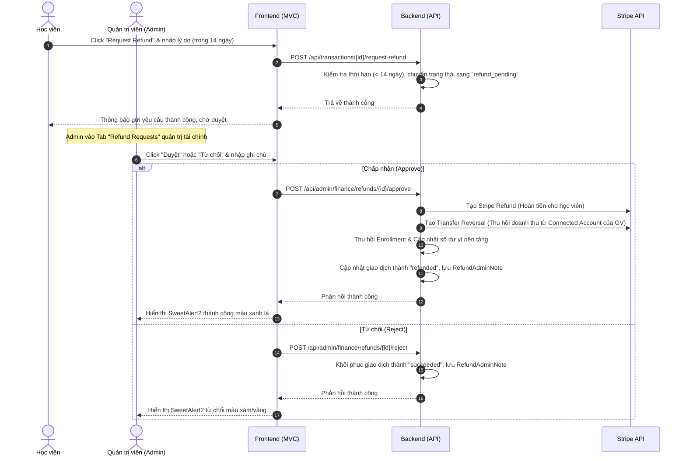

# 📜 QUY ĐỊNH & LUẬT HOÀN TIỀN (REFUND POLICY) - LINKED COURSE MARKETPLACE

Dưới đây là tài liệu chi tiết quy định và cơ chế kỹ thuật cho quy trình hoàn tiền (Refund) của nền tảng Linked. Quy trình này được thiết kế nhằm đảm bảo quyền lợi cân bằng giữa **Học viên (Buyers)**, **Giảng viên (Instructors)** và **Nền tảng (Platform/Admin)**.

---

## 1. 🕒 ĐIỀU KIỆN & QUY ĐỊNH HOÀN TIỀN (BUSINESS RULES)

### 📌 Quy tắc 14 ngày (The 14-Day Refund Rule)
* **Thời hạn hợp lệ:** Học viên chỉ có quyền yêu cầu hoàn tiền trong vòng **14 ngày (336 giờ)** kể từ thời điểm giao dịch mua khóa học được thực hiện thành công trên Stripe (`TransactionCreatedAt`).
* **Quá hạn:** Sau 14 ngày, nút yêu cầu hoàn tiền sẽ **tự động bị khóa/ẩn** trên giao diện chi tiết đơn hàng của học viên. Hệ thống backend cũng sẽ chặn mọi yêu cầu hoàn tiền cho các giao dịch quá hạn này.

### 📌 Lý do yêu cầu hoàn tiền (Refund Reason)
* Học viên **bắt buộc** phải cung cấp lý do hoàn tiền cụ thể (Refund Reason) thông qua biểu mẫu yêu cầu hoàn tiền trên giao diện.
* Lý do này sẽ được lưu trữ vào cơ sở dữ liệu (`RefundReason`) và hiển thị trực tiếp cho Admin tại trang quản trị tài chính để làm căn cứ phê duyệt.

### 📌 Trạng thái giao dịch chờ duyệt (Refund Pending State)
* Khi học viên gửi yêu cầu hoàn tiền, giao dịch sẽ chuyển từ trạng thái `succeeded` sang `refund_pending`.
* Trong thời gian chờ duyệt, học viên **vẫn được giữ quyền truy cập tạm thời** vào khóa học cho đến khi Admin đưa ra quyết định chính thức (chấp nhận hoặc từ chối).

---

## 2. 🛡️ QUY TRÌNH PHÊ DUYỆT CỦA ADMIN (ADMIN DECISION WORKFLOW)

Admin có toàn quyền kiểm soát tối cao thông qua Tab **Refund Requests** trong trang quản trị tài chính (`/AdminFinance`):

### ✅ Trường hợp 1: Chấp nhận yêu cầu hoàn tiền (Approve Refund)
Khi Admin phê duyệt hoàn tiền, hệ thống sẽ thực hiện đồng thời các tác vụ tự động sau:
1. **Hoàn tiền qua Stripe:** Gọi API Stripe thực hiện hoàn trả lại 100% số tiền giao dịch gốc về thẻ/ví của học viên (`Stripe Refund API`).
2. **Thu hồi doanh thu Giảng viên (Reverse Transfer):** 
   * Tính toán lại phần doanh thu giảng viên đã nhận cho đơn hàng đó.
   * Sử dụng API Stripe Connect để **thu hồi (reverse)** số tiền tương ứng từ tài khoản Stripe Connected Account của Giảng viên về tài khoản Stripe của Nền tảng.
3. **Cập nhật số dư nền tảng:** Điều chỉnh lại số dư khả dụng (`Platform Wallet / Platform Balance`) để khấu trừ khoản hoa hồng nền tảng từ đơn hàng bị hoàn.
4. **Thu hồi quyền học tập (Revoke Enrollment):** Tự động xóa hoặc vô hiệu hóa bản ghi đăng ký khóa học (`Enrollment`) của học viên đó, chặn quyền vào học, xem bài giảng.
5. **Gửi thông báo (Notification):** Gửi thông báo đẩy thời gian thực (Real-time SignalR) đến học viên thông báo yêu cầu hoàn tiền đã được **CHẤP NHẬN**, kèm ghi chú phản hồi từ Admin.

### ❌ Trường hợp 2: Từ chối yêu cầu hoàn tiền (Reject Refund)
Khi Admin từ chối yêu cầu hoàn tiền (yêu cầu nhập lý do từ chối cụ thể):
1. **Khôi phục giao dịch:** Chuyển trạng thái giao dịch từ `refund_pending` trở lại `succeeded` như ban đầu.
2. **Lưu trữ lý do từ chối:** Lưu trữ ghi chú của Admin (`RefundAdminNote`) vào cơ sở dữ liệu để làm bằng chứng đối soát.
3. **Giữ nguyên quyền học:** Học viên tiếp tục sở hữu và học tập bình thường.
4. **Gửi thông báo (Notification):** Gửi thông báo đẩy thời gian thực đến học viên thông báo yêu cầu hoàn tiền đã bị **TỪ CHỐI**, kèm lý do cụ thể mà Admin đã điền.

---

## 3. ⚙️ CƠ CHẾ KỸ THUẬT & SƠ ĐỒ HOẠT ĐỘNG (TECHNICAL ARCHITECTURE)

### 📊 Mô hình luồng dữ liệu (Data Flow Diagram)

---

## 4. 🗃️ THAY ĐỔI CƠ SỞ DỮ LIỆU (DATABASE SCHEMA MIGRATIONS)

Để hỗ trợ đầy đủ luồng nghiệp vụ trên, bảng `Transactions` đã được mở rộng thêm các trường sau:

| Tên trường | Kiểu dữ liệu | Mô tả |
| :--- | :--- | :--- |
| `TransactionsStatus` | `VARCHAR(50)` | Thêm trạng thái `refund_pending` và `refunded` (bên cạnh `succeeded`, `failed`). |
| `RefundReason` | `TEXT` (Nullable) | Lý do học viên gửi yêu cầu hoàn tiền. |
| `RefundRequestedAt` | `DATETIME` (Nullable) | Thời điểm học viên gửi yêu cầu hoàn tiền. |
| `RefundAdminNote` | `TEXT` (Nullable) | Ghi chú phản hồi hoặc lý do từ chối của Admin khi duyệt. |

---

## 5. 💡 LƯU Ý KHI VẬN HÀNH (OPERATIONAL RECOMMENDATIONS)

1. **Chính sách Stripe Connect:** Khi thực hiện hoàn tiền, hãy đảm bảo tài khoản Stripe chính của nền tảng có đủ số dư (Stripe Balance) để thực hiện hoàn tiền gốc, trước khi Stripe Connect tự động thu hồi tiền từ Giảng viên.
2. **Quyền riêng tư & Đối soát:** Mọi thao tác duyệt/từ chối đều lưu vết rõ ràng kèm tài khoản Admin thực hiện để phục vụ công tác đối soát tài chính cuối tháng.
