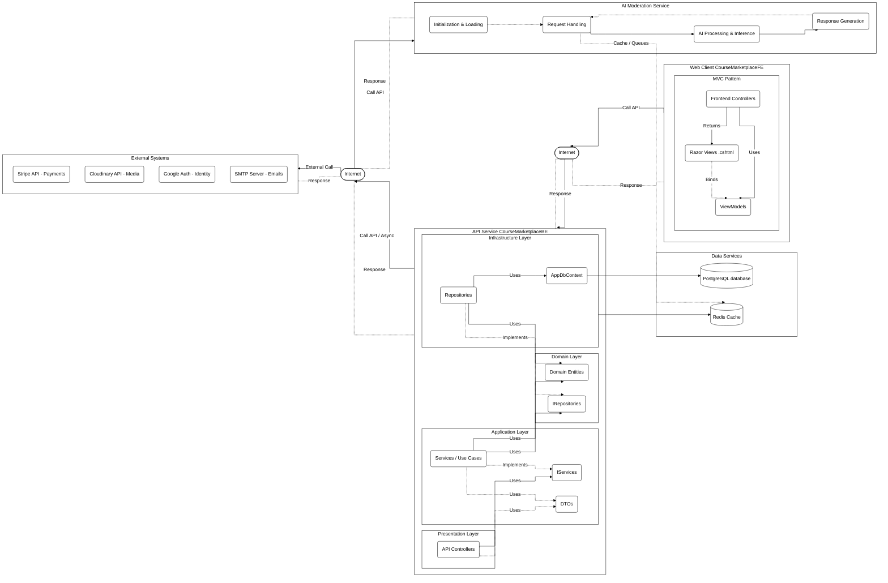

# System Architecture Overview

This document outlines the architecture of the Course Marketplace platform, based on the codebase structure and `docker-compose.yml` configuration. The diagram follows a layered approach similar to your reference image.

## Architecture Diagram

---

## Component Explanations

### 1. Web Client (`CourseMarketplaceFE`)
This represents the frontend application built with ASP.NET Core MVC. It runs in the user's browser, serving the user interface and handling client-side operations, while also acting as a proxy to the backend.
- **MVC Pattern**:
  - **Razor Views (.cshtml)**: The UI templates rendered into HTML for the user.
  - **ViewModels**: Data structures shaped specifically for the Views, binding the UI to the underlying data.
  - **Frontend Controllers**: Handle HTTP requests, prepare ViewModels, return Views, and act as a proxy that delegates API calls to the backend `CourseMarketplaceBE`.

### 2. API Service (`CourseMarketplaceBE`)
This is the core backend monolith of the application, structured following a Clean Architecture-inspired N-tier design.
- **Presentation Layer (API Controllers)**: The entry point for incoming HTTP requests from the frontend. It validates parameters and delegates workflows to `IServices`.
- **Application Layer (IServices, Services & DTOs)**: Contains the core application use cases. It defines the application interfaces (`IServices`), implements the business rules in `Services`, and uses Data Transfer Objects (DTOs) for data exchange.
- **Domain Layer (Entities & IRepositories)**: The core of the system, containing domain entities and enterprise logic independent of any specific technology. It also defines the data access abstractions (`IRepositories`) for the aggregates.
- **Infrastructure Layer (Repositories & AppDbContext)**: Implements the `IRepositories` interfaces defined in the Domain layer. It contains the Entity Framework Core `AppDbContext` for database sessions, and Repositories that use it to execute queries. It also handles external API integrations and caching mechanisms.

### 3. Data Services (`db` & `redis`)
Independent services providing data persistence and caching for the platform.
- **PostgreSQL (`db`)**: The primary relational database containing application data (users, courses, transactions). Uses the `pgvector` extension for AI vector embeddings and semantic search.
- **Redis (`redis`)**: An in-memory data store used by both the API Service and the AI Moderation Service for caching, distributed state, and message brokering.

### 4. AI Moderation Service (`ai-moderation`)
A standalone Python-based microservice (likely built with FastAPI) dedicated to analyzing and moderating content (e.g., detecting spam, toxic text, or analyzing media).
- **Initialization & Loading**: Responsible for bootstrapping the service and loading heavy HuggingFace ML models (Spam, Toxic, CLIP, Whisper) into memory or GPU on startup.
- **Request Handling**: Receives requests from the core API Service to analyze specific pieces of content.
- **AI Processing & Inference**: Executes machine learning inference on the provided text, image, or audio data using the loaded models.
- **Response Generation**: Formats the moderation results (e.g., safe/unsafe scores) and returns them to the main API Service.

### 5. External Systems
Third-party APIs and services integrated into the platform to handle specialized functionality.
- **Stripe API**: Securely processes payments, checkout sessions, and financial transactions for course purchases.
- **Cloudinary API**: Manages the upload, processing, storage, and global delivery of media assets (course images, videos).
- **Google Auth API**: Provides OAuth 2.0 authentication, allowing users to sign up and log in using their Google accounts.
- **Email SMTP Server**: Handles the delivery of transactional emails such as account verifications, receipts, and notifications.
