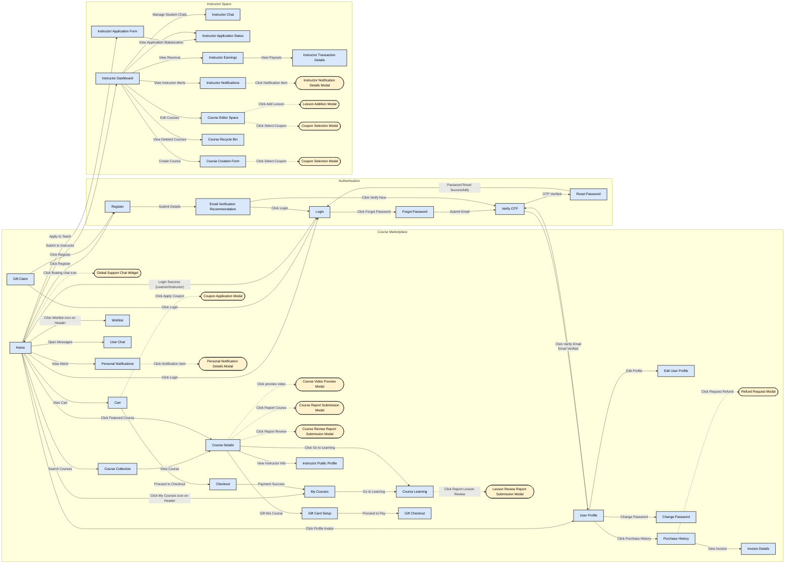
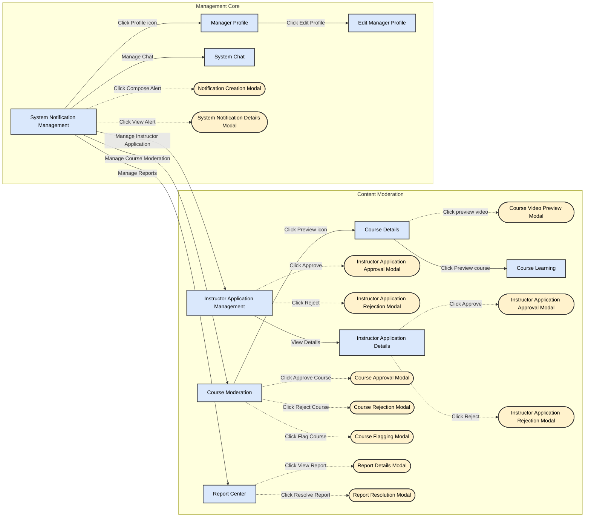
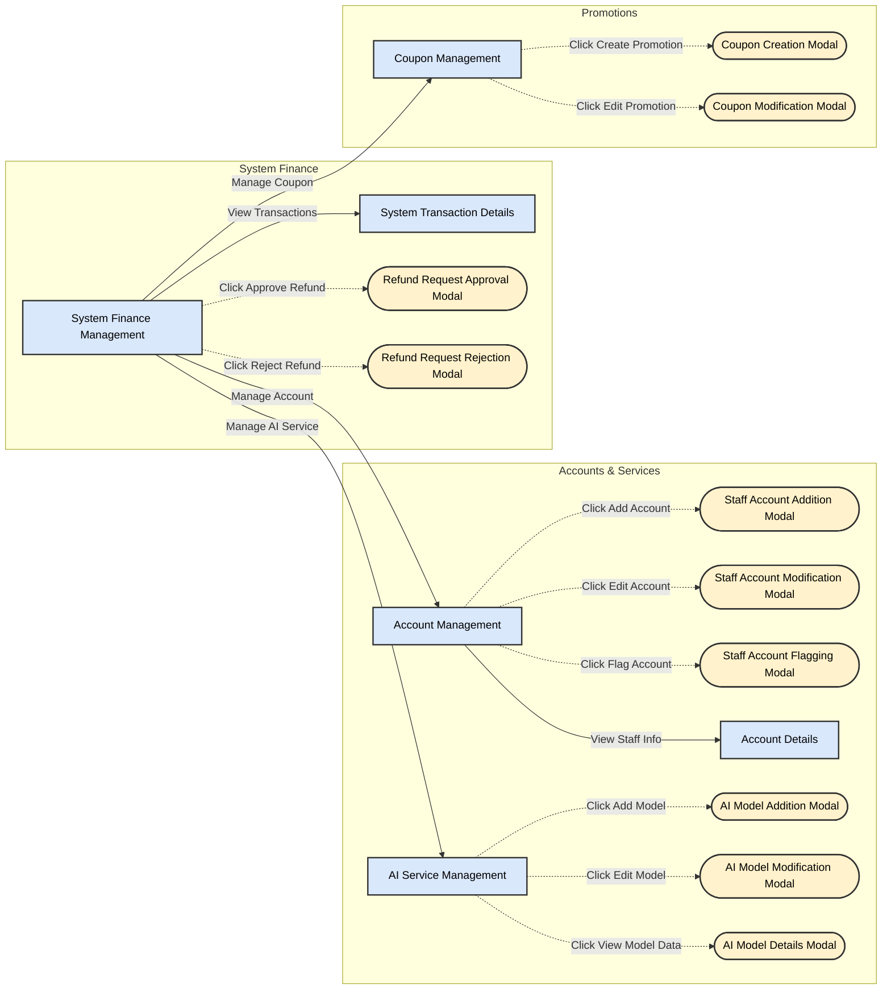

# Role-Based Screen Flow Diagrams

These diagrams illustrate the logical journey flows of the system partitioned into three core views. Nodes are grouped into Subgraphs to prevent spaghetti arrows and clearly outline feature domains.

## 1. Learner & Instructor Journey (Guest -> User -> Instructor)

## 2. Internal Operations (Staff & Admin Shared)

## 3. Executive Administration (Admin Only)

