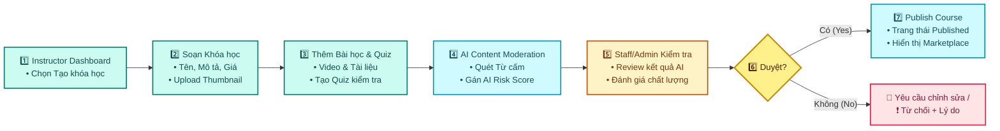
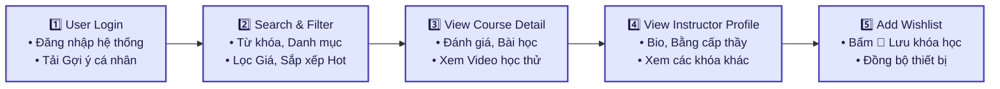
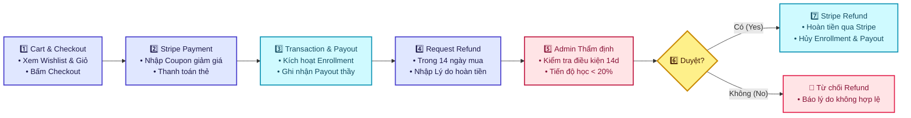
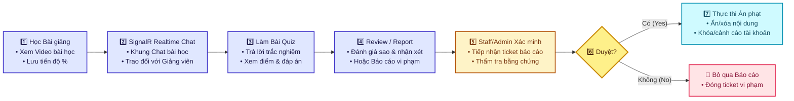
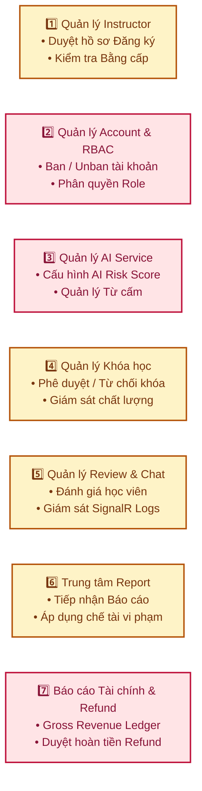

# 📊 BUSINESS WORKFLOWS – HỆ THỐNG LINKEDLEARN (MERMAID FLOWCHARTS)

Tài liệu chứa mã nguồn Mermaid Flowchart cho 6 quy trình nghiệp vụ chính của nền tảng **LinkedLearn**. Bạn có thể dùng trực tiếp trong GitHub Markdown, VS Code Mermaid Preview hoặc Notion.

---

## 👥 BẢNG MÀU QUY ĐỊNH VAI TRÒ (ACTORS)

| Actor | Tác nhân | Mã màu định danh |
| :--- | :--- | :--- |
| **Guest** | Khách vãng lai chưa đăng nhập | Slategray (`#64748b`) |
| **User** | Người dùng / Học viên | Indigo (`#4338ca`) |
| **Instructor** | Giảng viên / Người tạo khóa học | Teal (`#0f766e`) |
| **Staff** | Nhân viên kiểm duyệt / Hỗ trợ | Amber (`#b45309`) |
| **Admin** | Quản trị viên tối cao | Rose (`#be123c`) |
| **System** | Hệ thống xử lý tự động / Webhook / AI | Cyan (`#0891b2`) |

---

## 1️⃣ WORKFLOW 1: ONBOARDING & KÍCH HOẠT GIẢNG VIÊN

```mermaid
flowchart LR
    classDef guest fill:#f1f5f9,stroke:#64748b,stroke-width:2px,color:#0f172a
    classDef user fill:#e0e7ff,stroke:#4338ca,stroke-width:2px,color:#1e1b4b
    classDef system fill:#cffaff,stroke:#0891b2,stroke-width:2px,color:#164e63
    classDef staff fill:#fef3c7,stroke:#b45309,stroke-width:2px,color:#78350f
    classDef instructor fill:#ccfbf1,stroke:#0f766e,stroke-width:2px,color:#134e4a
    classDef decision fill:#fef08a,stroke:#ca8a04,stroke-width:2.5px,color:#451a03
    classDef reject fill:#ffe4e6,stroke:#e11d48,stroke-width:2px,color:#881337

    W1_1["1️⃣ Guest Đăng ký<br/>• Email & Mật khẩu<br/>• Tạo account User"]:::guest --> W1_2["2️⃣ User Nộp Hồ sơ<br/>• Bio, Kinh nghiệm<br/>• Bằng cấp, Chứng chỉ"]:::user
    W1_2 --> W1_3["3️⃣ System Tiếp nhận<br/>• Lưu Pending Profile<br/>• Báo Ticket cho Staff"]:::system
    W1_3 --> W1_4["4️⃣ Staff/Admin Kiểm tra<br/>• Xác minh thông tin<br/>• Đánh giá điều kiện"]:::staff
    W1_4 --> W1_5{"5️⃣ Duyệt?"}:::decision
    
    W1_5 -- "Có (Yes)" --> W1_6["6️⃣ System Kích hoạt<br/>• Đổi Role Instructor<br/>• Báo Link Stripe Connect"]:::system
    W1_6 --> W1_7["7️⃣ Stripe Onboarding<br/>• Nhập Bank Account<br/>• Hoàn tất Connect Payout"]:::instructor

    W1_5 -- "Không (No)" --> W1_R["📄 Yêu cầu bổ sung /<br/>❗ Từ chối + Lý do"]:::reject
```

---

## 2️⃣ WORKFLOW 2: TẠO KHÓA HỌC & AI/STAFF KIỂM DUYỆT

---

## 3️⃣ WORKFLOW 3: KHÁM PHÁ & TÌM KIẾM KHÓA HỌC

---

## 4️⃣ WORKFLOW 4: MUA HÀNG, THANH TOÁN & REFUND

---

## 5️⃣ WORKFLOW 5: HỌC TẬP, QUIZ & BÁO CÁO VI PHẠM

---

## 6️⃣ WORKFLOW 6: QUẢN TRỊ HỆ THỐNG (BACK-OFFICE MANAGEMENT)

> 💡 **Lưu ý**: Khối Back-Office gồm 7 Module quản trị độc lập hoạt động song song, không sử dụng mũi tên quy trình liên tiếp (`-->`).

