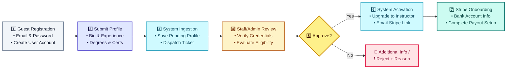
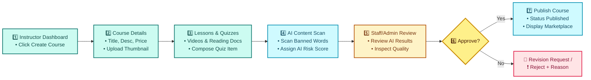
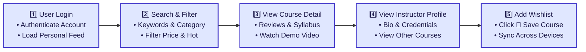
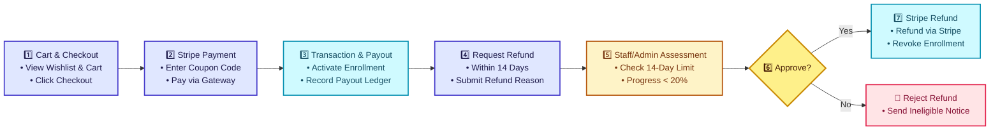
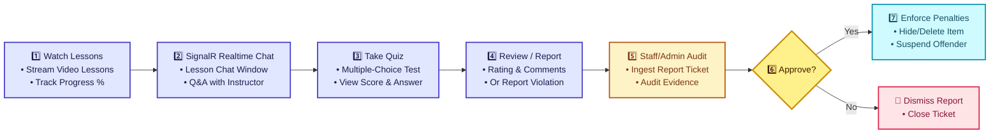
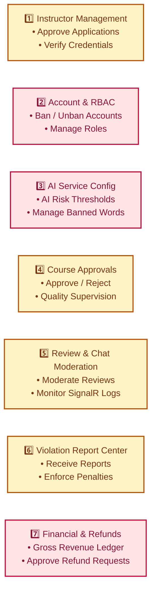

# 📊 BUSINESS WORKFLOWS – LINKEDLEARN PLATFORM (MERMAID FLOWCHARTS)

This document contains the Mermaid Flowchart source code for the 6 core business workflows of the **LinkedLearn** platform. You can use this directly in GitHub Markdown, VS Code Mermaid Preview, or Notion.

---

## 👥 SYSTEM ROLE COLOR SPECIFICATION

| Actor | Description | Color Code |
| :--- | :--- | :--- |
| **Guest** | Unauthenticated Visitor | Slategray (`#64748b`) |
| **User** | Enrolled Student | Indigo (`#4338ca`) |
| **Instructor** | Course Creator & Educator | Teal (`#0f766e`) |
| **Staff** | Moderation & Support Agent | Amber (`#b45309`) |
| **Admin** | Super Administrator | Rose (`#be123c`) |
| **System** | Automated Engine / Webhook / AI | Cyan (`#0891b2`) |

---

## 1️⃣ WORKFLOW 1: INSTRUCTOR ONBOARDING & ACTIVATION

---

## 2️⃣ WORKFLOW 2: COURSE CREATION & MODERATION

---

## 3️⃣ WORKFLOW 3: COURSE DISCOVERY & WISHLIST

---

## 4️⃣ WORKFLOW 4: CART, PAYMENT & REFUND

---

## 5️⃣ WORKFLOW 5: LEARNING, QUIZ & REPORT MODERATION

---

## 6️⃣ WORKFLOW 6: SYSTEM ADMINISTRATION (BACK-OFFICE MANAGEMENT)

> 💡 **Note**: The Back-Office consists of 7 independent management modules running in parallel; process flow arrows (`-->`) are omitted.

