<h6 style="font-family: 'Times New Roman', serif; font-size: 12pt; font-style: italic; color: blue; text-align: center; margin-top: 20px; margin-bottom: 10px;">Table 1. Source codes & documents</h6>
<table class="c30"><thead><tr class="c63"><td class="c52 c99" colspan="1" rowspan="1">
No.
</td><td class="c76" colspan="1" rowspan="1">
Items
</td><td class="c98" colspan="1" rowspan="1">
Sub-Items
</td><td class="c41 c99" colspan="1" rowspan="1">
Type
</td><td class="c52 c99" colspan="1" rowspan="1">
Version
</td></tr></thead><tbody></tbody><tr class="c63"><td class="c127" colspan="5" rowspan="1">
Code Package
</td></tr><tr class="c63"><td class="c52" colspan="1" rowspan="1">
1
</td><td class="c86" colspan="1" rowspan="1">
Backend API
</td><td class="c57" colspan="1" rowspan="1">
CourseMarketplaceBE.sln
</td><td class="c41" colspan="1" rowspan="1">
New
</td><td class="c52" colspan="1" rowspan="1">
1
</td></tr><tr class="c63"><td class="c52" colspan="1" rowspan="1">
2
</td><td class="c86" colspan="1" rowspan="1">
Frontend Web Client
</td><td class="c57" colspan="1" rowspan="1">
CourseMarketplaceFE.sln
</td><td class="c41" colspan="1" rowspan="1">
New
</td><td class="c52" colspan="1" rowspan="1">
1
</td></tr><tr class="c63"><td class="c52" colspan="1" rowspan="1">
3
</td><td class="c86" colspan="1" rowspan="1">
AI Moderation FastAPI
</td><td class="c57" colspan="1" rowspan="1">
None
</td><td class="c41" colspan="1" rowspan="1">
New
</td><td class="c52" colspan="1" rowspan="1">
1
</td></tr><tr class="c104"><td class="c106" colspan="5" rowspan="1">
Database
</td></tr><tr class="c63"><td class="c58" colspan="1" rowspan="1">
1
</td><td class="c94" colspan="1" rowspan="1">
PostgreSQL
</td><td class="c57" colspan="1" rowspan="1">
ocms_db.sql 
</td><td class="c41" colspan="1" rowspan="1">
New
</td><td class="c52" colspan="1" rowspan="1">
1
</td></tr><tr class="c63"><td class="c106" colspan="5" rowspan="1">
Documents
</td></tr><tr class="c63"><td class="c58" colspan="1" rowspan="1">
1
</td><td class="c94" colspan="1" rowspan="1">
Report 1
</td><td class="c57" colspan="1" rowspan="1">
Report1_ProjectIntroduction.docx
</td><td class="c41" colspan="1" rowspan="1">
New
</td><td class="c52" colspan="1" rowspan="1">
1
</td></tr><tr class="c63"><td class="c58" colspan="1" rowspan="1">
2
</td><td class="c94" colspan="1" rowspan="1">
Report 2
</td><td class="c57" colspan="1" rowspan="1">
Report2_ProjectManagementPlan.docx
</td><td class="c41" colspan="1" rowspan="1">
New
</td><td class="c52" colspan="1" rowspan="1">
1
</td></tr><tr class="c63"><td class="c58" colspan="1" rowspan="1">
3
</td><td class="c94" colspan="1" rowspan="1">
Report 3
</td><td class="c57" colspan="1" rowspan="1">
Report3_SoftwareRequirementSpecification.docx
</td><td class="c41" colspan="1" rowspan="1">
New
</td><td class="c52" colspan="1" rowspan="1">
1
</td></tr><tr class="c63"><td class="c58" colspan="1" rowspan="1">
4
</td><td class="c94" colspan="1" rowspan="1">
Report 4
</td><td class="c57" colspan="1" rowspan="1">
Report4_SoftwareDesignDocument.docx
</td><td class="c41" colspan="1" rowspan="1">
New
</td><td class="c52" colspan="1" rowspan="1">
1
</td></tr><tr class="c63"><td class="c52" colspan="1" rowspan="2">
5
</td><td class="c86" colspan="1" rowspan="2">
Report 5
</td><td class="c57" colspan="1" rowspan="1">
Report5_SoftwareTestDocumentation.docx
</td><td class="c41" colspan="1" rowspan="2">
New
</td><td class="c52" colspan="1" rowspan="2">
1
</td></tr><tr class="c63"><td class="c57" colspan="1" rowspan="1">
Report5_TestCaseDocument.xlsx
</td></tr><tr class="c63"><td class="c58" colspan="1" rowspan="1">
6
</td><td class="c94" colspan="1" rowspan="1">
Report 6
</td><td class="c57" colspan="1" rowspan="1">
Report6_SoftwareUserGuides.docx
</td><td class="c41" colspan="1" rowspan="1">
New
</td><td class="c52" colspan="1" rowspan="1">
1
</td></tr><tr class="c63"><td class="c58" colspan="1" rowspan="1">
7
</td><td class="c94" colspan="1" rowspan="1">
Report 7
</td><td class="c57" colspan="1" rowspan="1">
Report7_FinalProjectReport.docx
</td><td class="c41" colspan="1" rowspan="1">
New
</td><td class="c52" colspan="1" rowspan="1">
1
</td></tr></table>
 

<h5 style="font-family: 'Times New Roman', serif; font-size: 12pt; font-style: italic; color: blue; text-align: center; margin-top: 10px; margin-bottom: 20px;">Figure 1. Install Docker Desktop operation</h5>
 

<h5 style="font-family: 'Times New Roman', serif; font-size: 12pt; font-style: italic; color: blue; text-align: center; margin-top: 10px; margin-bottom: 20px;">Figure 2. Install Docker Desktop operation (2)</h5>
 
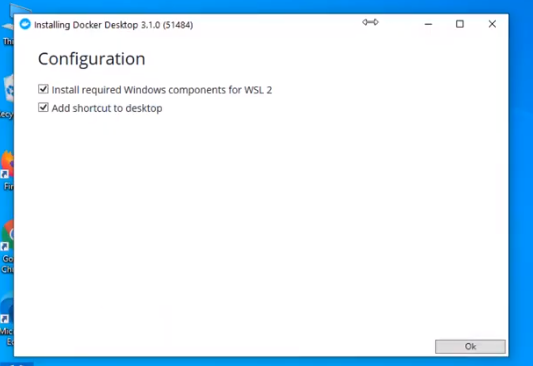
<h5 style="font-family: 'Times New Roman', serif; font-size: 12pt; font-style: italic; color: blue; text-align: center; margin-top: 10px; margin-bottom: 20px;">Figure 3. Install Docker Desktop operation (3)</h5>
 
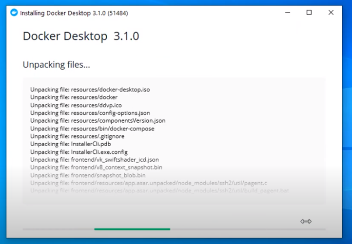
<h5 style="font-family: 'Times New Roman', serif; font-size: 12pt; font-style: italic; color: blue; text-align: center; margin-top: 10px; margin-bottom: 20px;">Figure 4. Install Docker Desktop operation (4)</h5>
 
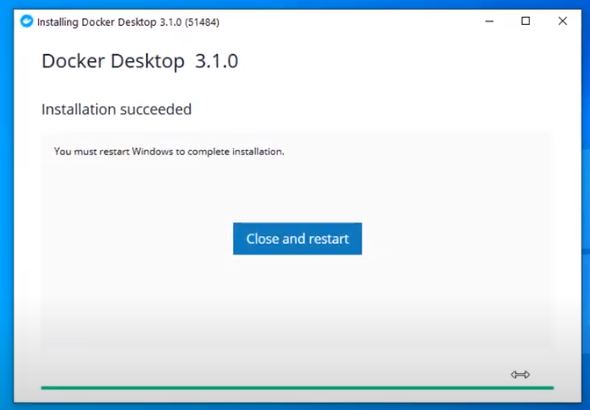
<h5 style="font-family: 'Times New Roman', serif; font-size: 12pt; font-style: italic; color: blue; text-align: center; margin-top: 10px; margin-bottom: 20px;">Figure 5. Install Docker Desktop operation (5)</h5>
 
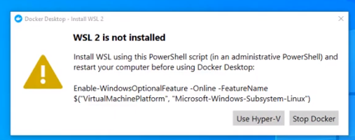
<h5 style="font-family: 'Times New Roman', serif; font-size: 12pt; font-style: italic; color: blue; text-align: center; margin-top: 10px; margin-bottom: 20px;">Figure 6. Install Docker Desktop operation (6)</h5>
 
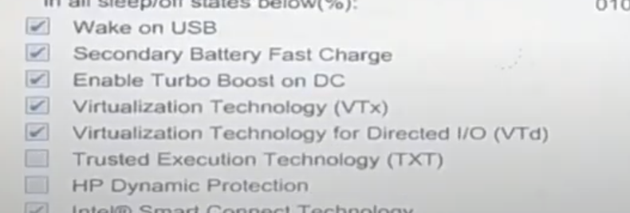
<h5 style="font-family: 'Times New Roman', serif; font-size: 12pt; font-style: italic; color: blue; text-align: center; margin-top: 10px; margin-bottom: 20px;">Figure 7. Install Docker Desktop operation (7)</h5>
 
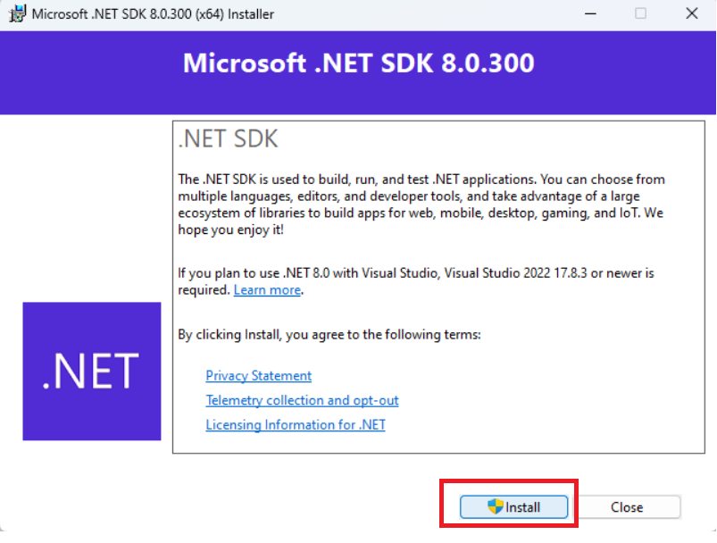
<h5 style="font-family: 'Times New Roman', serif; font-size: 12pt; font-style: italic; color: blue; text-align: center; margin-top: 10px; margin-bottom: 20px;">Figure 8. Install DotNet 8.0</h5>
 
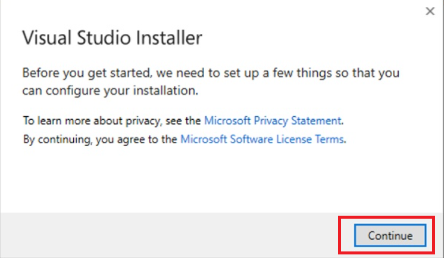
<h5 style="font-family: 'Times New Roman', serif; font-size: 12pt; font-style: italic; color: blue; text-align: center; margin-top: 10px; margin-bottom: 20px;">Figure 9. Install Visual Studio 2022</h5>
 
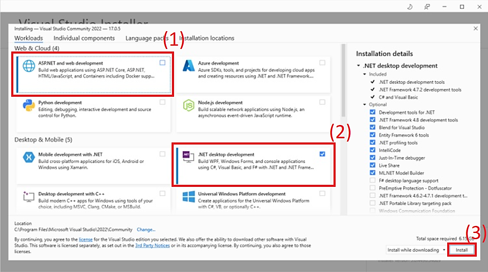
<h5 style="font-family: 'Times New Roman', serif; font-size: 12pt; font-style: italic; color: blue; text-align: center; margin-top: 10px; margin-bottom: 20px;">Figure 10. Install Visual Studio 2022 (2)</h5>
 
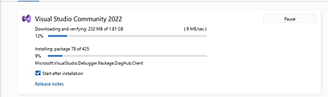
<h5 style="font-family: 'Times New Roman', serif; font-size: 12pt; font-style: italic; color: blue; text-align: center; margin-top: 10px; margin-bottom: 20px;">Figure 11. Waiting for installation</h5>
 
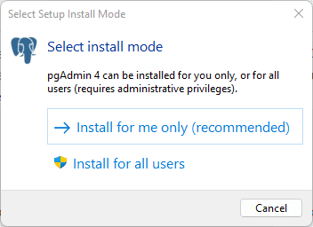
<h5 style="font-family: 'Times New Roman', serif; font-size: 12pt; font-style: italic; color: blue; text-align: center; margin-top: 10px; margin-bottom: 20px;">Figure 12. Install pgAdmin operation</h5>
 
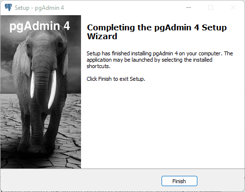
<h5 style="font-family: 'Times New Roman', serif; font-size: 12pt; font-style: italic; color: blue; text-align: center; margin-top: 10px; margin-bottom: 20px;">Figure 13. Install pgAdmin operation (2)</h5>
 
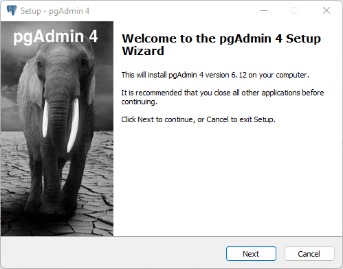
<h5 style="font-family: 'Times New Roman', serif; font-size: 12pt; font-style: italic; color: blue; text-align: center; margin-top: 10px; margin-bottom: 20px;">Figure 14. Install pgAdmin operation (3)</h5>
 
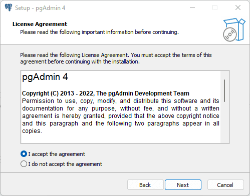
<h5 style="font-family: 'Times New Roman', serif; font-size: 12pt; font-style: italic; color: blue; text-align: center; margin-top: 10px; margin-bottom: 20px;">Figure 15. Install pgAdmin operation (4)</h5>
 
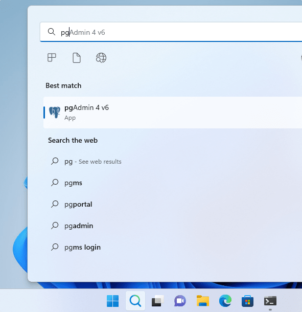
<h5 style="font-family: 'Times New Roman', serif; font-size: 12pt; font-style: italic; color: blue; text-align: center; margin-top: 10px; margin-bottom: 20px;">Figure 16. Install pgAdmin operation (5)</h5>
 
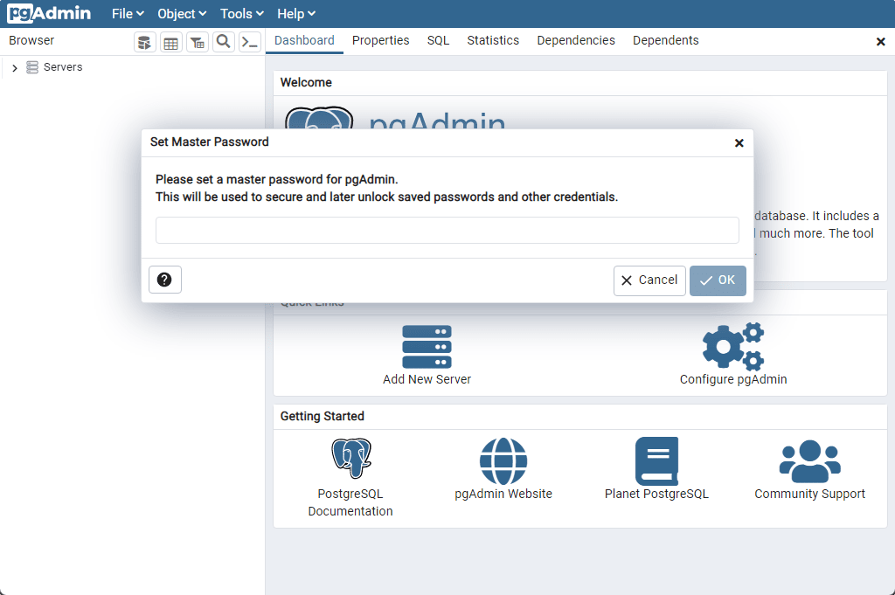
<h5 style="font-family: 'Times New Roman', serif; font-size: 12pt; font-style: italic; color: blue; text-align: center; margin-top: 10px; margin-bottom: 20px;">Figure 17. Install pgAdmin operation (6)</h5>
 
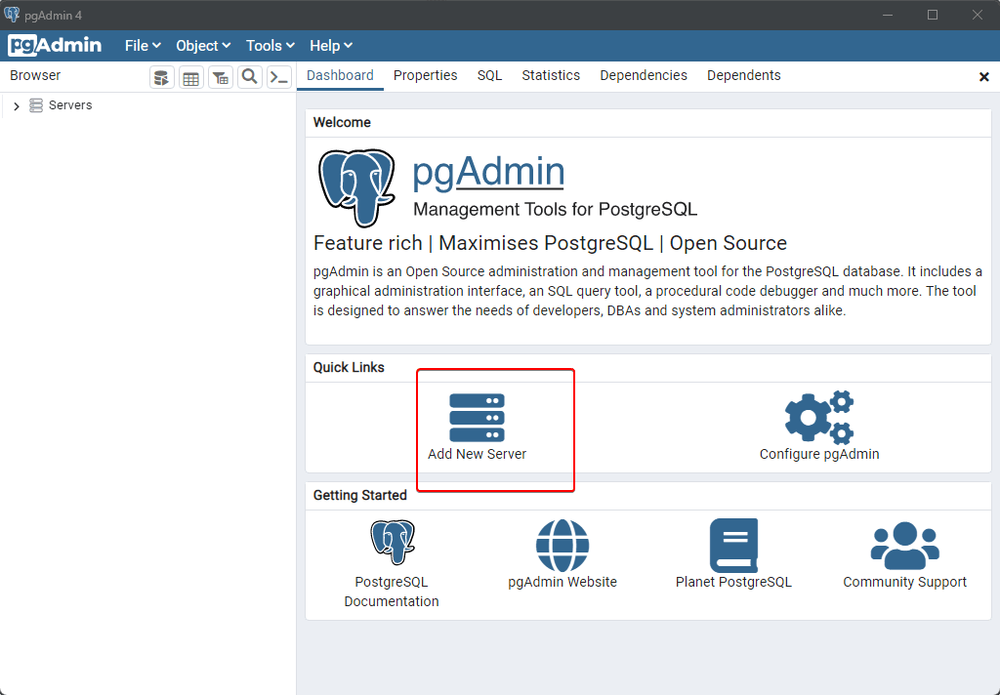
<h5 style="font-family: 'Times New Roman', serif; font-size: 12pt; font-style: italic; color: blue; text-align: center; margin-top: 10px; margin-bottom: 20px;">Figure 18. Install pgAdmin operation (7)</h5>
 
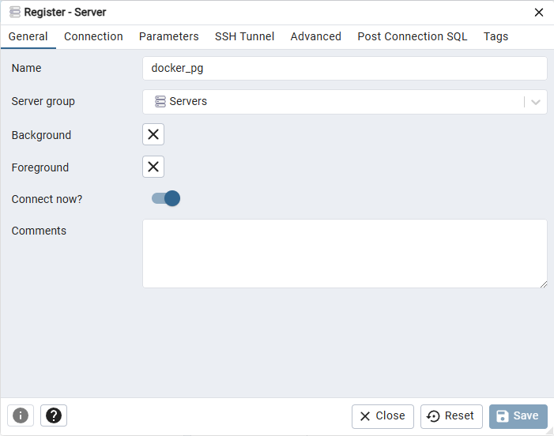
<h5 style="font-family: 'Times New Roman', serif; font-size: 12pt; font-style: italic; color: blue; text-align: center; margin-top: 10px; margin-bottom: 20px;">Figure 19. Install pgAdmin operation (8)</h5>
 
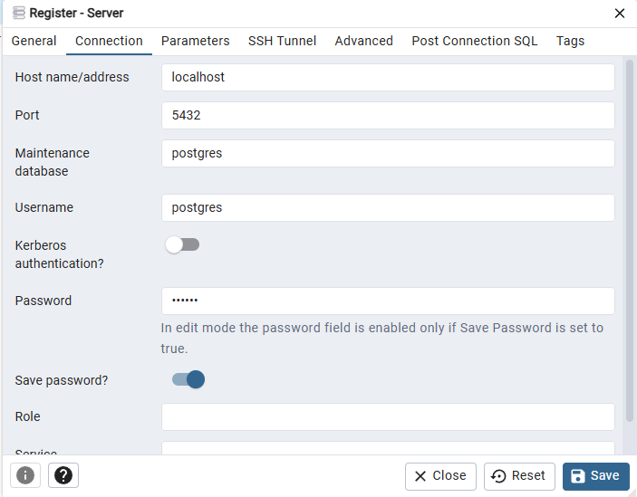
<h5 style="font-family: 'Times New Roman', serif; font-size: 12pt; font-style: italic; color: blue; text-align: center; margin-top: 10px; margin-bottom: 20px;">Figure 20. Install pgAdmin operation (9)</h5>
 
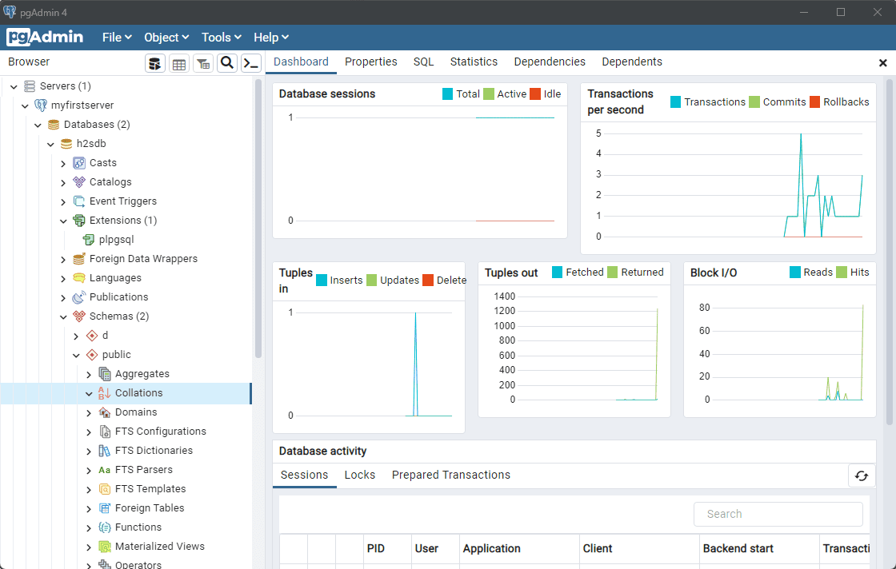
<h5 style="font-family: 'Times New Roman', serif; font-size: 12pt; font-style: italic; color: blue; text-align: center; margin-top: 10px; margin-bottom: 20px;">Figure 21. Install pgAdmin operation (10)</h5>
 
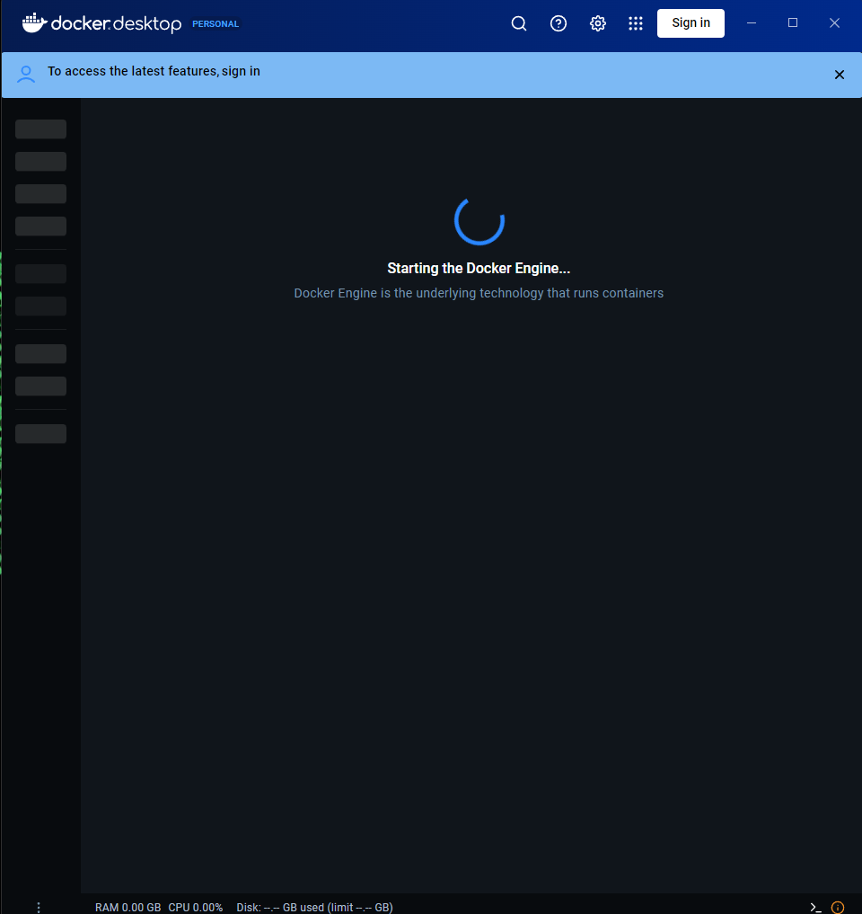
<h5 style="font-family: 'Times New Roman', serif; font-size: 12pt; font-style: italic; color: blue; text-align: center; margin-top: 10px; margin-bottom: 20px;">Figure 22. Docker Desktop initializing</h5>
 
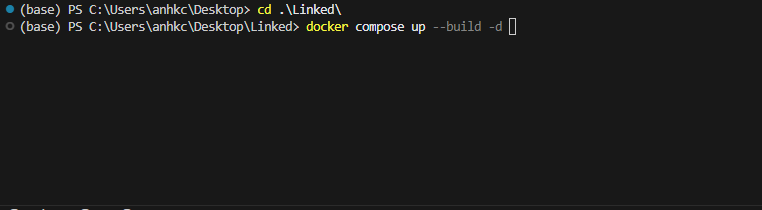
<h5 style="font-family: 'Times New Roman', serif; font-size: 12pt; font-style: italic; color: blue; text-align: center; margin-top: 10px; margin-bottom: 20px;">Figure 23. Command Line Interface</h5>
 

<h5 style="font-family: 'Times New Roman', serif; font-size: 12pt; font-style: italic; color: blue; text-align: center; margin-top: 10px; margin-bottom: 20px;">Figure 24. Application running on http://localhost:5208</h5>
 
<h6 style="font-family: 'Times New Roman', serif; font-size: 12pt; font-style: italic; color: blue; text-align: center; margin-top: 20px; margin-bottom: 10px;">Table 2. Terms and definitions</h6>
<table class="c30"><thead><tr class="c78"><td class="c66" colspan="1" rowspan="1">
No.
</td><td class="c101 c99" colspan="1" rowspan="1">
Term and definition
</td><td class="c25 c99" colspan="1" rowspan="1">
Description
</td></tr></thead><tbody></tbody><tr class="c63"><td class="c103" colspan="1" rowspan="1">
1
</td><td class="c101" colspan="1" rowspan="1">
Guest 
</td><td class="c25" colspan="1" rowspan="1">
An unregistered visitor who can browse published courses and view instructor profiles before registering an account.
</td></tr><tr class="c63"><td class="c103" colspan="1" rowspan="1">
2
</td><td class="c101" colspan="1" rowspan="1">
User
</td><td class="c25" colspan="1" rowspan="1">
A registered learner who can browse, purchase, and enroll in courses, take quizzes, and track their learning progress.
</td></tr><tr class="c63"><td class="c103" colspan="1" rowspan="1">
3
</td><td class="c101" colspan="1" rowspan="1">
Instructor 
</td><td class="c25" colspan="1" rowspan="1">
A user who creates and publishes courses, manages learning materials and quizzes, and tracks their course revenues and payouts. 
</td></tr><tr class="c63"><td class="c103" colspan="1" rowspan="1">
4
</td><td class="c101" colspan="1" rowspan="1">
Staff
</td><td class="c25" colspan="1" rowspan="1">
A manager responsible for moderating courses, processing instructor applications, resolving user reports, and handling customer support chats.
</td></tr><tr class="c63"><td class="c103" colspan="1" rowspan="1">
5 
</td><td class="c101" colspan="1" rowspan="1">
Admin
</td><td class="c25" colspan="1" rowspan="1">
The system administrator who manages user accounts, system configurations, AI moderation settings, financial policies, and oversees the entire platform.
</td></tr></table>
 

<h5 style="font-family: 'Times New Roman', serif; font-size: 12pt; font-style: italic; color: blue; text-align: center; margin-top: 10px; margin-bottom: 20px;">Figure 25. Register operation</h5>
 

<h5 style="font-family: 'Times New Roman', serif; font-size: 12pt; font-style: italic; color: blue; text-align: center; margin-top: 10px; margin-bottom: 20px;">Figure 26. Register operation (2)</h5>
 

<h5 style="font-family: 'Times New Roman', serif; font-size: 12pt; font-style: italic; color: blue; text-align: center; margin-top: 10px; margin-bottom: 20px;">Figure 27. Login operation</h5>
 

<h5 style="font-family: 'Times New Roman', serif; font-size: 12pt; font-style: italic; color: blue; text-align: center; margin-top: 10px; margin-bottom: 20px;">Figure 28. Login operation (2)</h5>
 

<h5 style="font-family: 'Times New Roman', serif; font-size: 12pt; font-style: italic; color: blue; text-align: center; margin-top: 10px; margin-bottom: 20px;">Figure 29. Login with Google operation</h5>
 

<h5 style="font-family: 'Times New Roman', serif; font-size: 12pt; font-style: italic; color: blue; text-align: center; margin-top: 10px; margin-bottom: 20px;">Figure 30. Login with Google operation (2)</h5>
 

<h5 style="font-family: 'Times New Roman', serif; font-size: 12pt; font-style: italic; color: blue; text-align: center; margin-top: 10px; margin-bottom: 20px;">Figure 31. Login with Google operation (3)</h5>
 

<h5 style="font-family: 'Times New Roman', serif; font-size: 12pt; font-style: italic; color: blue; text-align: center; margin-top: 10px; margin-bottom: 20px;">Figure 32. Verify Email operation</h5>
 
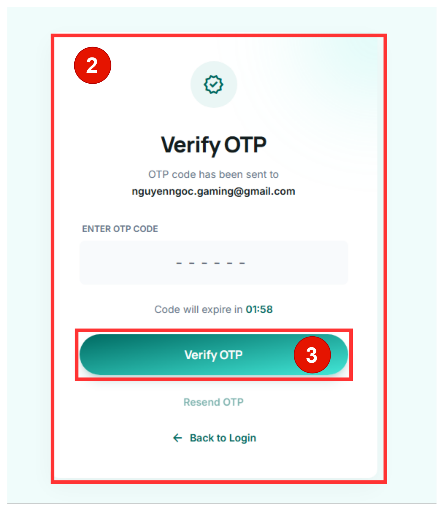
<h5 style="font-family: 'Times New Roman', serif; font-size: 12pt; font-style: italic; color: blue; text-align: center; margin-top: 10px; margin-bottom: 20px;">Figure 33. Verify Email operation (2)</h5>
 

<h5 style="font-family: 'Times New Roman', serif; font-size: 12pt; font-style: italic; color: blue; text-align: center; margin-top: 10px; margin-bottom: 20px;">Figure 34. Change Password operation</h5>
 
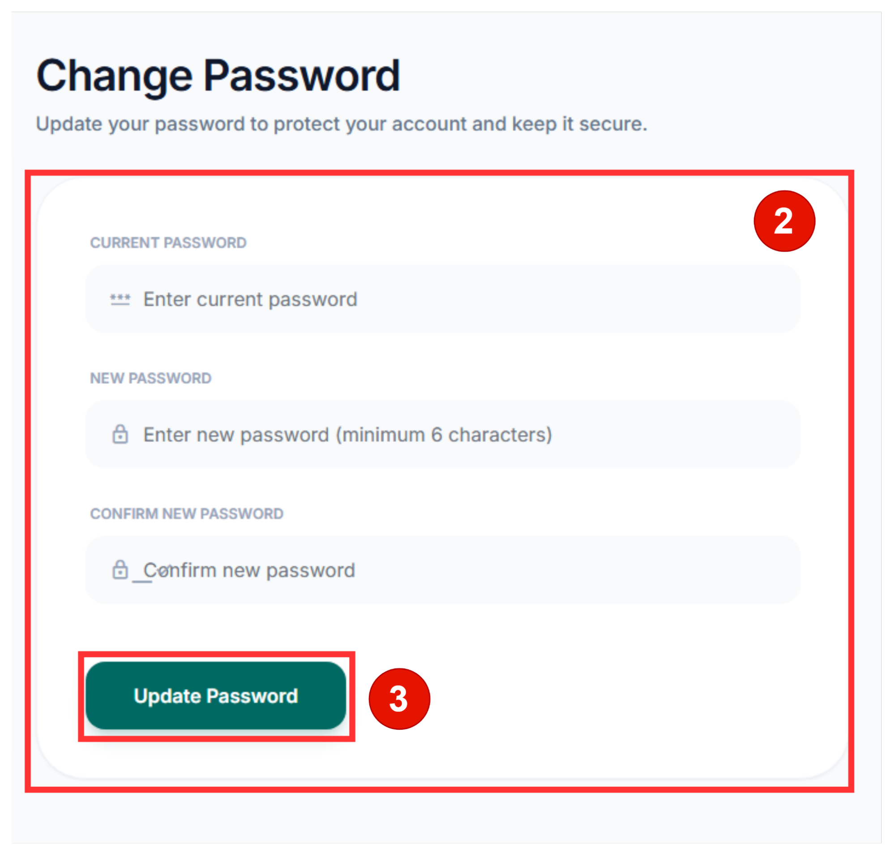
<h5 style="font-family: 'Times New Roman', serif; font-size: 12pt; font-style: italic; color: blue; text-align: center; margin-top: 10px; margin-bottom: 20px;">Figure 35. Change Password operation (2)</h5>
 

<h5 style="font-family: 'Times New Roman', serif; font-size: 12pt; font-style: italic; color: blue; text-align: center; margin-top: 10px; margin-bottom: 20px;">Figure 36. Forget Password operation</h5>
 

<h5 style="font-family: 'Times New Roman', serif; font-size: 12pt; font-style: italic; color: blue; text-align: center; margin-top: 10px; margin-bottom: 20px;">Figure 37. Forget Password operation (2)</h5>
 

<h5 style="font-family: 'Times New Roman', serif; font-size: 12pt; font-style: italic; color: blue; text-align: center; margin-top: 10px; margin-bottom: 20px;">Figure 38. Forget Password operation (3)</h5>
 
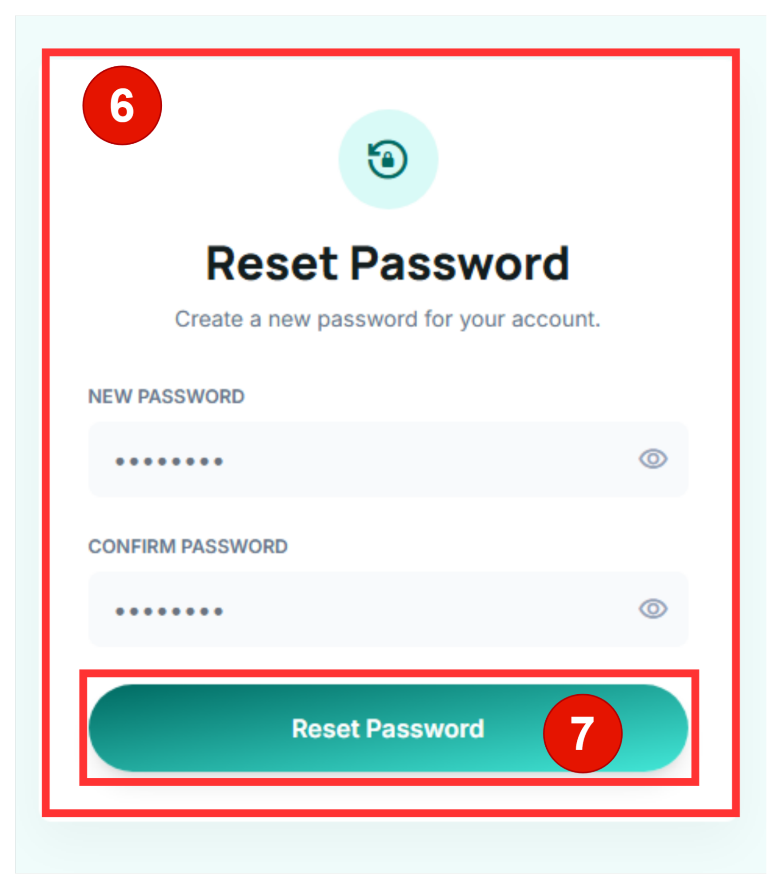
<h5 style="font-family: 'Times New Roman', serif; font-size: 12pt; font-style: italic; color: blue; text-align: center; margin-top: 10px; margin-bottom: 20px;">Figure 39. Forget Password operation (4)</h5>
 
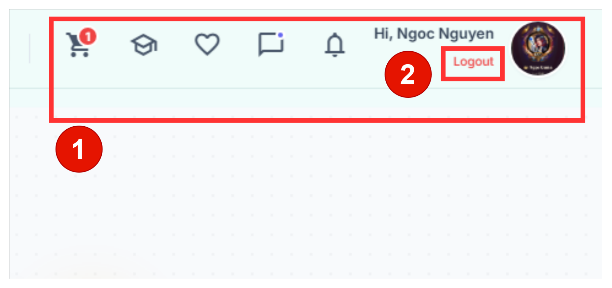
<h5 style="font-family: 'Times New Roman', serif; font-size: 12pt; font-style: italic; color: blue; text-align: center; margin-top: 10px; margin-bottom: 20px;">Figure 40. Logout operation</h5>
 
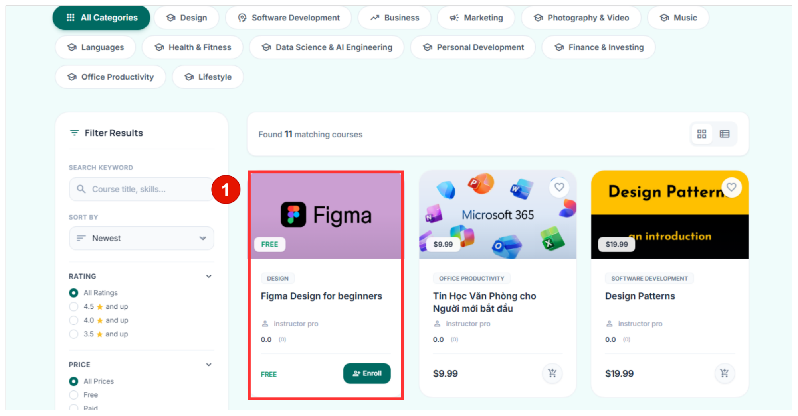
<h5 style="font-family: 'Times New Roman', serif; font-size: 12pt; font-style: italic; color: blue; text-align: center; margin-top: 10px; margin-bottom: 20px;">Figure 41. Add wishlist items operation</h5>
 
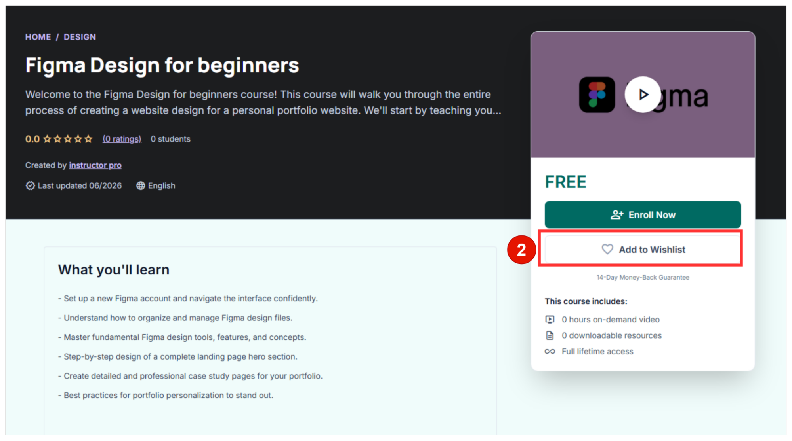
<h5 style="font-family: 'Times New Roman', serif; font-size: 12pt; font-style: italic; color: blue; text-align: center; margin-top: 10px; margin-bottom: 20px;">Figure 42. Add wishlist items operation (2)</h5>
 
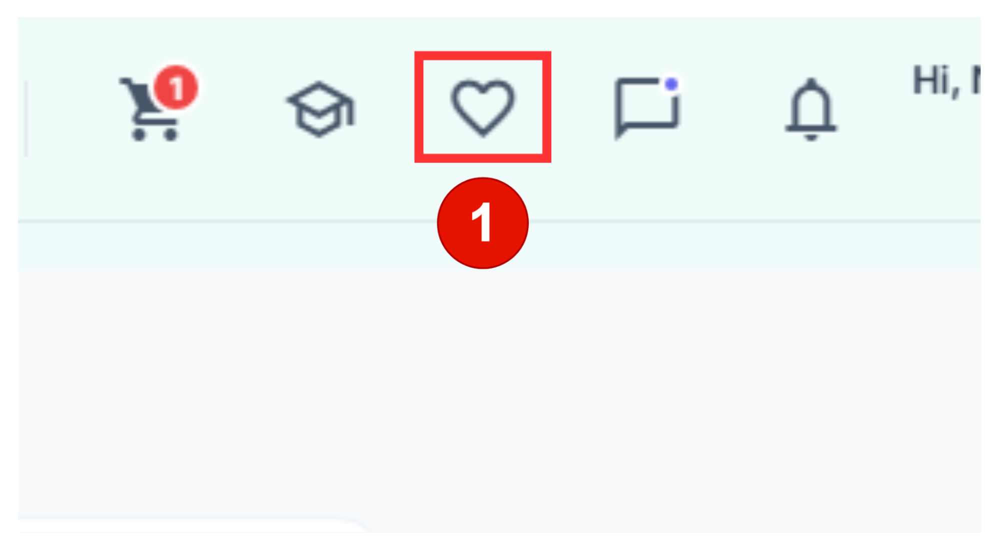
<h5 style="font-family: 'Times New Roman', serif; font-size: 12pt; font-style: italic; color: blue; text-align: center; margin-top: 10px; margin-bottom: 20px;">Figure 43. View Wishlist operation</h5>
 

<h5 style="font-family: 'Times New Roman', serif; font-size: 12pt; font-style: italic; color: blue; text-align: center; margin-top: 10px; margin-bottom: 20px;">Figure 44. View Wishlist operation (2)</h5>
 
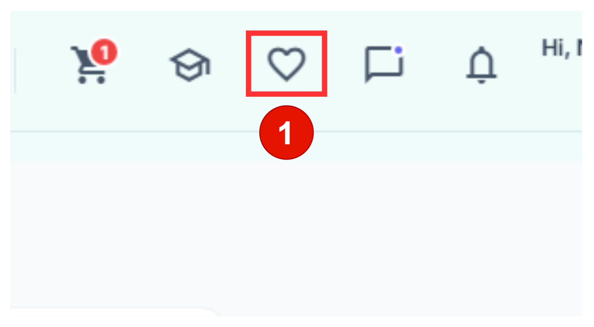
<h5 style="font-family: 'Times New Roman', serif; font-size: 12pt; font-style: italic; color: blue; text-align: center; margin-top: 10px; margin-bottom: 20px;">Figure 45. Delete Wishlist Items operation</h5>
 

<h5 style="font-family: 'Times New Roman', serif; font-size: 12pt; font-style: italic; color: blue; text-align: center; margin-top: 10px; margin-bottom: 20px;">Figure 46. Delete Wishlist Items operation (2)</h5>
 

<h5 style="font-family: 'Times New Roman', serif; font-size: 12pt; font-style: italic; color: blue; text-align: center; margin-top: 10px; margin-bottom: 20px;">Figure 47. View Course Moderation List operation</h5>
 

<h5 style="font-family: 'Times New Roman', serif; font-size: 12pt; font-style: italic; color: blue; text-align: center; margin-top: 10px; margin-bottom: 20px;">Figure 48. View Course Moderation List operation (2)</h5>
 
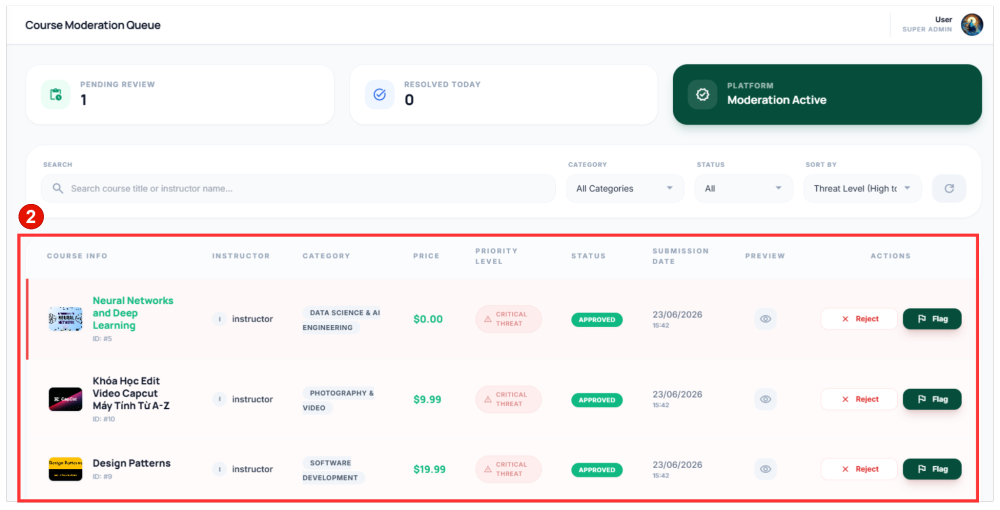
<h5 style="font-family: 'Times New Roman', serif; font-size: 12pt; font-style: italic; color: blue; text-align: center; margin-top: 10px; margin-bottom: 20px;">Figure 49. View Course Moderation List operation (3)</h5>
 
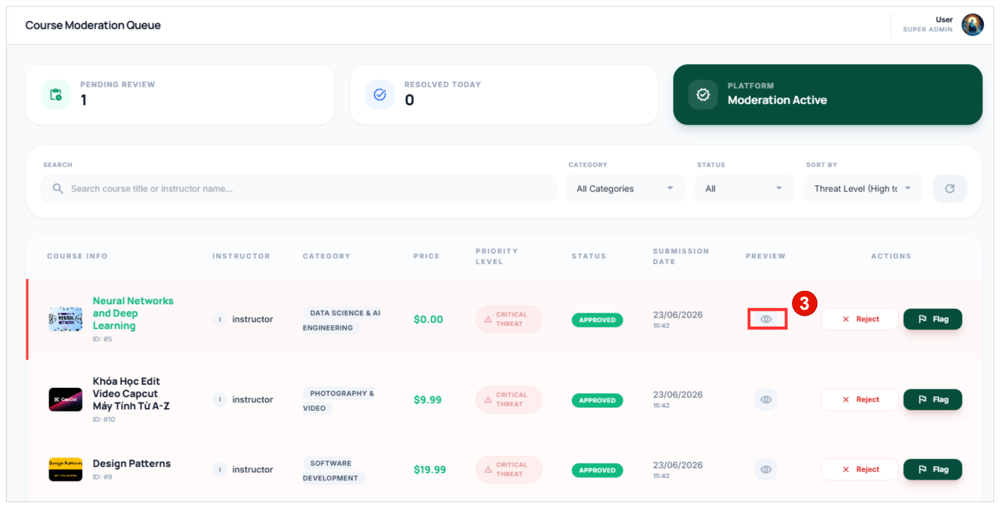
<h5 style="font-family: 'Times New Roman', serif; font-size: 12pt; font-style: italic; color: blue; text-align: center; margin-top: 10px; margin-bottom: 20px;">Figure 50. View Course Moderation List operation (4)</h5>
 
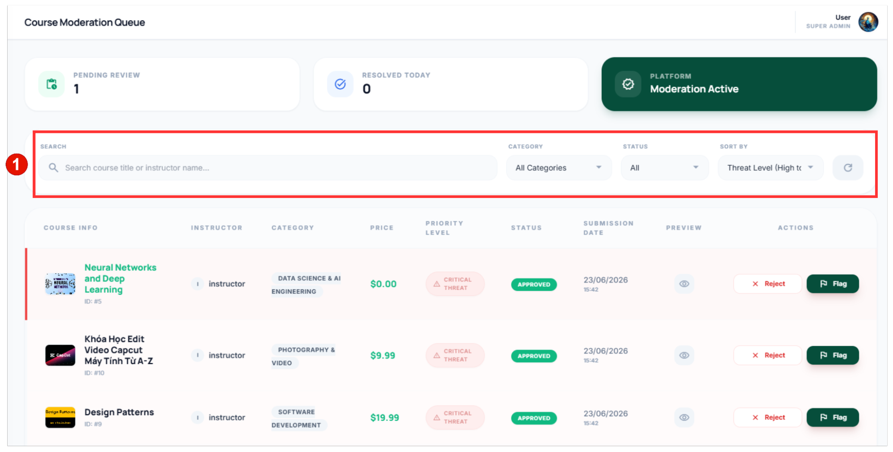
<h5 style="font-family: 'Times New Roman', serif; font-size: 12pt; font-style: italic; color: blue; text-align: center; margin-top: 10px; margin-bottom: 20px;">Figure 51. Search Courses operation</h5>
 
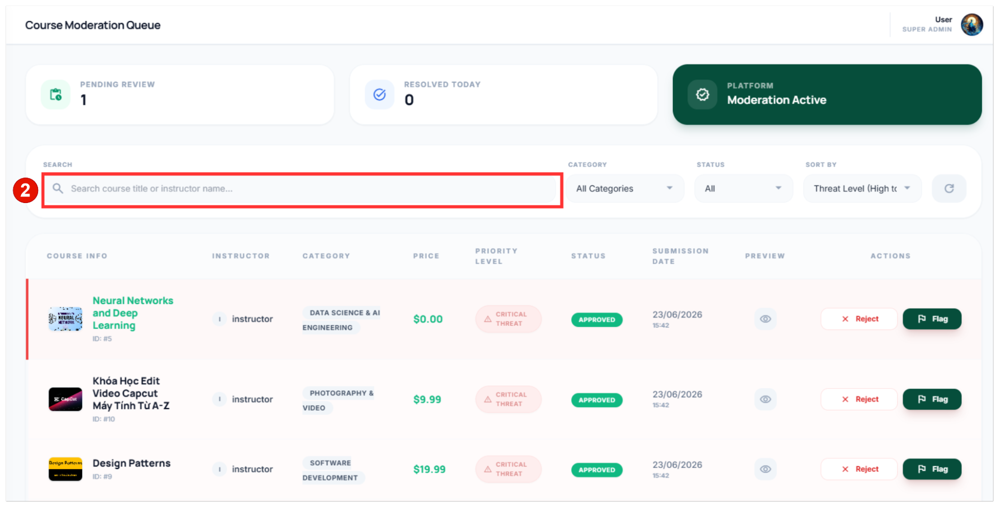
<h5 style="font-family: 'Times New Roman', serif; font-size: 12pt; font-style: italic; color: blue; text-align: center; margin-top: 10px; margin-bottom: 20px;">Figure 52. Search Courses operation (2)</h5>
 
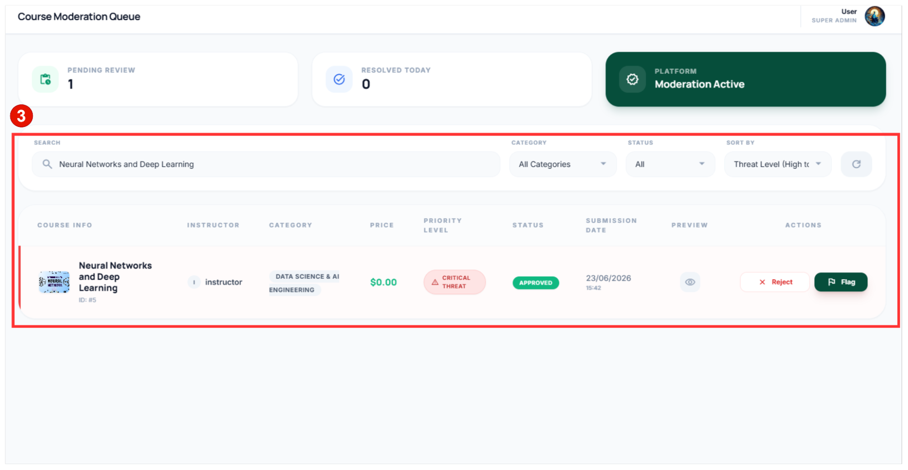
<h5 style="font-family: 'Times New Roman', serif; font-size: 12pt; font-style: italic; color: blue; text-align: center; margin-top: 10px; margin-bottom: 20px;">Figure 53. Search Courses operation (3)</h5>
 
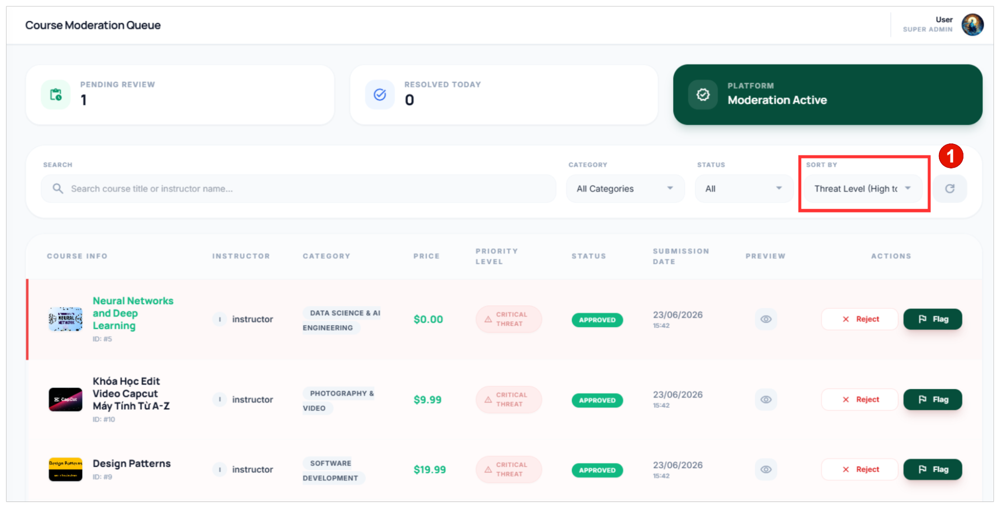
<h5 style="font-family: 'Times New Roman', serif; font-size: 12pt; font-style: italic; color: blue; text-align: center; margin-top: 10px; margin-bottom: 20px;">Figure 54. Sort Courses operation</h5>
 
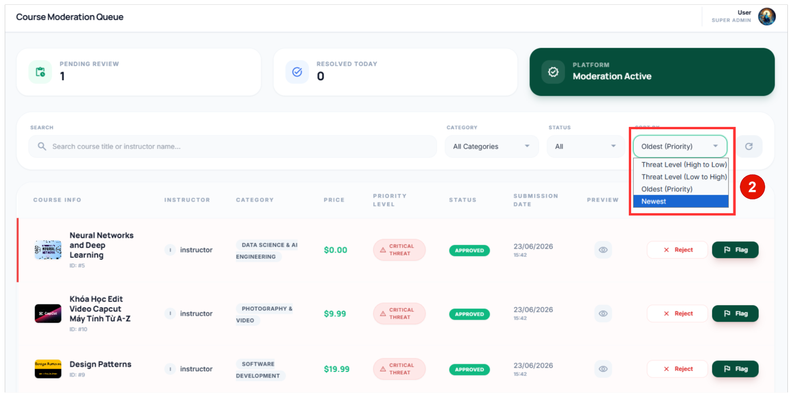
<h5 style="font-family: 'Times New Roman', serif; font-size: 12pt; font-style: italic; color: blue; text-align: center; margin-top: 10px; margin-bottom: 20px;">Figure 55. Sort Courses operation (2)</h5>
 
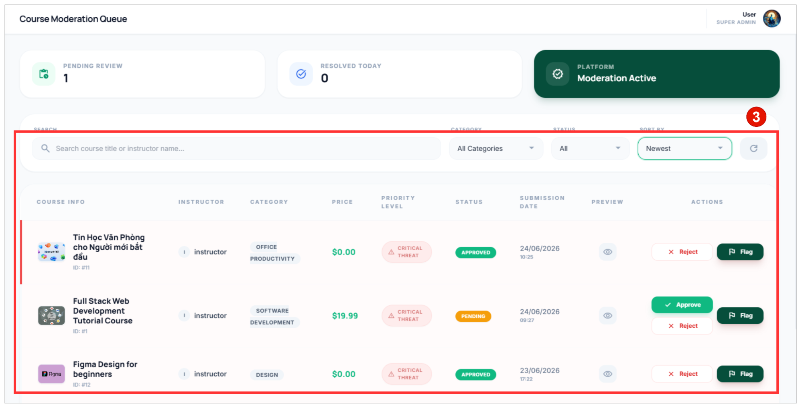
<h5 style="font-family: 'Times New Roman', serif; font-size: 12pt; font-style: italic; color: blue; text-align: center; margin-top: 10px; margin-bottom: 20px;">Figure 56. Sort Courses operation (3)</h5>
 
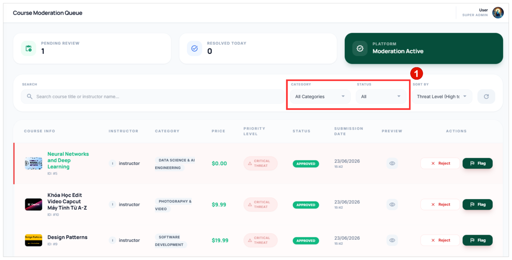
<h5 style="font-family: 'Times New Roman', serif; font-size: 12pt; font-style: italic; color: blue; text-align: center; margin-top: 10px; margin-bottom: 20px;">Figure 57. Filter Courses operation</h5>
 
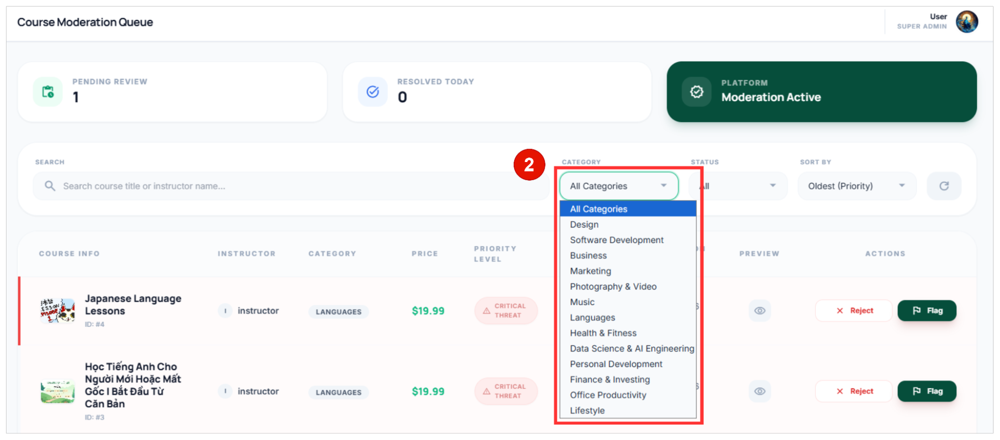
<h5 style="font-family: 'Times New Roman', serif; font-size: 12pt; font-style: italic; color: blue; text-align: center; margin-top: 10px; margin-bottom: 20px;">Figure 58. Filter Courses operation (2)</h5>
 
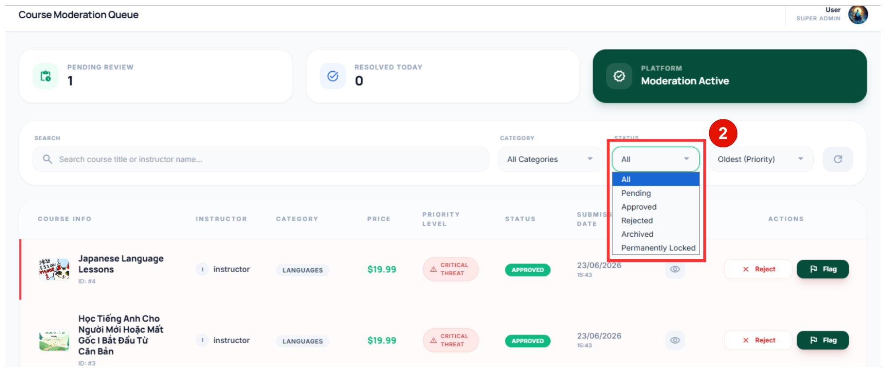
<h5 style="font-family: 'Times New Roman', serif; font-size: 12pt; font-style: italic; color: blue; text-align: center; margin-top: 10px; margin-bottom: 20px;">Figure 59. Filter Courses operation (3)</h5>
 
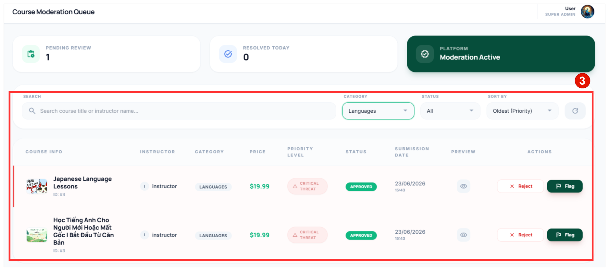
<h5 style="font-family: 'Times New Roman', serif; font-size: 12pt; font-style: italic; color: blue; text-align: center; margin-top: 10px; margin-bottom: 20px;">Figure 60. Filter Courses operation (4)</h5>
 
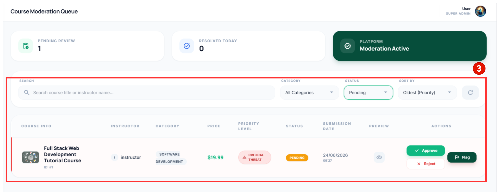
<h5 style="font-family: 'Times New Roman', serif; font-size: 12pt; font-style: italic; color: blue; text-align: center; margin-top: 10px; margin-bottom: 20px;">Figure 61. Filter Courses operation (5)</h5>
 
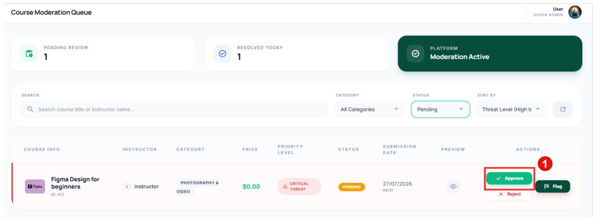
<h5 style="font-family: 'Times New Roman', serif; font-size: 12pt; font-style: italic; color: blue; text-align: center; margin-top: 10px; margin-bottom: 20px;">Figure 62. Approve Course Submission operation</h5>
 
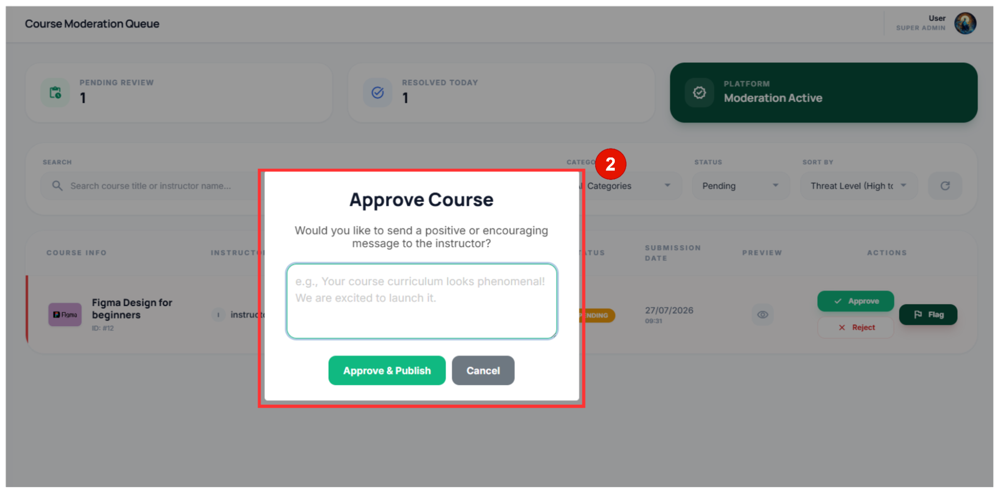
<h5 style="font-family: 'Times New Roman', serif; font-size: 12pt; font-style: italic; color: blue; text-align: center; margin-top: 10px; margin-bottom: 20px;">Figure 63. Approve Course Submission operation (2)</h5>
 
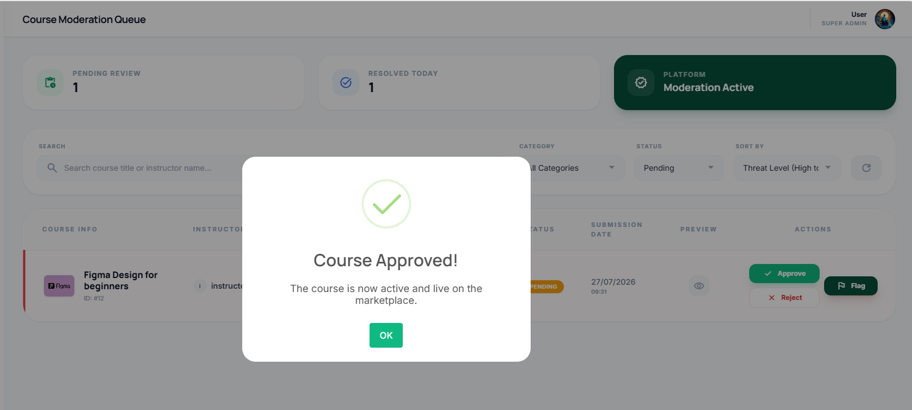
<h5 style="font-family: 'Times New Roman', serif; font-size: 12pt; font-style: italic; color: blue; text-align: center; margin-top: 10px; margin-bottom: 20px;">Figure 64. Approve Course Submission operation (3)</h5>
 
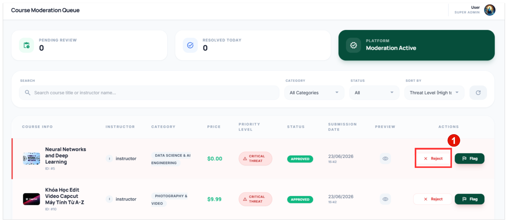
<h5 style="font-family: 'Times New Roman', serif; font-size: 12pt; font-style: italic; color: blue; text-align: center; margin-top: 10px; margin-bottom: 20px;">Figure 65. Reject Course Submission operation</h5>
 
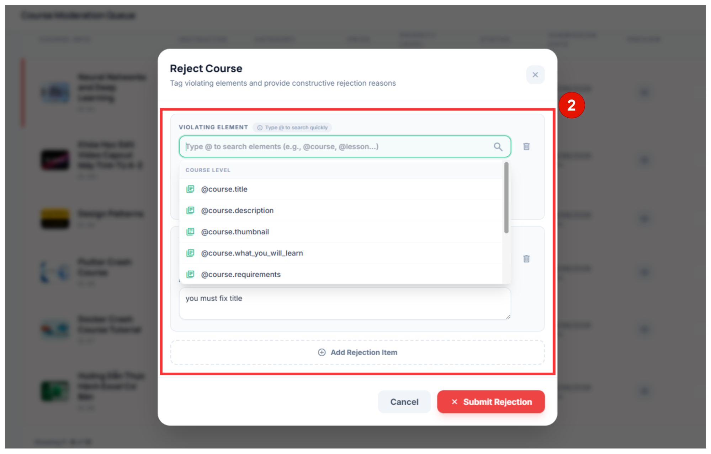
<h5 style="font-family: 'Times New Roman', serif; font-size: 12pt; font-style: italic; color: blue; text-align: center; margin-top: 10px; margin-bottom: 20px;">Figure 66. Reject Course Submission operation (2)</h5>
 
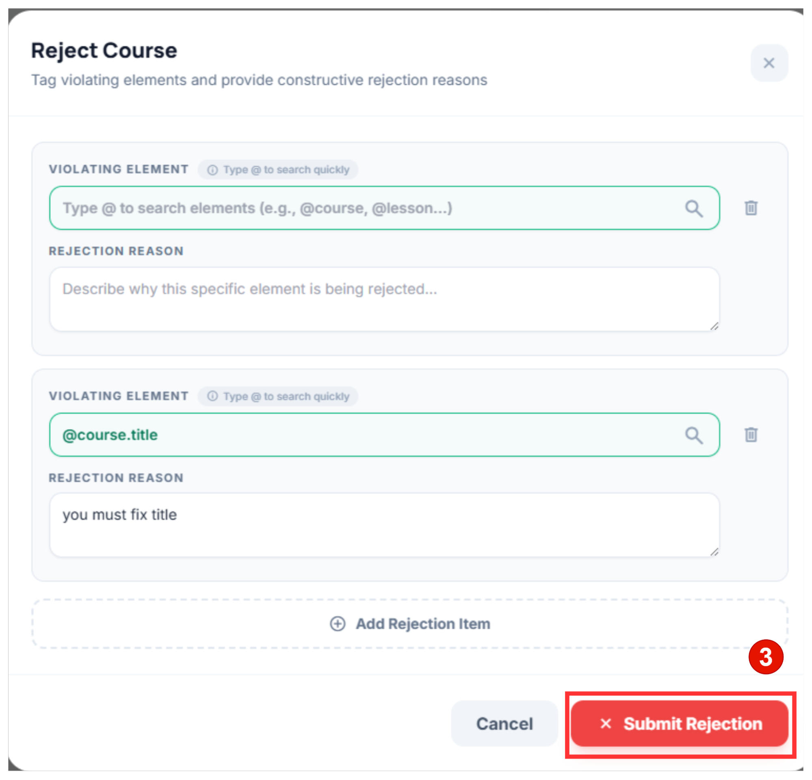
<h5 style="font-family: 'Times New Roman', serif; font-size: 12pt; font-style: italic; color: blue; text-align: center; margin-top: 10px; margin-bottom: 20px;">Figure 67. Reject Course Submission operation (3)</h5>
 

<h5 style="font-family: 'Times New Roman', serif; font-size: 12pt; font-style: italic; color: blue; text-align: center; margin-top: 10px; margin-bottom: 20px;">Figure 68. Reject Course Submission operation (4)</h5>
 
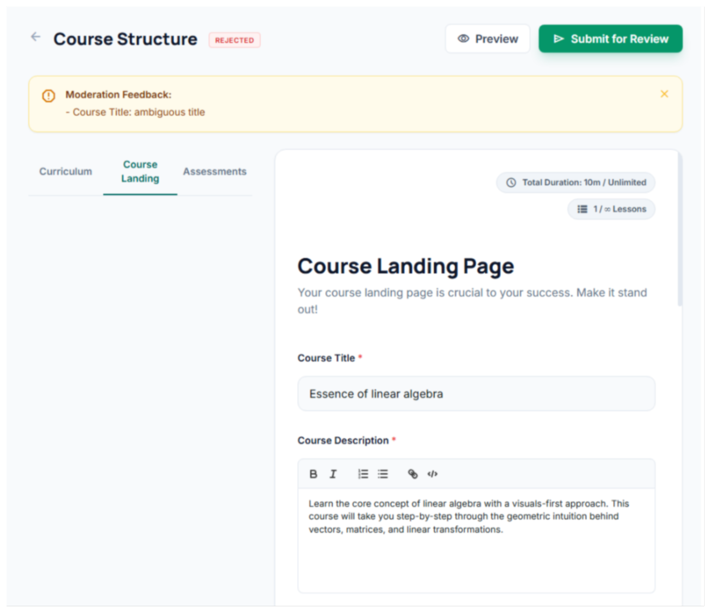
<h5 style="font-family: 'Times New Roman', serif; font-size: 12pt; font-style: italic; color: blue; text-align: center; margin-top: 10px; margin-bottom: 20px;">Figure 69. Reject Course Submission operation (5)</h5>
 
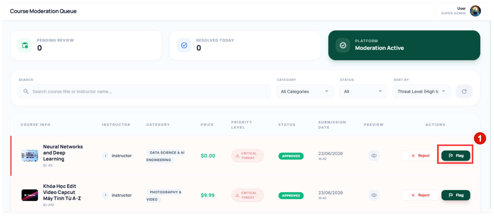
<h5 style="font-family: 'Times New Roman', serif; font-size: 12pt; font-style: italic; color: blue; text-align: center; margin-top: 10px; margin-bottom: 20px;">Figure 70. Flag Course for Content Violation operation</h5>
 

<h5 style="font-family: 'Times New Roman', serif; font-size: 12pt; font-style: italic; color: blue; text-align: center; margin-top: 10px; margin-bottom: 20px;">Figure 71. Flag Course for Content Violation operation (2)</h5>
 

<h5 style="font-family: 'Times New Roman', serif; font-size: 12pt; font-style: italic; color: blue; text-align: center; margin-top: 10px; margin-bottom: 20px;">Figure 72. Flag Course for Content Violation operation (3)</h5>
 

<h5 style="font-family: 'Times New Roman', serif; font-size: 12pt; font-style: italic; color: blue; text-align: center; margin-top: 10px; margin-bottom: 20px;">Figure 73. Flag Course for Content Violation operation (4)</h5>
 

<h5 style="font-family: 'Times New Roman', serif; font-size: 12pt; font-style: italic; color: blue; text-align: center; margin-top: 10px; margin-bottom: 20px;">Figure 74. Become An Instructor operation</h5>
 

<h5 style="font-family: 'Times New Roman', serif; font-size: 12pt; font-style: italic; color: blue; text-align: center; margin-top: 10px; margin-bottom: 20px;">Figure 75. Become An Instructor operation (2)</h5>
 

<h5 style="font-family: 'Times New Roman', serif; font-size: 12pt; font-style: italic; color: blue; text-align: center; margin-top: 10px; margin-bottom: 20px;">Figure 76. View Instructor Applications operation</h5>
 

<h5 style="font-family: 'Times New Roman', serif; font-size: 12pt; font-style: italic; color: blue; text-align: center; margin-top: 10px; margin-bottom: 20px;">Figure 77. View Instructor Applications operation (2)</h5>
 

<h5 style="font-family: 'Times New Roman', serif; font-size: 12pt; font-style: italic; color: blue; text-align: center; margin-top: 10px; margin-bottom: 20px;">Figure 78. View Instructor Applications Detail operation</h5>
 

<h5 style="font-family: 'Times New Roman', serif; font-size: 12pt; font-style: italic; color: blue; text-align: center; margin-top: 10px; margin-bottom: 20px;">Figure 79. View Instructor Applications Detail operation (2)</h5>
 

<h5 style="font-family: 'Times New Roman', serif; font-size: 12pt; font-style: italic; color: blue; text-align: center; margin-top: 10px; margin-bottom: 20px;">Figure 80. Approve Instructor Application operation</h5>
 

<h5 style="font-family: 'Times New Roman', serif; font-size: 12pt; font-style: italic; color: blue; text-align: center; margin-top: 10px; margin-bottom: 20px;">Figure 81. Approve Instructor Application operation (2)</h5>
 

<h5 style="font-family: 'Times New Roman', serif; font-size: 12pt; font-style: italic; color: blue; text-align: center; margin-top: 10px; margin-bottom: 20px;">Figure 82. Reject Instructor Application operation</h5>
 

<h5 style="font-family: 'Times New Roman', serif; font-size: 12pt; font-style: italic; color: blue; text-align: center; margin-top: 10px; margin-bottom: 20px;">Figure 83. Reject Instructor Application operation (2)</h5>
 

<h5 style="font-family: 'Times New Roman', serif; font-size: 12pt; font-style: italic; color: blue; text-align: center; margin-top: 10px; margin-bottom: 20px;">Figure 84. Search Instructor Applications operation</h5>
 

<h5 style="font-family: 'Times New Roman', serif; font-size: 12pt; font-style: italic; color: blue; text-align: center; margin-top: 10px; margin-bottom: 20px;">Figure 85. Search Instructor Applications operation (2)</h5>
 

<h5 style="font-family: 'Times New Roman', serif; font-size: 12pt; font-style: italic; color: blue; text-align: center; margin-top: 10px; margin-bottom: 20px;">Figure 86. Filter Instructor Applications operation</h5>
 

<h5 style="font-family: 'Times New Roman', serif; font-size: 12pt; font-style: italic; color: blue; text-align: center; margin-top: 10px; margin-bottom: 20px;">Figure 87. Sort Instructor Applications operation</h5>
 

<h5 style="font-family: 'Times New Roman', serif; font-size: 12pt; font-style: italic; color: blue; text-align: center; margin-top: 10px; margin-bottom: 20px;">Figure 88. View Notification list operation</h5>
 

<h5 style="font-family: 'Times New Roman', serif; font-size: 12pt; font-style: italic; color: blue; text-align: center; margin-top: 10px; margin-bottom: 20px;">Figure 89. View Notification Detail operation</h5>
 

<h5 style="font-family: 'Times New Roman', serif; font-size: 12pt; font-style: italic; color: blue; text-align: center; margin-top: 10px; margin-bottom: 20px;">Figure 90. View Notification Detail operation (2)</h5>
 

<h5 style="font-family: 'Times New Roman', serif; font-size: 12pt; font-style: italic; color: blue; text-align: center; margin-top: 10px; margin-bottom: 20px;">Figure 91. Mark As Read operation</h5>
 

<h5 style="font-family: 'Times New Roman', serif; font-size: 12pt; font-style: italic; color: blue; text-align: center; margin-top: 10px; margin-bottom: 20px;">Figure 92. Delete Notifications operation</h5>
 

<h5 style="font-family: 'Times New Roman', serif; font-size: 12pt; font-style: italic; color: blue; text-align: center; margin-top: 10px; margin-bottom: 20px;">Figure 93. Delete Notifications operation (2)</h5>
 

<h5 style="font-family: 'Times New Roman', serif; font-size: 12pt; font-style: italic; color: blue; text-align: center; margin-top: 10px; margin-bottom: 20px;">Figure 94. View Notification List operation (2)</h5>
 

<h5 style="font-family: 'Times New Roman', serif; font-size: 12pt; font-style: italic; color: blue; text-align: center; margin-top: 10px; margin-bottom: 20px;">Figure 95. Send Notifications operation</h5>
 

<h5 style="font-family: 'Times New Roman', serif; font-size: 12pt; font-style: italic; color: blue; text-align: center; margin-top: 10px; margin-bottom: 20px;">Figure 96. View Notification Detail operation (3)</h5>
 

<h5 style="font-family: 'Times New Roman', serif; font-size: 12pt; font-style: italic; color: blue; text-align: center; margin-top: 10px; margin-bottom: 20px;">Figure 97. View Notification Detail operation (4)</h5>
 

<h5 style="font-family: 'Times New Roman', serif; font-size: 12pt; font-style: italic; color: blue; text-align: center; margin-top: 10px; margin-bottom: 20px;">Figure 98. Search Notifications operation</h5>
 

<h5 style="font-family: 'Times New Roman', serif; font-size: 12pt; font-style: italic; color: blue; text-align: center; margin-top: 10px; margin-bottom: 20px;">Figure 99. Sort Notifications operation</h5>
 

<h5 style="font-family: 'Times New Roman', serif; font-size: 12pt; font-style: italic; color: blue; text-align: center; margin-top: 10px; margin-bottom: 20px;">Figure 100. Filter Notifications operation</h5>
 

<h5 style="font-family: 'Times New Roman', serif; font-size: 12pt; font-style: italic; color: blue; text-align: center; margin-top: 10px; margin-bottom: 20px;">Figure 101. Filter Notifications operation (2)</h5>
 

<h5 style="font-family: 'Times New Roman', serif; font-size: 12pt; font-style: italic; color: blue; text-align: center; margin-top: 10px; margin-bottom: 20px;">Figure 102. Report A Course Review operation</h5>
 

<h5 style="font-family: 'Times New Roman', serif; font-size: 12pt; font-style: italic; color: blue; text-align: center; margin-top: 10px; margin-bottom: 20px;">Figure 103. Report A Course Review operation (2)</h5>
 

<h5 style="font-family: 'Times New Roman', serif; font-size: 12pt; font-style: italic; color: blue; text-align: center; margin-top: 10px; margin-bottom: 20px;">Figure 104. Report A Course Review operation (3)</h5>
 

<h5 style="font-family: 'Times New Roman', serif; font-size: 12pt; font-style: italic; color: blue; text-align: center; margin-top: 10px; margin-bottom: 20px;">Figure 105. Report A Lesson Review operation</h5>
 

<h5 style="font-family: 'Times New Roman', serif; font-size: 12pt; font-style: italic; color: blue; text-align: center; margin-top: 10px; margin-bottom: 20px;">Figure 106. Report A Lesson Review operation (2)</h5>
 

<h5 style="font-family: 'Times New Roman', serif; font-size: 12pt; font-style: italic; color: blue; text-align: center; margin-top: 10px; margin-bottom: 20px;">Figure 107. Report A Lesson Review operation (3)</h5>
 

<h5 style="font-family: 'Times New Roman', serif; font-size: 12pt; font-style: italic; color: blue; text-align: center; margin-top: 10px; margin-bottom: 20px;">Figure 108. Report A Course operation</h5>
 

<h5 style="font-family: 'Times New Roman', serif; font-size: 12pt; font-style: italic; color: blue; text-align: center; margin-top: 10px; margin-bottom: 20px;">Figure 109. View List of User Reports operation</h5>
 

<h5 style="font-family: 'Times New Roman', serif; font-size: 12pt; font-style: italic; color: blue; text-align: center; margin-top: 10px; margin-bottom: 20px;">Figure 110. View Report Detail operation</h5>
 

<h5 style="font-family: 'Times New Roman', serif; font-size: 12pt; font-style: italic; color: blue; text-align: center; margin-top: 10px; margin-bottom: 20px;">Figure 111. Filter Reports operation</h5>
 

<h5 style="font-family: 'Times New Roman', serif; font-size: 12pt; font-style: italic; color: blue; text-align: center; margin-top: 10px; margin-bottom: 20px;">Figure 112. Resolve Report operation</h5>
 

<h5 style="font-family: 'Times New Roman', serif; font-size: 12pt; font-style: italic; color: blue; text-align: center; margin-top: 10px; margin-bottom: 20px;">Figure 113. View Balance operation</h5>
 

<h5 style="font-family: 'Times New Roman', serif; font-size: 12pt; font-style: italic; color: blue; text-align: center; margin-top: 10px; margin-bottom: 20px;">Figure 114. View Balance operation (2)</h5>
 

<h5 style="font-family: 'Times New Roman', serif; font-size: 12pt; font-style: italic; color: blue; text-align: center; margin-top: 10px; margin-bottom: 20px;">Figure 115. View Instructor Payouts operation</h5>
 

<h5 style="font-family: 'Times New Roman', serif; font-size: 12pt; font-style: italic; color: blue; text-align: center; margin-top: 10px; margin-bottom: 20px;">Figure 116. View Funds Withdrawal History operation</h5>
 

<h5 style="font-family: 'Times New Roman', serif; font-size: 12pt; font-style: italic; color: blue; text-align: center; margin-top: 10px; margin-bottom: 20px;">Figure 117. View List of Refund Requests operation</h5>
 

<h5 style="font-family: 'Times New Roman', serif; font-size: 12pt; font-style: italic; color: blue; text-align: center; margin-top: 10px; margin-bottom: 20px;">Figure 118. Approve Refund Request operation</h5>
 

<h5 style="font-family: 'Times New Roman', serif; font-size: 12pt; font-style: italic; color: blue; text-align: center; margin-top: 10px; margin-bottom: 20px;">Figure 119. Approve Refund Request operation</h5>
 

<h5 style="font-family: 'Times New Roman', serif; font-size: 12pt; font-style: italic; color: blue; text-align: center; margin-top: 10px; margin-bottom: 20px;">Figure 120. Reject Refund Request operation</h5>
 

<h5 style="font-family: 'Times New Roman', serif; font-size: 12pt; font-style: italic; color: blue; text-align: center; margin-top: 10px; margin-bottom: 20px;">Figure 121. Reject Refund Request operation</h5>
 

<h5 style="font-family: 'Times New Roman', serif; font-size: 12pt; font-style: italic; color: blue; text-align: center; margin-top: 10px; margin-bottom: 20px;">Figure 122. Set Transfer Rate operation</h5>
 

<h5 style="font-family: 'Times New Roman', serif; font-size: 12pt; font-style: italic; color: blue; text-align: center; margin-top: 10px; margin-bottom: 20px;">Figure 123. Set Transfer Rate operation (2)</h5>
 

<h5 style="font-family: 'Times New Roman', serif; font-size: 12pt; font-style: italic; color: blue; text-align: center; margin-top: 10px; margin-bottom: 20px;">Figure 124. Confirm Payout Schedule operation</h5>
 

<h5 style="font-family: 'Times New Roman', serif; font-size: 12pt; font-style: italic; color: blue; text-align: center; margin-top: 10px; margin-bottom: 20px;">Figure 125. Set Payout Schedule of Instructor operation</h5>
 

<h5 style="font-family: 'Times New Roman', serif; font-size: 12pt; font-style: italic; color: blue; text-align: center; margin-top: 10px; margin-bottom: 20px;">Figure 126. Confirm Withdrawal operation</h5>
 

<h5 style="font-family: 'Times New Roman', serif; font-size: 12pt; font-style: italic; color: blue; text-align: center; margin-top: 10px; margin-bottom: 20px;">Figure 127. Withdraw Funds operation</h5>
 

<h5 style="font-family: 'Times New Roman', serif; font-size: 12pt; font-style: italic; color: blue; text-align: center; margin-top: 10px; margin-bottom: 20px;">Figure 128. Filter Financial Dashboard By Period operation</h5>
 

<h5 style="font-family: 'Times New Roman', serif; font-size: 12pt; font-style: italic; color: blue; text-align: center; margin-top: 10px; margin-bottom: 20px;">Figure 129. View transaction detail operation</h5>
 

<h5 style="font-family: 'Times New Roman', serif; font-size: 12pt; font-style: italic; color: blue; text-align: center; margin-top: 10px; margin-bottom: 20px;">Figure 130. View Transaction Detail operation</h5>
 

<h5 style="font-family: 'Times New Roman', serif; font-size: 12pt; font-style: italic; color: blue; text-align: center; margin-top: 10px; margin-bottom: 20px;">Figure 131. View Chat List operation</h5>
 

<h5 style="font-family: 'Times New Roman', serif; font-size: 12pt; font-style: italic; color: blue; text-align: center; margin-top: 10px; margin-bottom: 20px;">Figure 132. Delete Chats operation</h5>
 

<h5 style="font-family: 'Times New Roman', serif; font-size: 12pt; font-style: italic; color: blue; text-align: center; margin-top: 10px; margin-bottom: 20px;">Figure 133. Send Messages operation</h5>
 

<h5 style="font-family: 'Times New Roman', serif; font-size: 12pt; font-style: italic; color: blue; text-align: center; margin-top: 10px; margin-bottom: 20px;">Figure 134. View Chat History operation</h5>
 

<h5 style="font-family: 'Times New Roman', serif; font-size: 12pt; font-style: italic; color: blue; text-align: center; margin-top: 10px; margin-bottom: 20px;">Figure 135. Search Chat History operation</h5>
 

<h5 style="font-family: 'Times New Roman', serif; font-size: 12pt; font-style: italic; color: blue; text-align: center; margin-top: 10px; margin-bottom: 20px;">Figure 136. View Chat List operation (2)</h5>
 

<h5 style="font-family: 'Times New Roman', serif; font-size: 12pt; font-style: italic; color: blue; text-align: center; margin-top: 10px; margin-bottom: 20px;">Figure 137. Delete Chats operation (2)</h5>
 

<h5 style="font-family: 'Times New Roman', serif; font-size: 12pt; font-style: italic; color: blue; text-align: center; margin-top: 10px; margin-bottom: 20px;">Figure 138. Send Messages operation (2)</h5>
 

<h5 style="font-family: 'Times New Roman', serif; font-size: 12pt; font-style: italic; color: blue; text-align: center; margin-top: 10px; margin-bottom: 20px;">Figure 139. View Chat History operation (2)</h5>
 

<h5 style="font-family: 'Times New Roman', serif; font-size: 12pt; font-style: italic; color: blue; text-align: center; margin-top: 10px; margin-bottom: 20px;">Figure 140. Search Chat History operation (2)</h5>
 

<h5 style="font-family: 'Times New Roman', serif; font-size: 12pt; font-style: italic; color: blue; text-align: center; margin-top: 10px; margin-bottom: 20px;">Figure 141. View Course List operation</h5>
 

<h5 style="font-family: 'Times New Roman', serif; font-size: 12pt; font-style: italic; color: blue; text-align: center; margin-top: 10px; margin-bottom: 20px;">Figure 142. View Course List operation (2)</h5>
 

<h5 style="font-family: 'Times New Roman', serif; font-size: 12pt; font-style: italic; color: blue; text-align: center; margin-top: 10px; margin-bottom: 20px;">Figure 143. Filter Courses operation (6)</h5>
 

<h5 style="font-family: 'Times New Roman', serif; font-size: 12pt; font-style: italic; color: blue; text-align: center; margin-top: 10px; margin-bottom: 20px;">Figure 144. Filter Courses operation (7)</h5>
 

<h5 style="font-family: 'Times New Roman', serif; font-size: 12pt; font-style: italic; color: blue; text-align: center; margin-top: 10px; margin-bottom: 20px;">Figure 145. Sort Courses operation (4)</h5>
 

<h5 style="font-family: 'Times New Roman', serif; font-size: 12pt; font-style: italic; color: blue; text-align: center; margin-top: 10px; margin-bottom: 20px;">Figure 146. Sort Courses operation (5)</h5>
 

<h5 style="font-family: 'Times New Roman', serif; font-size: 12pt; font-style: italic; color: blue; text-align: center; margin-top: 10px; margin-bottom: 20px;">Figure 147. View Course Detail operation</h5>
 

<h5 style="font-family: 'Times New Roman', serif; font-size: 12pt; font-style: italic; color: blue; text-align: center; margin-top: 10px; margin-bottom: 20px;">Figure 148. View Course Detail operation (2)</h5>
 

<h5 style="font-family: 'Times New Roman', serif; font-size: 12pt; font-style: italic; color: blue; text-align: center; margin-top: 10px; margin-bottom: 20px;">Figure 149. Search Courses operation (4)</h5>
 

<h5 style="font-family: 'Times New Roman', serif; font-size: 12pt; font-style: italic; color: blue; text-align: center; margin-top: 10px; margin-bottom: 20px;">Figure 150. Search Courses operation (5)</h5>
 

<h5 style="font-family: 'Times New Roman', serif; font-size: 12pt; font-style: italic; color: blue; text-align: center; margin-top: 10px; margin-bottom: 20px;">Figure 151. Go To Learning operation</h5>
 

<h5 style="font-family: 'Times New Roman', serif; font-size: 12pt; font-style: italic; color: blue; text-align: center; margin-top: 10px; margin-bottom: 20px;">Figure 152. Go To Learning operation (2)</h5>
 

<h5 style="font-family: 'Times New Roman', serif; font-size: 12pt; font-style: italic; color: blue; text-align: center; margin-top: 10px; margin-bottom: 20px;">Figure 153. Go To Learning operation (3)</h5>
 

<h5 style="font-family: 'Times New Roman', serif; font-size: 12pt; font-style: italic; color: blue; text-align: center; margin-top: 10px; margin-bottom: 20px;">Figure 154. View Learning Progress operation</h5>
 

<h5 style="font-family: 'Times New Roman', serif; font-size: 12pt; font-style: italic; color: blue; text-align: center; margin-top: 10px; margin-bottom: 20px;">Figure 155. View Learning Progress operation (2)</h5>
 

<h5 style="font-family: 'Times New Roman', serif; font-size: 12pt; font-style: italic; color: blue; text-align: center; margin-top: 10px; margin-bottom: 20px;">Figure 156. View Learning Progress operation (3)</h5>
 

<h5 style="font-family: 'Times New Roman', serif; font-size: 12pt; font-style: italic; color: blue; text-align: center; margin-top: 10px; margin-bottom: 20px;">Figure 157. View Learning Progress operation (4)</h5>
 

<h5 style="font-family: 'Times New Roman', serif; font-size: 12pt; font-style: italic; color: blue; text-align: center; margin-top: 10px; margin-bottom: 20px;">Figure 158. View purchased course list operation</h5>
 

<h5 style="font-family: 'Times New Roman', serif; font-size: 12pt; font-style: italic; color: blue; text-align: center; margin-top: 10px; margin-bottom: 20px;">Figure 159. View purchased course list operation (2)</h5>
 

<h5 style="font-family: 'Times New Roman', serif; font-size: 12pt; font-style: italic; color: blue; text-align: center; margin-top: 10px; margin-bottom: 20px;">Figure 160. View purchased course list operation (3)</h5>
 

<h5 style="font-family: 'Times New Roman', serif; font-size: 12pt; font-style: italic; color: blue; text-align: center; margin-top: 10px; margin-bottom: 20px;">Figure 161. Enroll courses operation</h5>
 

<h5 style="font-family: 'Times New Roman', serif; font-size: 12pt; font-style: italic; color: blue; text-align: center; margin-top: 10px; margin-bottom: 20px;">Figure 162. Enroll courses operation (2)</h5>
 

<h5 style="font-family: 'Times New Roman', serif; font-size: 12pt; font-style: italic; color: blue; text-align: center; margin-top: 10px; margin-bottom: 20px;">Figure 163. Enroll courses operation (3)</h5>
 

<h5 style="font-family: 'Times New Roman', serif; font-size: 12pt; font-style: italic; color: blue; text-align: center; margin-top: 10px; margin-bottom: 20px;">Figure 164. Create Courses operation</h5>
 

<h5 style="font-family: 'Times New Roman', serif; font-size: 12pt; font-style: italic; color: blue; text-align: center; margin-top: 10px; margin-bottom: 20px;">Figure 165. Create Courses operation (2)</h5>
 

<h5 style="font-family: 'Times New Roman', serif; font-size: 12pt; font-style: italic; color: blue; text-align: center; margin-top: 10px; margin-bottom: 20px;">Figure 166. Create Courses operation (3)</h5>
 

<h5 style="font-family: 'Times New Roman', serif; font-size: 12pt; font-style: italic; color: blue; text-align: center; margin-top: 10px; margin-bottom: 20px;">Figure 167. Edit Courses operation</h5>
 

<h5 style="font-family: 'Times New Roman', serif; font-size: 12pt; font-style: italic; color: blue; text-align: center; margin-top: 10px; margin-bottom: 20px;">Figure 168. Edit Courses operation (2)</h5>
 

<h5 style="font-family: 'Times New Roman', serif; font-size: 12pt; font-style: italic; color: blue; text-align: center; margin-top: 10px; margin-bottom: 20px;">Figure 169. Edit Courses operation (3)</h5>
 

<h5 style="font-family: 'Times New Roman', serif; font-size: 12pt; font-style: italic; color: blue; text-align: center; margin-top: 10px; margin-bottom: 20px;">Figure 170. Edit Courses operation (4)</h5>
 

<h5 style="font-family: 'Times New Roman', serif; font-size: 12pt; font-style: italic; color: blue; text-align: center; margin-top: 10px; margin-bottom: 20px;">Figure 171. Publish Courses operation</h5>
 

<h5 style="font-family: 'Times New Roman', serif; font-size: 12pt; font-style: italic; color: blue; text-align: center; margin-top: 10px; margin-bottom: 20px;">Figure 172. Publish Courses operation (2)</h5>
 

<h5 style="font-family: 'Times New Roman', serif; font-size: 12pt; font-style: italic; color: blue; text-align: center; margin-top: 10px; margin-bottom: 20px;">Figure 173. Publish Courses operation (3)</h5>
 

<h5 style="font-family: 'Times New Roman', serif; font-size: 12pt; font-style: italic; color: blue; text-align: center; margin-top: 10px; margin-bottom: 20px;">Figure 174. Publish Courses operation (4)</h5>
 

<h5 style="font-family: 'Times New Roman', serif; font-size: 12pt; font-style: italic; color: blue; text-align: center; margin-top: 10px; margin-bottom: 20px;">Figure 175. Publish Courses operation (5)</h5>
 

<h5 style="font-family: 'Times New Roman', serif; font-size: 12pt; font-style: italic; color: blue; text-align: center; margin-top: 10px; margin-bottom: 20px;">Figure 176. Add Lessons operation</h5>
 

<h5 style="font-family: 'Times New Roman', serif; font-size: 12pt; font-style: italic; color: blue; text-align: center; margin-top: 10px; margin-bottom: 20px;">Figure 177. Add Lessons operation (2)</h5>
 

<h5 style="font-family: 'Times New Roman', serif; font-size: 12pt; font-style: italic; color: blue; text-align: center; margin-top: 10px; margin-bottom: 20px;">Figure 178. Add Lessons operation (3)</h5>
 

<h5 style="font-family: 'Times New Roman', serif; font-size: 12pt; font-style: italic; color: blue; text-align: center; margin-top: 10px; margin-bottom: 20px;">Figure 179. Remove Lessons operation</h5>
 

<h5 style="font-family: 'Times New Roman', serif; font-size: 12pt; font-style: italic; color: blue; text-align: center; margin-top: 10px; margin-bottom: 20px;">Figure 180. Remove Lessons operation (2)</h5>
 

<h5 style="font-family: 'Times New Roman', serif; font-size: 12pt; font-style: italic; color: blue; text-align: center; margin-top: 10px; margin-bottom: 20px;">Figure 181. Remove Lessons operation (3)</h5>
 

<h5 style="font-family: 'Times New Roman', serif; font-size: 12pt; font-style: italic; color: blue; text-align: center; margin-top: 10px; margin-bottom: 20px;">Figure 182. Add Learning Materials operation</h5>
 

<h5 style="font-family: 'Times New Roman', serif; font-size: 12pt; font-style: italic; color: blue; text-align: center; margin-top: 10px; margin-bottom: 20px;">Figure 183. Edit Learning Materials operation</h5>
 

<h5 style="font-family: 'Times New Roman', serif; font-size: 12pt; font-style: italic; color: blue; text-align: center; margin-top: 10px; margin-bottom: 20px;">Figure 184. Remove Learning Materials operation</h5>
 

<h5 style="font-family: 'Times New Roman', serif; font-size: 12pt; font-style: italic; color: blue; text-align: center; margin-top: 10px; margin-bottom: 20px;">Figure 185. Remove Learning Materials operation (2)</h5>
 

<h5 style="font-family: 'Times New Roman', serif; font-size: 12pt; font-style: italic; color: blue; text-align: center; margin-top: 10px; margin-bottom: 20px;">Figure 186. Remove Learning Materials operation (3)</h5>
 

<h5 style="font-family: 'Times New Roman', serif; font-size: 12pt; font-style: italic; color: blue; text-align: center; margin-top: 10px; margin-bottom: 20px;">Figure 187. View Instructor's Course List operation</h5>
 

<h5 style="font-family: 'Times New Roman', serif; font-size: 12pt; font-style: italic; color: blue; text-align: center; margin-top: 10px; margin-bottom: 20px;">Figure 188. Remove Courses operation</h5>
 

<h5 style="font-family: 'Times New Roman', serif; font-size: 12pt; font-style: italic; color: blue; text-align: center; margin-top: 10px; margin-bottom: 20px;">Figure 189. Remove Courses operation (2)</h5>
 

<h5 style="font-family: 'Times New Roman', serif; font-size: 12pt; font-style: italic; color: blue; text-align: center; margin-top: 10px; margin-bottom: 20px;">Figure 190. Hide courses operation</h5>
 

<h5 style="font-family: 'Times New Roman', serif; font-size: 12pt; font-style: italic; color: blue; text-align: center; margin-top: 10px; margin-bottom: 20px;">Figure 191. Hide courses operation (2)</h5>
 

<h5 style="font-family: 'Times New Roman', serif; font-size: 12pt; font-style: italic; color: blue; text-align: center; margin-top: 10px; margin-bottom: 20px;">Figure 192. Hide courses operation (3)</h5>
 

<h5 style="font-family: 'Times New Roman', serif; font-size: 12pt; font-style: italic; color: blue; text-align: center; margin-top: 10px; margin-bottom: 20px;">Figure 193. View list of removed learning materials operation</h5>
 

<h5 style="font-family: 'Times New Roman', serif; font-size: 12pt; font-style: italic; color: blue; text-align: center; margin-top: 10px; margin-bottom: 20px;">Figure 194. View list of removed learning materials operation (2)</h5>
 

<h5 style="font-family: 'Times New Roman', serif; font-size: 12pt; font-style: italic; color: blue; text-align: center; margin-top: 10px; margin-bottom: 20px;">Figure 195. Restore learning materials operation</h5>
 

<h5 style="font-family: 'Times New Roman', serif; font-size: 12pt; font-style: italic; color: blue; text-align: center; margin-top: 10px; margin-bottom: 20px;">Figure 196. Restore learning materials operation (2)</h5>
 

<h5 style="font-family: 'Times New Roman', serif; font-size: 12pt; font-style: italic; color: blue; text-align: center; margin-top: 10px; margin-bottom: 20px;">Figure 197. Permanently delete learning materials operation</h5>
 

<h5 style="font-family: 'Times New Roman', serif; font-size: 12pt; font-style: italic; color: blue; text-align: center; margin-top: 10px; margin-bottom: 20px;">Figure 198. Setup Payout operation</h5>
 

<h5 style="font-family: 'Times New Roman', serif; font-size: 12pt; font-style: italic; color: blue; text-align: center; margin-top: 10px; margin-bottom: 20px;">Figure 199. Setup Payout operation</h5>
 

<h5 style="font-family: 'Times New Roman', serif; font-size: 12pt; font-style: italic; color: blue; text-align: center; margin-top: 10px; margin-bottom: 20px;">Figure 200. Stripe Connect onboarding operation</h5>
 

<h5 style="font-family: 'Times New Roman', serif; font-size: 12pt; font-style: italic; color: blue; text-align: center; margin-top: 10px; margin-bottom: 20px;">Figure 201. Stripe phone verification operation</h5>
 

<h5 style="font-family: 'Times New Roman', serif; font-size: 12pt; font-style: italic; color: blue; text-align: center; margin-top: 10px; margin-bottom: 20px;">Figure 202. Setup Payout operation (2)</h5>
 

<h5 style="font-family: 'Times New Roman', serif; font-size: 12pt; font-style: italic; color: blue; text-align: center; margin-top: 10px; margin-bottom: 20px;">Figure 203. Stripe personal details operation</h5>
 

<h5 style="font-family: 'Times New Roman', serif; font-size: 12pt; font-style: italic; color: blue; text-align: center; margin-top: 10px; margin-bottom: 20px;">Figure 204. Stripe business details form operation</h5>
 

<h5 style="font-family: 'Times New Roman', serif; font-size: 12pt; font-style: italic; color: blue; text-align: center; margin-top: 10px; margin-bottom: 20px;">Figure 205. Stripe bank account selection operation</h5>
 

<h5 style="font-family: 'Times New Roman', serif; font-size: 12pt; font-style: italic; color: blue; text-align: center; margin-top: 10px; margin-bottom: 20px;">Figure 206. Setup Payout operation (3)</h5>
 

<h5 style="font-family: 'Times New Roman', serif; font-size: 12pt; font-style: italic; color: blue; text-align: center; margin-top: 10px; margin-bottom: 20px;">Figure 207. Setup Payout operation (4)</h5>
 

<h5 style="font-family: 'Times New Roman', serif; font-size: 12pt; font-style: italic; color: blue; text-align: center; margin-top: 10px; margin-bottom: 20px;">Figure 208. Stripe review and identity verification operation</h5>
 

<h5 style="font-family: 'Times New Roman', serif; font-size: 12pt; font-style: italic; color: blue; text-align: center; margin-top: 10px; margin-bottom: 20px;">Figure 209. View Balance operation</h5>
 

<h5 style="font-family: 'Times New Roman', serif; font-size: 12pt; font-style: italic; color: blue; text-align: center; margin-top: 10px; margin-bottom: 20px;">Figure 210. View Instructor's Transaction History operation</h5>
 

<h5 style="font-family: 'Times New Roman', serif; font-size: 12pt; font-style: italic; color: blue; text-align: center; margin-top: 10px; margin-bottom: 20px;">Figure 211. View Payout History operation</h5>
 

<h5 style="font-family: 'Times New Roman', serif; font-size: 12pt; font-style: italic; color: blue; text-align: center; margin-top: 10px; margin-bottom: 20px;">Figure 212. Sort Instructor's Transaction History operation</h5>
 

<h5 style="font-family: 'Times New Roman', serif; font-size: 12pt; font-style: italic; color: blue; text-align: center; margin-top: 10px; margin-bottom: 20px;">Figure 213. Filter Instructor's Transaction History operation</h5>
 

<h5 style="font-family: 'Times New Roman', serif; font-size: 12pt; font-style: italic; color: blue; text-align: center; margin-top: 10px; margin-bottom: 20px;">Figure 214. Filter Payout History operation</h5>
 

<h5 style="font-family: 'Times New Roman', serif; font-size: 12pt; font-style: italic; color: blue; text-align: center; margin-top: 10px; margin-bottom: 20px;">Figure 215. Sort Payout History operation</h5>
 

<h5 style="font-family: 'Times New Roman', serif; font-size: 12pt; font-style: italic; color: blue; text-align: center; margin-top: 10px; margin-bottom: 20px;">Figure 216. View Instructor's Course Revenue operation</h5>
 

<h5 style="font-family: 'Times New Roman', serif; font-size: 12pt; font-style: italic; color: blue; text-align: center; margin-top: 10px; margin-bottom: 20px;">Figure 217. View Instructor's Transaction History Detail operation</h5>
 

<h5 style="font-family: 'Times New Roman', serif; font-size: 12pt; font-style: italic; color: blue; text-align: center; margin-top: 10px; margin-bottom: 20px;">Figure 218. View Instructor's Transaction History Detail operation</h5>
 

<h5 style="font-family: 'Times New Roman', serif; font-size: 12pt; font-style: italic; color: blue; text-align: center; margin-top: 10px; margin-bottom: 20px;">Figure 219. View Instructor Profile operation</h5>
 

<h5 style="font-family: 'Times New Roman', serif; font-size: 12pt; font-style: italic; color: blue; text-align: center; margin-top: 10px; margin-bottom: 20px;">Figure 220. View Instructor Profile operation (2)</h5>
 

<h5 style="font-family: 'Times New Roman', serif; font-size: 12pt; font-style: italic; color: blue; text-align: center; margin-top: 10px; margin-bottom: 20px;">Figure 221. Update Personal Info operation</h5>
 

<h5 style="font-family: 'Times New Roman', serif; font-size: 12pt; font-style: italic; color: blue; text-align: center; margin-top: 10px; margin-bottom: 20px;">Figure 222. Update Personal Info operation (2)</h5>
 

<h5 style="font-family: 'Times New Roman', serif; font-size: 12pt; font-style: italic; color: blue; text-align: center; margin-top: 10px; margin-bottom: 20px;">Figure 223. View Profile operation</h5>
 

<h5 style="font-family: 'Times New Roman', serif; font-size: 12pt; font-style: italic; color: blue; text-align: center; margin-top: 10px; margin-bottom: 20px;">Figure 224. View Profile operation (2)</h5>
 

<h5 style="font-family: 'Times New Roman', serif; font-size: 12pt; font-style: italic; color: blue; text-align: center; margin-top: 10px; margin-bottom: 20px;">Figure 225. View Profile operation</h5>
 

<h5 style="font-family: 'Times New Roman', serif; font-size: 12pt; font-style: italic; color: blue; text-align: center; margin-top: 10px; margin-bottom: 20px;">Figure 226. Edit Profile operation</h5>
 

<h5 style="font-family: 'Times New Roman', serif; font-size: 12pt; font-style: italic; color: blue; text-align: center; margin-top: 10px; margin-bottom: 20px;">Figure 227. Edit Profile operation (2)</h5>
 

<h5 style="font-family: 'Times New Roman', serif; font-size: 12pt; font-style: italic; color: blue; text-align: center; margin-top: 10px; margin-bottom: 20px;">Figure 228. Edit Profile operation (3)</h5>
 

<h5 style="font-family: 'Times New Roman', serif; font-size: 12pt; font-style: italic; color: blue; text-align: center; margin-top: 10px; margin-bottom: 20px;">Figure 229. View Account List operation</h5>
 

<h5 style="font-family: 'Times New Roman', serif; font-size: 12pt; font-style: italic; color: blue; text-align: center; margin-top: 10px; margin-bottom: 20px;">Figure 230. View Account List operation (2)</h5>
 

<h5 style="font-family: 'Times New Roman', serif; font-size: 12pt; font-style: italic; color: blue; text-align: center; margin-top: 10px; margin-bottom: 20px;">Figure 231. Create Accounts operation</h5>
 

<h5 style="font-family: 'Times New Roman', serif; font-size: 12pt; font-style: italic; color: blue; text-align: center; margin-top: 10px; margin-bottom: 20px;">Figure 232. Create Accounts operation (2)</h5>
 

<h5 style="font-family: 'Times New Roman', serif; font-size: 12pt; font-style: italic; color: blue; text-align: center; margin-top: 10px; margin-bottom: 20px;">Figure 233. Update Accounts operation</h5>
 

<h5 style="font-family: 'Times New Roman', serif; font-size: 12pt; font-style: italic; color: blue; text-align: center; margin-top: 10px; margin-bottom: 20px;">Figure 234. Update Accounts operation (2)</h5>
 

<h5 style="font-family: 'Times New Roman', serif; font-size: 12pt; font-style: italic; color: blue; text-align: center; margin-top: 10px; margin-bottom: 20px;">Figure 235. Delete Accounts operation</h5>
 

<h5 style="font-family: 'Times New Roman', serif; font-size: 12pt; font-style: italic; color: blue; text-align: center; margin-top: 10px; margin-bottom: 20px;">Figure 236. Filter Accounts operation</h5>
 

<h5 style="font-family: 'Times New Roman', serif; font-size: 12pt; font-style: italic; color: blue; text-align: center; margin-top: 10px; margin-bottom: 20px;">Figure 237. Search Accounts operation</h5>
 

<h5 style="font-family: 'Times New Roman', serif; font-size: 12pt; font-style: italic; color: blue; text-align: center; margin-top: 10px; margin-bottom: 20px;">Figure 238. Flag Accounts for Violation operation</h5>
 

<h5 style="font-family: 'Times New Roman', serif; font-size: 12pt; font-style: italic; color: blue; text-align: center; margin-top: 10px; margin-bottom: 20px;">Figure 239. Flag Accounts for Violation operation (2)</h5>
 

<h5 style="font-family: 'Times New Roman', serif; font-size: 12pt; font-style: italic; color: blue; text-align: center; margin-top: 10px; margin-bottom: 20px;">Figure 240. View Account Details operation</h5>
 

<h5 style="font-family: 'Times New Roman', serif; font-size: 12pt; font-style: italic; color: blue; text-align: center; margin-top: 10px; margin-bottom: 20px;">Figure 241. View Account Details operation (2)</h5>
 

<h5 style="font-family: 'Times New Roman', serif; font-size: 12pt; font-style: italic; color: blue; text-align: center; margin-top: 10px; margin-bottom: 20px;">Figure 242. Apply Coupons operation</h5>
 

<h5 style="font-family: 'Times New Roman', serif; font-size: 12pt; font-style: italic; color: blue; text-align: center; margin-top: 10px; margin-bottom: 20px;">Figure 243. Apply Coupons operation (2)</h5>
 

<h5 style="font-family: 'Times New Roman', serif; font-size: 12pt; font-style: italic; color: blue; text-align: center; margin-top: 10px; margin-bottom: 20px;">Figure 244. Cancel Coupons operation</h5>
 

<h5 style="font-family: 'Times New Roman', serif; font-size: 12pt; font-style: italic; color: blue; text-align: center; margin-top: 10px; margin-bottom: 20px;">Figure 245. Cancel Coupons operation (2)</h5>
 

<h5 style="font-family: 'Times New Roman', serif; font-size: 12pt; font-style: italic; color: blue; text-align: center; margin-top: 10px; margin-bottom: 20px;">Figure 246. Cancel Coupons operation (3)</h5>
 

<h5 style="font-family: 'Times New Roman', serif; font-size: 12pt; font-style: italic; color: blue; text-align: center; margin-top: 10px; margin-bottom: 20px;">Figure 247. View Coupons List operation</h5>
 

<h5 style="font-family: 'Times New Roman', serif; font-size: 12pt; font-style: italic; color: blue; text-align: center; margin-top: 10px; margin-bottom: 20px;">Figure 248. View Coupons List operation (2)</h5>
 

<h5 style="font-family: 'Times New Roman', serif; font-size: 12pt; font-style: italic; color: blue; text-align: center; margin-top: 10px; margin-bottom: 20px;">Figure 249. Add Coupons operation</h5>
 

<h5 style="font-family: 'Times New Roman', serif; font-size: 12pt; font-style: italic; color: blue; text-align: center; margin-top: 10px; margin-bottom: 20px;">Figure 250. Add Coupons operation (2)</h5>
 

<h5 style="font-family: 'Times New Roman', serif; font-size: 12pt; font-style: italic; color: blue; text-align: center; margin-top: 10px; margin-bottom: 20px;">Figure 251. Edit Coupons operation</h5>
 

<h5 style="font-family: 'Times New Roman', serif; font-size: 12pt; font-style: italic; color: blue; text-align: center; margin-top: 10px; margin-bottom: 20px;">Figure 252. Edit Coupons operation (2)</h5>
 

<h5 style="font-family: 'Times New Roman', serif; font-size: 12pt; font-style: italic; color: blue; text-align: center; margin-top: 10px; margin-bottom: 20px;">Figure 253. Delete Coupons operation</h5>
 

<h5 style="font-family: 'Times New Roman', serif; font-size: 12pt; font-style: italic; color: blue; text-align: center; margin-top: 10px; margin-bottom: 20px;">Figure 254. Delete Coupons operation (2)</h5>
 

<h5 style="font-family: 'Times New Roman', serif; font-size: 12pt; font-style: italic; color: blue; text-align: center; margin-top: 10px; margin-bottom: 20px;">Figure 255. Search Coupons operation</h5>
 

<h5 style="font-family: 'Times New Roman', serif; font-size: 12pt; font-style: italic; color: blue; text-align: center; margin-top: 10px; margin-bottom: 20px;">Figure 256. Sort Coupons operation</h5>
 

<h5 style="font-family: 'Times New Roman', serif; font-size: 12pt; font-style: italic; color: blue; text-align: center; margin-top: 10px; margin-bottom: 20px;">Figure 257. Sort Coupons operation (2)</h5>
 

<h5 style="font-family: 'Times New Roman', serif; font-size: 12pt; font-style: italic; color: blue; text-align: center; margin-top: 10px; margin-bottom: 20px;">Figure 258. Filter Coupons operation</h5>
 

<h5 style="font-family: 'Times New Roman', serif; font-size: 12pt; font-style: italic; color: blue; text-align: center; margin-top: 10px; margin-bottom: 20px;">Figure 259. Filter Coupons operation (2)</h5>
 

<h5 style="font-family: 'Times New Roman', serif; font-size: 12pt; font-style: italic; color: blue; text-align: center; margin-top: 10px; margin-bottom: 20px;">Figure 260. Checkout operation</h5>
 

<h5 style="font-family: 'Times New Roman', serif; font-size: 12pt; font-style: italic; color: blue; text-align: center; margin-top: 10px; margin-bottom: 20px;">Figure 261. Add to cart operation</h5>
 

<h5 style="font-family: 'Times New Roman', serif; font-size: 12pt; font-style: italic; color: blue; text-align: center; margin-top: 10px; margin-bottom: 20px;">Figure 262. Add to cart operation (2)</h5>
 

<h5 style="font-family: 'Times New Roman', serif; font-size: 12pt; font-style: italic; color: blue; text-align: center; margin-top: 10px; margin-bottom: 20px;">Figure 263. View Cart items operation</h5>
 

<h5 style="font-family: 'Times New Roman', serif; font-size: 12pt; font-style: italic; color: blue; text-align: center; margin-top: 10px; margin-bottom: 20px;">Figure 264. View Cart items operation (2)</h5>
 

<h5 style="font-family: 'Times New Roman', serif; font-size: 12pt; font-style: italic; color: blue; text-align: center; margin-top: 10px; margin-bottom: 20px;">Figure 265. Delete cart items operation</h5>
 

<h5 style="font-family: 'Times New Roman', serif; font-size: 12pt; font-style: italic; color: blue; text-align: center; margin-top: 10px; margin-bottom: 20px;">Figure 266. Delete cart items operation (2)</h5>
 

<h5 style="font-family: 'Times New Roman', serif; font-size: 12pt; font-style: italic; color: blue; text-align: center; margin-top: 10px; margin-bottom: 20px;">Figure 267. View System Transaction List operation</h5>
 

<h5 style="font-family: 'Times New Roman', serif; font-size: 12pt; font-style: italic; color: blue; text-align: center; margin-top: 10px; margin-bottom: 20px;">Figure 268. Fill search criteria operation</h5>
 

<h5 style="font-family: 'Times New Roman', serif; font-size: 12pt; font-style: italic; color: blue; text-align: center; margin-top: 10px; margin-bottom: 20px;">Figure 269. Fill filter criteria operation</h5>
 

<h5 style="font-family: 'Times New Roman', serif; font-size: 12pt; font-style: italic; color: blue; text-align: center; margin-top: 10px; margin-bottom: 20px;">Figure 270. View review list operation</h5>
 

<h5 style="font-family: 'Times New Roman', serif; font-size: 12pt; font-style: italic; color: blue; text-align: center; margin-top: 10px; margin-bottom: 20px;">Figure 271. View review list operation (2)</h5>
 

<h5 style="font-family: 'Times New Roman', serif; font-size: 12pt; font-style: italic; color: blue; text-align: center; margin-top: 10px; margin-bottom: 20px;">Figure 272. Add personal reviews operation</h5>
 

<h5 style="font-family: 'Times New Roman', serif; font-size: 12pt; font-style: italic; color: blue; text-align: center; margin-top: 10px; margin-bottom: 20px;">Figure 273. Add personal reviews operation (2)</h5>
 

<h5 style="font-family: 'Times New Roman', serif; font-size: 12pt; font-style: italic; color: blue; text-align: center; margin-top: 10px; margin-bottom: 20px;">Figure 274. Delete personal reviews operation</h5>
 

<h5 style="font-family: 'Times New Roman', serif; font-size: 12pt; font-style: italic; color: blue; text-align: center; margin-top: 10px; margin-bottom: 20px;">Figure 275. View AI Model List operation</h5>
 

<h5 style="font-family: 'Times New Roman', serif; font-size: 12pt; font-style: italic; color: blue; text-align: center; margin-top: 10px; margin-bottom: 20px;">Figure 276. Add AI Model operation</h5>
 

<h5 style="font-family: 'Times New Roman', serif; font-size: 12pt; font-style: italic; color: blue; text-align: center; margin-top: 10px; margin-bottom: 20px;">Figure 277. Update AI Model operation</h5>
 

<h5 style="font-family: 'Times New Roman', serif; font-size: 12pt; font-style: italic; color: blue; text-align: center; margin-top: 10px; margin-bottom: 20px;">Figure 278. Delete AI Model operation</h5>
 

<h5 style="font-family: 'Times New Roman', serif; font-size: 12pt; font-style: italic; color: blue; text-align: center; margin-top: 10px; margin-bottom: 20px;">Figure 279. View AI Model Details operation</h5>
 

<h5 style="font-family: 'Times New Roman', serif; font-size: 12pt; font-style: italic; color: blue; text-align: center; margin-top: 10px; margin-bottom: 20px;">Figure 280. Set Confidence Threshold operation</h5>
 

<h5 style="font-family: 'Times New Roman', serif; font-size: 12pt; font-style: italic; color: blue; text-align: center; margin-top: 10px; margin-bottom: 20px;">Figure 281. Set Confidence Threshold operation (2)</h5>
 

<h5 style="font-family: 'Times New Roman', serif; font-size: 12pt; font-style: italic; color: blue; text-align: center; margin-top: 10px; margin-bottom: 20px;">Figure 282. View Activity Log operation</h5>
 

<h5 style="font-family: 'Times New Roman', serif; font-size: 12pt; font-style: italic; color: blue; text-align: center; margin-top: 10px; margin-bottom: 20px;">Figure 283. Gift Courses operation</h5>
 

<h5 style="font-family: 'Times New Roman', serif; font-size: 12pt; font-style: italic; color: blue; text-align: center; margin-top: 10px; margin-bottom: 20px;">Figure 284. Gift Courses operation (2)</h5>
 

<h5 style="font-family: 'Times New Roman', serif; font-size: 12pt; font-style: italic; color: blue; text-align: center; margin-top: 10px; margin-bottom: 20px;">Figure 285. Pay for a gift operation</h5>
 

<h5 style="font-family: 'Times New Roman', serif; font-size: 12pt; font-style: italic; color: blue; text-align: center; margin-top: 10px; margin-bottom: 20px;">Figure 286. Receive a gift operation</h5>
 

<h5 style="font-family: 'Times New Roman', serif; font-size: 12pt; font-style: italic; color: blue; text-align: center; margin-top: 10px; margin-bottom: 20px;">Figure 287. View Transaction List operation</h5>
 

<h5 style="font-family: 'Times New Roman', serif; font-size: 12pt; font-style: italic; color: blue; text-align: center; margin-top: 10px; margin-bottom: 20px;">Figure 288. Search Transaction History operation</h5>
 

<h5 style="font-family: 'Times New Roman', serif; font-size: 12pt; font-style: italic; color: blue; text-align: center; margin-top: 10px; margin-bottom: 20px;">Figure 289. Search Transaction History operation (2)</h5>
 

<h5 style="font-family: 'Times New Roman', serif; font-size: 12pt; font-style: italic; color: blue; text-align: center; margin-top: 10px; margin-bottom: 20px;">Figure 290. Request Refund operation</h5>
 

<h5 style="font-family: 'Times New Roman', serif; font-size: 12pt; font-style: italic; color: blue; text-align: center; margin-top: 10px; margin-bottom: 20px;">Figure 291. Request Refund operation (2)</h5>
 

<h5 style="font-family: 'Times New Roman', serif; font-size: 12pt; font-style: italic; color: blue; text-align: center; margin-top: 10px; margin-bottom: 20px;">Figure 292. View Transaction Detail operation (2)</h5>
 

<h5 style="font-family: 'Times New Roman', serif; font-size: 12pt; font-style: italic; color: blue; text-align: center; margin-top: 10px; margin-bottom: 20px;">Figure 293. View Transaction Detail operation (3)</h5>
 

<h5 style="font-family: 'Times New Roman', serif; font-size: 12pt; font-style: italic; color: blue; text-align: center; margin-top: 10px; margin-bottom: 20px;">Figure 294. Start Quiz Attempt operation</h5>
 

<h5 style="font-family: 'Times New Roman', serif; font-size: 12pt; font-style: italic; color: blue; text-align: center; margin-top: 10px; margin-bottom: 20px;">Figure 295. Start Quiz Attempt operation (2)</h5>
 

<h5 style="font-family: 'Times New Roman', serif; font-size: 12pt; font-style: italic; color: blue; text-align: center; margin-top: 10px; margin-bottom: 20px;">Figure 296. Start Quiz Attempt operation (3)</h5>
 

<h5 style="font-family: 'Times New Roman', serif; font-size: 12pt; font-style: italic; color: blue; text-align: center; margin-top: 10px; margin-bottom: 20px;">Figure 297. Submit Quiz Attempt operation</h5>
 

<h5 style="font-family: 'Times New Roman', serif; font-size: 12pt; font-style: italic; color: blue; text-align: center; margin-top: 10px; margin-bottom: 20px;">Figure 298. View Attempt Detail operation</h5>
 

<h5 style="font-family: 'Times New Roman', serif; font-size: 12pt; font-style: italic; color: blue; text-align: center; margin-top: 10px; margin-bottom: 20px;">Figure 299. View Attempt Detail operation (2)</h5>
 

<h5 style="font-family: 'Times New Roman', serif; font-size: 12pt; font-style: italic; color: blue; text-align: center; margin-top: 10px; margin-bottom: 20px;">Figure 300. View Quiz History operation</h5>
 

<h5 style="font-family: 'Times New Roman', serif; font-size: 12pt; font-style: italic; color: blue; text-align: center; margin-top: 10px; margin-bottom: 20px;">Figure 301. Assign Quiz To Course operation</h5>
 

<h5 style="font-family: 'Times New Roman', serif; font-size: 12pt; font-style: italic; color: blue; text-align: center; margin-top: 10px; margin-bottom: 20px;">Figure 302. Assign Quiz To Course operation (2)</h5>
 

<h5 style="font-family: 'Times New Roman', serif; font-size: 12pt; font-style: italic; color: blue; text-align: center; margin-top: 10px; margin-bottom: 20px;">Figure 303. Assign Quiz To Course operation (3)</h5>
 

<h5 style="font-family: 'Times New Roman', serif; font-size: 12pt; font-style: italic; color: blue; text-align: center; margin-top: 10px; margin-bottom: 20px;">Figure 304. View Question Bank operation</h5>
 

<h5 style="font-family: 'Times New Roman', serif; font-size: 12pt; font-style: italic; color: blue; text-align: center; margin-top: 10px; margin-bottom: 20px;">Figure 305. View Question Bank operation (2)</h5>
 

<h5 style="font-family: 'Times New Roman', serif; font-size: 12pt; font-style: italic; color: blue; text-align: center; margin-top: 10px; margin-bottom: 20px;">Figure 306. View Course Questions operation</h5>
 

<h5 style="font-family: 'Times New Roman', serif; font-size: 12pt; font-style: italic; color: blue; text-align: center; margin-top: 10px; margin-bottom: 20px;">Figure 307. View Course Questions operation (2)</h5>
 

<h5 style="font-family: 'Times New Roman', serif; font-size: 12pt; font-style: italic; color: blue; text-align: center; margin-top: 10px; margin-bottom: 20px;">Figure 308. View Course Questions operation (3)</h5>
 

<h5 style="font-family: 'Times New Roman', serif; font-size: 12pt; font-style: italic; color: blue; text-align: center; margin-top: 10px; margin-bottom: 20px;">Figure 309. Create Question operation</h5>
 

<h5 style="font-family: 'Times New Roman', serif; font-size: 12pt; font-style: italic; color: blue; text-align: center; margin-top: 10px; margin-bottom: 20px;">Figure 310. Create Question operation (2)</h5>
 

<h5 style="font-family: 'Times New Roman', serif; font-size: 12pt; font-style: italic; color: blue; text-align: center; margin-top: 10px; margin-bottom: 20px;">Figure 311. Create Question operation (3)</h5>
 

<h5 style="font-family: 'Times New Roman', serif; font-size: 12pt; font-style: italic; color: blue; text-align: center; margin-top: 10px; margin-bottom: 20px;">Figure 312. Edit Question operation</h5>
 

<h5 style="font-family: 'Times New Roman', serif; font-size: 12pt; font-style: italic; color: blue; text-align: center; margin-top: 10px; margin-bottom: 20px;">Figure 313. Edit Question operation (2)</h5>
 

<h5 style="font-family: 'Times New Roman', serif; font-size: 12pt; font-style: italic; color: blue; text-align: center; margin-top: 10px; margin-bottom: 20px;">Figure 314. Delete Question operation</h5>
 

<h5 style="font-family: 'Times New Roman', serif; font-size: 12pt; font-style: italic; color: blue; text-align: center; margin-top: 10px; margin-bottom: 20px;">Figure 315. Delete Question operation (2)</h5>
 

<h5 style="font-family: 'Times New Roman', serif; font-size: 12pt; font-style: italic; color: blue; text-align: center; margin-top: 10px; margin-bottom: 20px;">Figure 316. View Quiz List operation</h5>
 

<h5 style="font-family: 'Times New Roman', serif; font-size: 12pt; font-style: italic; color: blue; text-align: center; margin-top: 10px; margin-bottom: 20px;">Figure 317. Create Quiz operation</h5>
 

<h5 style="font-family: 'Times New Roman', serif; font-size: 12pt; font-style: italic; color: blue; text-align: center; margin-top: 10px; margin-bottom: 20px;">Figure 318. Create Quiz operation (2)</h5>
 

<h5 style="font-family: 'Times New Roman', serif; font-size: 12pt; font-style: italic; color: blue; text-align: center; margin-top: 10px; margin-bottom: 20px;">Figure 319. Delete Quiz operation</h5>
 

<h5 style="font-family: 'Times New Roman', serif; font-size: 12pt; font-style: italic; color: blue; text-align: center; margin-top: 10px; margin-bottom: 20px;">Figure 320. Delete Quiz operation (2)</h5>
 

<h5 style="font-family: 'Times New Roman', serif; font-size: 12pt; font-style: italic; color: blue; text-align: center; margin-top: 10px; margin-bottom: 20px;">Figure 321. Edit Quiz Settings operation</h5>
 

<h5 style="font-family: 'Times New Roman', serif; font-size: 12pt; font-style: italic; color: blue; text-align: center; margin-top: 10px; margin-bottom: 20px;">Figure 322. Edit Quiz Settings operation (2)</h5>
 
