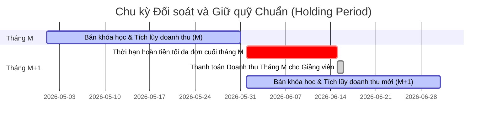

# Stripe Settlement & Payout Strategy: Holding Period, Refunds & Platform Reserves

Tài liệu này phác thảo kế hoạch tài chính và kiến trúc đối soát thanh toán (Settlement & Payout Strategy) đạt chuẩn công nghiệp dành cho nền tảng **Course Marketplace**, giải quyết triệt để các vấn đề cốt lõi về dòng tiền, thời gian giam quỹ, cơ chế hoàn tiền và kiểm soát số dư dự phòng trên cổng thanh toán Stripe.

---

## 1. Bản chất Dòng tiền trên Stripe: Incoming (Pending) vs. Available

Một lỗi phổ biến khiến các nền tảng gặp trục trặc dòng tiền là **chuyển tiền quá sớm cho giảng viên trước khi tiền thực sự khả dụng (Available) hoặc trước khi hết hạn hoàn tiền (Refund Window)**.

### Cơ chế hoạt động của Stripe:
1. **Khách hàng thanh toán**: Tiền ngay lập tức được cộng vào tài khoản Stripe của Sàn (Platform Account) nhưng ở trạng thái **Pending Balance** (Số dư chờ đối soát).
2. **Thời gian luân chuyển tiền (Payout Speed/Settlement Time)**: Stripe cần từ **2 - 7 ngày làm việc** (tùy thuộc vào quốc gia của Sàn) để xử lý thẻ, đối soát liên ngân hàng và chuyển dòng tiền này từ `Pending` sang `Available Balance` (Số dư khả dụng).
3. **Thao tác chuyển tiền (Transfer/Payout)**: Bạn **chỉ có thể** thực hiện các lệnh chuyển tiền (`Stripe Transfer` sang ví giảng viên hoặc `Stripe Payout` về ngân hàng) từ nguồn **Available Balance**. Nếu cố gắng chuyển số tiền đang ở trạng thái `Pending`, giao dịch sẽ thất bại ngay lập tức (`Insufficient Funds`).

---

## 2. Kế hoạch Đối soát & Thanh toán Định kỳ (Payout Cycle Design)

Để giải quyết vấn đề của bạn: **"Set ngày cố định trong tháng để chuyển tiền cho tất cả giảng viên cùng lúc"**, chúng ta sẽ áp dụng **mô hình Udemy/Coursera chuẩn quốc tế**:

### Thiết kế Chu kỳ thanh toán 30-ngày chậm pha (Chế độ Giữ Quỹ / Holding Period):
* **Tháng đối soát (Tháng M)**: Từ ngày 1 đến ngày cuối cùng của tháng M.
* **Ngày chốt quỹ & thanh toán**: Ngày **15 của tháng tiếp theo (Tháng M+1)**.

### Tại sao lại là ngày 15 của tháng sau?
1. **Khớp chu kỳ Hoàn tiền (Refund Window)**:
   * Sàn áp dụng chính sách hoàn tiền trong vòng **14 ngày** kể từ ngày mua.
   * Một học viên mua khóa học vào ngày **31 của tháng M** sẽ có quyền yêu cầu hoàn tiền đến hết ngày **14 của tháng M+1**.
   * Đến ngày **15 của tháng M+1**, toàn bộ các giao dịch phát sinh trong tháng M **đều đã chính thức hết hạn hoàn tiền**. Giảng viên được toàn quyền nhận số tiền này mà không sợ rủi ro bị học viên đòi lại sau đó.
2. **Đảm bảo Tiền đã chuyển từ Pending sang Available**:
   * Toàn bộ tiền bán khóa học của tháng M chắc chắn đã được Stripe chuyển đổi 100% từ `Pending` sang `Available` trước ngày 15 tháng sau (do thời gian xử lý của Stripe chỉ từ 2-7 ngày).
3. **Tự động tạo Quỹ Dự phòng tự nhiên (Natural Rolling Reserve)**:
   * Trong khoảng thời gian từ ngày 1 đến ngày 15 của tháng M+1, sàn vẫn tiếp tục bán được khóa học. Tiền của các đơn hàng mới này sẽ liên tục chảy vào tài khoản Stripe của Sàn dưới dạng `Pending` và bắt đầu chuyển sang `Available`.
   * Số dư thực tế trong ví Stripe của Sàn luôn rất cao, giúp tài khoản không bao giờ bị rơi vào trạng thái cạn kiệt tiền mặt, loại bỏ hoàn toàn khả năng sập web hay lỗi chuyển tiền.



---

## 3. Cơ chế Xử lý Hoàn tiền (Refund & Disputes)

Khi học viên yêu cầu hoàn tiền thành công, hệ thống xử lý ra sao để không bị thâm hụt tài chính của Sàn?

### Trường hợp 1: Hoàn tiền TRONG THỜI HẠN giữ quỹ (Trước ngày chốt thanh toán)
* **Quy trình hoạt động**:
  1. Học viên yêu cầu refund trong vòng 14 ngày.
  2. Sàn phê duyệt refund. Tiền được hoàn trả trực tiếp từ số dư Stripe của Sàn về thẻ của học viên.
  3. Trong cơ sở dữ liệu của Sàn: Giao dịch đó được đổi trạng thái thành `refunded`.
  4. Đến ngày thanh toán định kỳ (ngày 15 của tháng sau), hệ thống **loại bỏ** giao dịch này khỏi tổng số tiền cần chuyển cho giảng viên.
* **Đánh giá**: **Cực kỳ an toàn**. Vì Sàn chưa hề chuyển tiền cho giảng viên nên Sàn không cần phải thu hồi tiền từ bất kỳ ai, tiền trả cho học viên chính là khoản tiền đang tạm giữ của đơn hàng đó.

### Trường hợp 2: Hoàn tiền/Khiếu nại SAU KHI đã thanh toán cho giảng viên (Hy hữu)
* **Bối cảnh**: Hết thời hạn 14 ngày thông thường, nhưng học viên gửi khiếu nại tranh chấp lên ngân hàng (Chargeback) hoặc Sàn duyệt hoàn tiền đặc biệt cho học viên. Lúc này tiền đã chuyển vào ví giảng viên vào ngày 15.
* **Giải pháp khắc phục**:
  1. Hệ thống ghi nhận một giao dịch âm vào tài khoản giảng viên trong cơ sở dữ liệu (ví dụ: `- $80.00`).
  2. **Trừ vào doanh thu tháng tiếp theo**: Doanh thu của giảng viên trong các tháng kế tiếp sẽ tự động bù đắp khoản âm này cho đến khi số dư khả dụng dương trở lại.
  3. **Stripe connected clawback**: Nếu dùng Stripe Express/Custom Connect, bạn có thể gọi API Stripe để ghi nợ trực tiếp ví connected của giảng viên (`Stripe Transfer Reversal`), nhưng giải pháp (2) luôn là giải pháp dễ chịu nhất cho cộng đồng giảng viên và đơn giản nhất về mặt kỹ thuật.

---

## 4. Quản lý Số dư Dự phòng (Platform Reserve Fund) & Tính ổn định của Hệ thống

Bạn lo lắng: **"Có nên bơm trước một khoản tiền dự phòng không? Giữ lại bao nhiêu để web không bị đứng?"**

### 1. Có cần "bơm" trước tiền từ túi Admin vào không?
* **Không cần thiết** nếu bạn áp dụng đúng mô hình thanh toán trễ (Payout Delay) ở phần 2. Tiền bán khóa học mới luôn là nguồn thanh khoản dồi dào gối đầu liên tục.
* Tuy nhiên, nếu bạn muốn vận hành theo cơ chế **rút tiền tức thì (Instant Payout - Giảng viên bán được là rút được ngay)**, bạn **bắt buộc** phải nạp trước một khoản tiền dự phòng lớn vào Stripe (gọi là *Platform Reserve*) để bù đắp các khoản refund phát sinh, do tiền bán chưa kịp chuyển sang trạng thái `Available` nhưng bạn đã cho giảng viên rút tiền `Available` của sàn.
* **Khuyến nghị**: Sử dụng mô hình **Thanh toán định kỳ trễ 15 hoặc 30 ngày** (Payout Delay) là tối ưu nhất. Vừa không tốn chi phí vốn dự phòng, vừa an toàn 100% trước nạn lừa đảo thẻ tín dụng (Fraud).

### 2. Tỷ lệ giữ lại an toàn (Reserve Percentage)
Nếu bạn vẫn muốn giữ lại một khoản nhỏ dự phòng trong hệ thống nhằm đề phòng rủi ro Chargeback/Disputes bất ngờ:
* **Quy tắc 5% Rolling Reserve**: 
  * Khi tính toán số tiền chuyển cho giảng viên vào ngày 15, hệ thống chỉ chuyển **95%** số tiền thực nhận của họ.
  * **5%** còn lại sẽ được giữ lại làm **Quỹ dự phòng luân phiên (Rolling Reserve)** và sẽ tự động giải phóng, thanh toán kèm vào chu kỳ của tháng kế tiếp.
  * *Công thức tính số tiền chuyển khoản ngày 15*:
    $$\text{Amount To Transfer} = (\text{Total Earned in Month M} - \text{Refunds}) \times 95\% + \text{Reserve from Month M-1}$$

### 3. Giải pháp Code để Hệ thống không bao giờ bị "đứng" hoặc báo lỗi sập nguồn ví
Để hệ thống không bao giờ bị lỗi `Insufficient Funds` từ Stripe khi chạy lệnh thanh toán hàng loạt (Batch Transfers):
1. **Kiểm tra số dư khả dụng thực tế của Sàn trước khi chuyển**:
   * Trước khi khởi chạy vòng lặp chuyển tiền cho giảng viên, Worker gọi API Stripe để lấy số dư khả dụng thực tế:
     ```csharp
     var balanceService = new BalanceService();
     var stripeBalance = await balanceService.GetAsync();
     var availablePlatformAmount = stripeBalance.Available.First(x => x.Currency == "usd").Amount;
     ```
2. **Kiểm tra và Ưu tiên**:
   * So sánh `availablePlatformAmount` với tổng số tiền cần thanh toán cho các giảng viên trong hàng đợi.
   * Nếu số dư của Sàn không đủ (ví dụ do các khoản giữ tiền khẩn cấp từ Stripe): Hệ thống sẽ tiến hành thanh toán ưu tiên theo thứ tự thời gian (đơn cũ thanh toán trước) hoặc chia tỷ lệ thanh toán đồng đều, đồng thời gửi email cảnh báo khẩn cấp đến Administrator để nạp thêm tiền (Top-up) vào ví Stripe, chứ không để chương trình ném ngoại lệ hệ thống và ngưng hoạt động.

---

## 5. Luồng hoạt động 1 tháng thực tế & Phân bổ nguồn tiền (Ví dụ số học)

Để làm rõ câu hỏi **"Tôi có cần tự nạp sẵn một khoản tiền (deposit) vào tài khoản Stripe của Sàn lúc ban đầu không?"**, chúng ta hãy đi qua một ví dụ thực tế bằng những con số cụ thể trong **Tháng 6**:

### Thiết lập giả định:
* **Tỷ lệ phân chia**: **80%** cho Giảng viên, **20%** cho Sàn.
* **Giá khóa học**: **100 USD** / khóa.
* **Thời hạn hoàn tiền**: **14 ngày**.
* **Ngày thanh toán**: **15 hàng tháng**.
* **Vốn ban đầu tự nạp (Deposit)**: **0 USD**.

---

### Nhật ký dòng tiền trong Tháng 6 & Tháng 7:

#### 1. Giai đoạn tích lũy (Từ 01/06 - 30/06):
Trong tháng 6, Sàn bán được **100 khóa học**.
* **Dòng tiền Stripe của Sàn**:
  * Stripe thu tổng cộng: $100 \text{ khóa học} \times 100 \text{ USD} = 10,000 \text{ USD}$.
  * Số tiền này nằm **100%** trong tài khoản Stripe của Sàn. Không hề phân chia cho Connected Accounts vào lúc này.
  * Đến ngày 30/06, Stripe đã luân chuyển thành công toàn bộ 10,000 USD từ trạng thái `Pending` sang `Available Balance` trong ví của Sàn.
* **Vốn nạp thêm**: **0 USD**.

#### 2. Giai đoạn xử lý hoàn tiền (Từ 01/07 - 14/07):
Giả sử có **5 học viên** yêu cầu hoàn tiền cho các đơn hàng mua trong tháng 6 (Tỷ lệ hoàn tiền 5%):
* **Cách xử lý**:
  * Sàn bấm duyệt refund trực tiếp trên hệ thống. 
  * Tiền được Stripe tự động trích từ chính số dư khả dụng (Available) 10,000 USD đang có sẵn của Sàn để hoàn lại cho học viên: $5 \text{ khóa học} \times 100 \text{ USD} = 500 \text{ USD}$.
  * Không cần nạp thêm bất kỳ đồng nào từ túi Admin để làm quỹ đệm hoàn tiền.
* **Số dư khả dụng của Sàn sau khi refund**: $10,000 - 500 = 9,500 \text{ USD}$.
* **Vốn nạp thêm**: **0 USD**.

#### 3. Ngày quyết toán chuyển tiền (Ngày 15/07):
* **Tính toán số liệu trên Database của Sàn**:
  * Tổng số đơn hàng tháng 6 thành công và quá hạn 14 ngày (không bị refund) là: **95 đơn** = 9,500 USD gross.
  * Số tiền thực tế chia cho giảng viên (80%): $9,500 \times 80\% = 7,600 \text{ USD}$.
  * Số tiền thực tế Sàn được giữ lại (20%): $9,500 \times 20\% = 1,900 \text{ USD}$.
* **Thực thi chuyển khoản trên Stripe (Stripe Connect Transfer)**:
  * Vào ngày 15/07, Worker chạy ngầm kích hoạt lệnh transfer tổng cộng **7,600 USD** từ ví Sàn sang các tài khoản Connected Stripe của giảng viên.
  * Stripe thực hiện chuyển tiền an toàn vì số dư khả dụng của Sàn hiện tại là **9,500 USD** (đủ điều kiện thanh toán).
* **Số dư ví Stripe của Sàn sau ngày 15/07**: $9,500 - 7,600 = 1,900 \text{ USD}$ (Đây chính là lợi nhuận ròng 20% tích lũy của Sàn). Sàn có thể rút 1,900 USD này về ngân hàng của mình bất kỳ lúc nào.
* **Vốn nạp thêm**: **0 USD**.

---

### Khi nào Sàn mới cần nạp sẵn tiền (Top-up/Deposit) từ ngoài vào?

Bạn **chỉ cần** nạp thêm tiền từ tài khoản ngân hàng của Sàn vào Stripe trong 2 trường hợp đặc biệt sau:

1. **Vận hành Instant Payout (Chuyển tiền ngay lập tức)**:
   * Nếu bạn thiết kế web cho giảng viên bán khóa học xong là rút được tiền ngay lập tức trong ngày.
   * Lúc này, học viên thanh toán 100 USD nhưng tiền vẫn đang ở dạng `Pending` trong ví Sàn. Sàn chưa thể rút được, nhưng bạn lại cho giảng viên rút ngay 80 USD dạng `Available`.
   * **Hậu quả**: Ví của bạn bị thâm hụt số dư khả dụng. Bạn bắt buộc phải nạp sẵn một khoản dự phòng khoảng **1,000 USD - 2,000 USD** vào ví Stripe để làm dòng tiền ứng trước (floating capital).
2. **Tỷ lệ hoàn tiền/Dispute quá cao vượt mức**:
   * Nếu dòng tiền thâm hụt do có quá nhiều khiếu nại tài khoản cũ (bị ngân hàng phạt giam tiền) khiến số dư Stripe của Sàn bị âm. Tuy nhiên, tỷ lệ này thường dưới 1% đối với nội dung số.

---

## 6. Các Kịch bản & Tình huống Phát sinh Thực tế (Scenarios & Edge Cases)

Để bạn hoàn toàn yên tâm về tính vững chắc của hệ thống, chúng ta hãy đặt ra **4 Kịch bản biến động dòng tiền** từ đầu tháng đến cuối tháng và cách hệ thống tự động xử lý:

### Kịch bản 1: Đơn hàng mua vào ĐẦU tháng (Từ ngày 01 đến 15 của Tháng 6)
* **Tình huống**: Học viên A mua khóa học 100 USD vào ngày **03/06**.
* **Luồng xử lý**:
  * Tiền chuyển từ `Pending` sang `Available` trên ví Stripe của Sàn vào khoảng ngày **07/06 - 10/06**.
  * Hạn refund 14 ngày kết thúc vào ngày **17/06**.
  * Đơn hàng này nằm trong trạng thái "Giam giữ an toàn" trên ví Sàn tổng cộng **42 ngày** (Từ 03/06 đến ngày quyết toán 15/07). 
  * Nếu học viên yêu cầu hoàn tiền vào ngày 10/06, Sàn trả lại dễ dàng vì tiền đang có sẵn. Nếu không refund, giảng viên nhận tiền vào ngày 15/07.

### Kịch bản 2: Đơn hàng mua vào CUỐI tháng (Từ ngày 16 đến 30 của Tháng 6)
* **Tình huống**: Học viên B mua khóa học 100 USD vào ngày **29/06**.
* **Luồng xử lý**:
  * Tiền chuyển sang `Available` trên ví Stripe của Sàn vào khoảng ngày **03/07 - 05/07**.
  * Hạn refund 14 ngày kết thúc vào ngày **13/07**.
  * Đến ngày quyết toán **15/07**, đơn hàng này **đã chính thức quá hạn refund** (quá hạn từ ngày 13/07). Do đó, đơn hàng này vẫn được tính vào đợt thanh toán ngày 15/07 bình thường và an toàn tuyệt đối.

### Kịch bản 3: Sàn chịu biến động doanh số vào đầu tháng sau (Từ 01/07 đến 15/07)
* **Tình huống**: Bước sang tháng 7, từ ngày 01/07 đến 15/07, sàn rơi vào tình trạng **"không có một khách nào mua khóa học"** (Doanh số = 0 USD). Liệu ngày 15/07 Sàn có tiền chuyển cho giảng viên của tháng 6 không?
* **Luồng xử lý**:
  * **HOÀN TOÀN ĐỦ TIỀN**. Vì toàn bộ doanh số sạch của tháng 6 (đã trừ các khoản hoàn tiền phát sinh trước đó) vẫn đang được bảo toàn nguyên vẹn trong ví Stripe của Sàn từ cuối tháng 6. 
  * Việc tháng 7 không có khách mua chỉ ảnh hưởng đến đợt thanh toán vào ngày **15/08**, chứ hoàn toàn không ảnh hưởng đến số dư khả dụng dùng để thanh toán cho tháng 6 vào ngày **15/07**.

### Kịch bản 4: "Cơn bão Hoàn tiền" (Refund Storm) ập đến vào đầu tháng sau
* **Tình huống**: Tháng 6 bán rất tốt được 100 đơn. Nhưng sang đầu tháng 7 (từ ngày 01/07 đến 14/07), đột nhiên có **15 học viên** đòi refund hàng loạt cho các đơn hàng mua cuối tháng 6. Sàn có bị thâm hụt tiền khả dụng không?
* **Luồng xử lý**:
  * **KHÔNG THÂM HỤT**. 
  * Khi 15 học viên đòi refund, Stripe trích thẳng $15 \times 100\text{ USD} = 1,500\text{ USD}$ trả lại họ. Ví Stripe của Sàn giảm từ 10,000 USD xuống còn 8,500 USD.
  * Đến ngày quyết toán 15/07: Hệ thống quét cơ sở dữ liệu và **loại bỏ hoàn toàn 15 đơn đã bị refund**. Hệ thống chỉ tính toán doanh thu chuyển khoản cho **85 đơn còn lại**.
  * Tiền giảng viên được nhận (80% của 85 đơn): $8,500\text{ USD} \times 80\% = 5,950\text{ USD}$.
  * Số dư khả dụng hiện tại của Sàn là **8,500 USD**, thừa sức thực hiện lệnh chuyển 5,950 USD cho giảng viên.
  * Sau khi chuyển, Sàn còn dư: $8,500 - 5,950 = 2,550\text{ USD}$ (trong đó 1,700 USD là lợi nhuận thực tế 20% của Sàn cho 85 đơn thành công, phần còn lại là số dư đệm an toàn).
  * Mọi con số khớp khít tuyệt đối, Sàn không mất một đồng tiền túi nào!

---

## 7. Nguyên tắc Kết chuyển Kỳ Kế toán & Hiển thị Báo cáo (Monthly Rollover & Reporting Rules)

Một thắc mắc rất phổ biến là: **"Doanh thu hay đơn hàng tháng trước có bị hiển thị nhảy qua tháng sau không? Làm sao để không bị trộn lẫn dòng tiền?"**

Để hệ thống đối soát kế toán luôn minh bạch và chuẩn mực, chúng ta áp dụng **2 Nguyên tắc Kết chuyển Kế toán** sau:

### Nguyên tắc 1: Doanh thu bán hàng (Earnings) đi theo Ngày Giao Dịch thực tế (Transaction Date)
* **Quy tắc**: Học viên mua ngày nào thì doanh thu ghi nhận cho tháng đó, bất kể tiền thực tế được chuyển khoản vào ngày nào.
* **Ví dụ**:
  * Học viên mua khóa học vào ngày **29/06**. 
  * Trên giao dịch, trường `Date` ghi nhận là `29/06/2026`.
  * Trên giao diện của giảng viên, khi họ lọc xem doanh thu **"Tháng 6"**, đơn hàng này **luôn luôn hiển thị trong báo cáo của Tháng 6**.
  * Điều này tuân thủ nguyên tắc **Kế toán dồn tích (Accrual Accounting)** chuẩn mực quốc tế.

### Nguyên tắc 2: Thanh toán thực tế (Payouts) đi theo Ngày Chuyển Tiền thực tế (Disbursement Date)
* **Quy tắc**: Lệnh chuyển khoản (Transfer) được thực hiện vào ngày nào thì ghi nhận lịch sử rút tiền của ngày đó.
* **Ví dụ**:
  * Vào ngày **15/07**, Worker chuyển **7,600 USD** (doanh thu sạch của Tháng 6) cho giảng viên.
  * Lịch sử thanh toán này sẽ ghi nhận vào ngày **15/07/2026**.
  * Trên giao diện của giảng viên, khi xem tab **"Payout History" (Lịch sử thanh toán)**, họ sẽ thấy một dòng giao dịch phát sinh vào ngày `15/07/2026` với nội dung ghi chú rõ ràng: *"Thanh toán Doanh thu khóa học Tháng 6/2026: 7,600 USD"*.

---

### Sơ đồ luân chuyển & kết chuyển dòng tiền qua các tháng:

Để đảm bảo không bao giờ có sự trộn lẫn, Database quản lý dòng tiền được chia tách độc lập bằng **Bộ lọc chu kỳ (`BillingCycle`)**:

| Đơn hàng mua ngày | Kỳ doanh thu ghi nhận | Hạn kết thúc Refund | Ngày Worker đối soát | Ngày chuyển tiền thực tế |
| :--- | :--- | :--- | :--- | :--- |
| **05/06** (Tháng 6) | Tháng 6 / 2026 | 19/06 | 15/07 | **15/07** |
| **29/06** (Tháng 6) | Tháng 6 / 2026 | 13/07 | 15/07 | **15/07** |
| **02/07** (Tháng 7) | Tháng 7 / 2026 | 16/07 | 15/08 | **15/08** |
| **28/07** (Tháng 7) | Tháng 7 / 2026 | 11/08 | 15/08 | **15/08** |

### Cách Database ngăn chặn sự trộn lẫn giữa các tháng:
1. Khi học viên mua khóa học vào ngày **02/07**, đơn hàng này sẽ có `BillingCycle = "2026-07"` (tháng 7).
2. Vào ngày **15/07** (ngày chạy Worker quyết toán cho tháng 6), Worker chỉ truy vấn những đơn hàng có `BillingCycle = "2026-06"` (tháng 6) để tính toán chuyển tiền.
3. Toàn bộ các đơn hàng của tháng 7 (`BillingCycle = "2026-07"`) sẽ **hoàn toàn đứng ngoài** đợt chuyển khoản ngày 15/07. Chúng nằm yên chờ đợi đến lượt chạy tiếp theo của Worker vào ngày **15/08**.

Nhờ sự phân tách rạch ròi này, số liệu báo cáo luôn khớp đến từng xu và không bao giờ xảy ra hiện tượng dòng tiền tháng trước bị nhảy lộn xộn qua tháng sau trên báo cáo của giảng viên hay hệ thống Admin!

---

## 8. Kế hoạch triển khai Chi tiết (Implementation Plan)

### Bước 1: Thiết kế Cơ sở Dữ liệu (Database Ledger States)
Thêm các trường quản lý trạng thái giữ quỹ vào bảng giao dịch mua/payout:
* **Trạng thái đối soát (`SettlementStatus`)**:
  - `PendingSettlement`: Tiền đang trong thời hạn giữ quỹ 14 ngày.
  - `Settled`: Đã qua 14 ngày, không có khiếu nại, sẵn sàng thanh toán.
  - `Disbursed` (hoặc `PaidOut`): Đã chuyển tiền thành công sang ví giảng viên.
  - `Cancelled`: Giao dịch bị hoàn tiền (Refunded).

### Bước 2: Xây dựng Background Worker (Hệ thống thanh toán tự động)
* Tạo một cron-job/worker (ví dụ dùng Coravel hoặc Hangfire) chạy định kỳ vào **00:05 ngày 15 hàng tháng**.
* **Nhiệm vụ của Worker**:
  1. Đổi trạng thái các đơn hàng thành công của tháng trước từ `PendingSettlement` sang `Settled` (nếu đã qua 14 ngày và không bị hoàn tiền).
  2. Gom nhóm tổng số tiền `Settled` theo từng `InstructorId`.
  3. Gọi Stripe API kiểm tra số dư khả dụng của Sàn (`Stripe.Balance.Get()`).
  4. Thực hiện `Transfer` tiền từ ví Sàn sang tài khoản Connected Stripe của từng giảng viên:
     ```csharp
     var transferOptions = new TransferCreateOptions
     {
         Amount = instructorSettledShareAmount,
         Currency = "usd",
         Destination = instructorStripeConnectedAccountId,
         Description = $"Monthly revenue settlement for Month {lastMonth} - Instructor {instructorId}"
     };
     ```
  5. Cập nhật trạng thái các đơn hàng đã chuyển thành `Disbursed` và tạo bản ghi lịch sử chuyển tiền trong bảng `InstructorPayouts` để đồng bộ hiển thị lên giao diện.

---

## Yêu cầu Người dùng phản hồi (Request Feedback)

> [!IMPORTANT]
> 1. Bạn thấy chính sách **thanh toán trễ vào ngày 15 của tháng tiếp theo** (giữ tiền 15-45 ngày tùy thời điểm mua trong tháng) có phù hợp với định hướng vận hành và chính sách đối với giảng viên của sàn bạn không? (Udemy đang áp dụng giữ tiền 30-45 ngày rất thành công).
> 2. Bạn muốn thực hiện thanh toán tự động 100% vào ngày 15 bằng Worker (chạy ngầm) hay Admin sẽ bấm nút phê duyệt thủ công trên dashboard tài chính để kích hoạt đợt chuyển tiền?
